# 시스템 아키텍처 다이어그램

`kg/` 현행 시스템의 구조를 그림으로 정리한다 — ①DB 스키마(ERD), ②모듈/클래스,
③시나리오별 시퀀스, ④EL 데이터 플로우. 원본 근거는 [kg/schema.sql](../kg/schema.sql)과
각 모듈 소스이며, 스키마가 바뀌면 이 문서도 같은 커밋에서 갱신한다.
(GitHub에서 mermaid가 바로 렌더된다.)

- 작업 이력: [PROGRESS.md](PROGRESS.md)
- 레거시 초기 설계: [IMPLEMENTATION_PLAN.md](IMPLEMENTATION_PLAN.md) / [WEB_PLAN.md](WEB_PLAN.md)

---

## 1. DB 스키마 (ERD)

하나의 워크스페이스 DB(`domains/<d>/data/kg/kg.db`)에 6개 영역이 산다.
영역별로 나눠 그린다 (PK/FK와 핵심 컬럼만 표기).

### 1.1 도메인 온톨로지 + 시맨틱 매핑

고정 개념 체계(L1/L2/L3)와, 문서 트리 노드를 개념에 잇는 매핑.
`semantic_mapping`이 두 세계(온톨로지 ↔ 문서 트리)의 다리다.

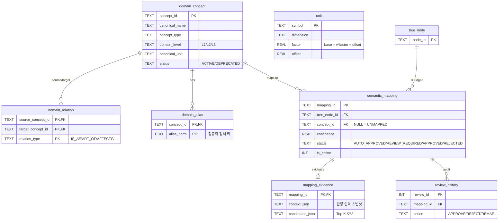

### 1.2 문서 트리 + 값 저장 (그래프/값 분리)

문서 구조는 `tree_node`(안정 경로 기반 — 버전이 바뀌어도 같은 경로면 같은
노드로 매핑 승계), 값은 트리 밖 `data_payload/payload_value`에 관계형으로 둔다.
`payload_value.cell_address`가 lineage의 최말단이다.

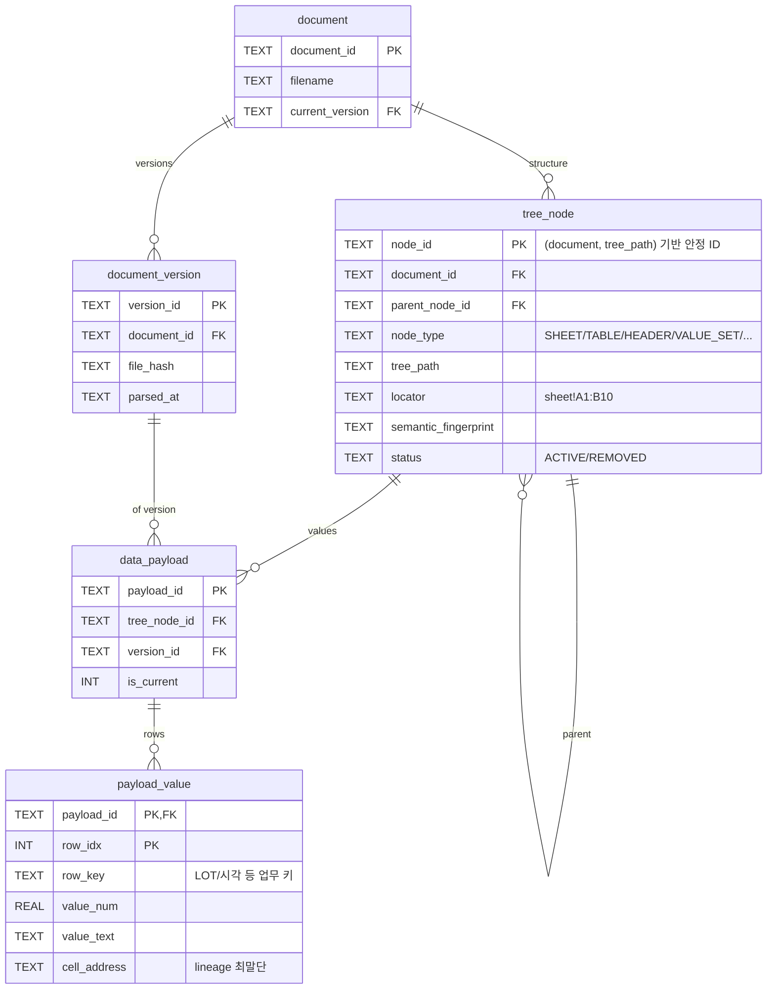

### 1.3 파싱 템플릿 런타임 (문서:템플릿 = N:M)

템플릿은 KG 노드가 아닌 **운영 파싱 계층**. 버전은 불변 스냅샷이고,
`document_template_assignment`는 PK(document, version, template)로 **한 문서에
관점이 다른 템플릿 여러 개**를 허용한다. override·parse_run·상태 갱신은 전부
템플릿 단위로 독립이다.

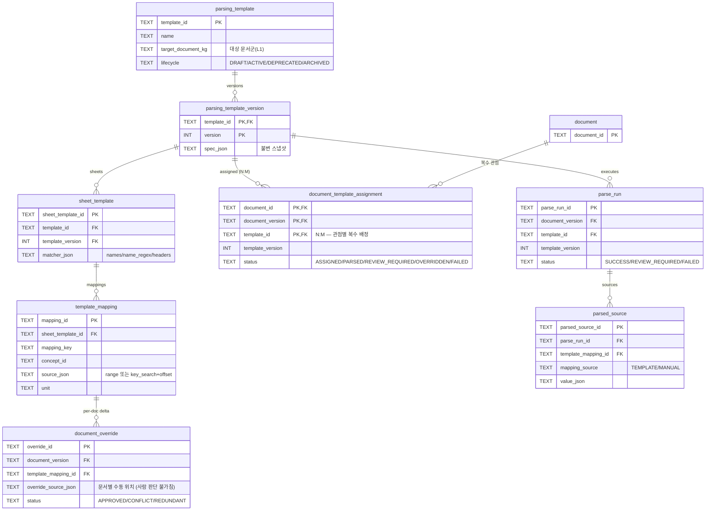

### 1.4 뷰어 + DRM 획득 게이트

DRM은 우회하지 않는다 — 요청서 발급 → 해제본(같은 파일명) 도착 자동 감지.
뷰어 원본 경로(`unlocked_path`)는 백엔드 전용으로 API에 절대 노출되지 않는다.

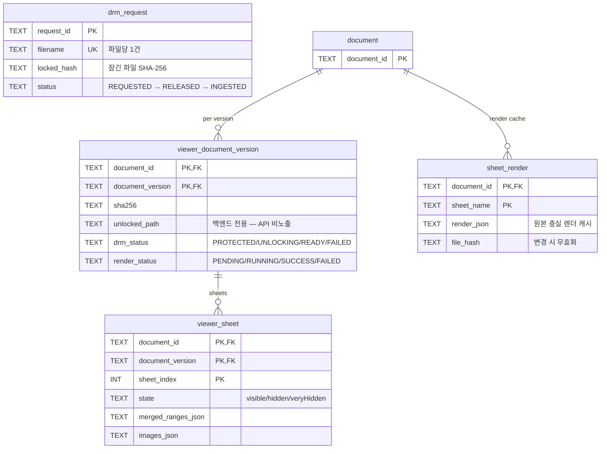

### 1.5 문서군(그룹) + 추출 레시피 + 재크롤링

문서군 멤버십은 승인 매핑에서 **파생**되고, 사람 델타(INCLUDED/EXCLUDED)만
저장한다. 레시피는 그룹당 ACTIVE 1개의 append-only 선형 이력.

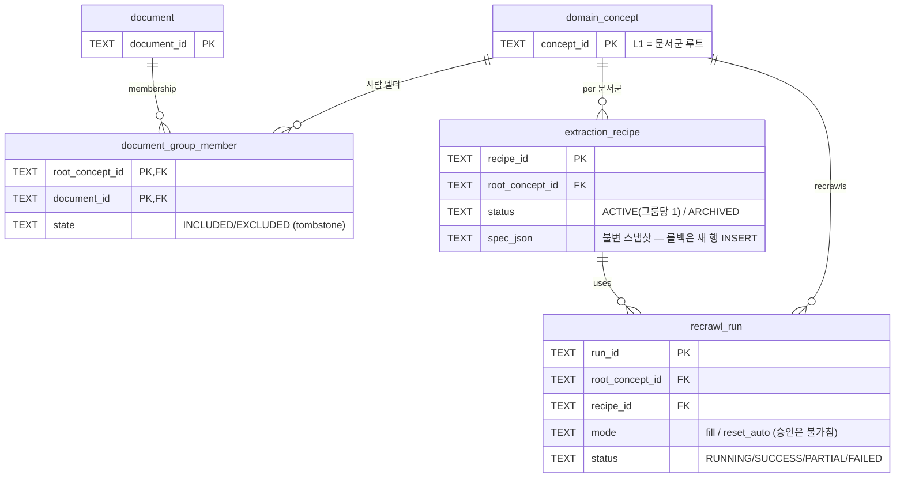

### 1.6 통합 DB 빌드 + Lineage

통합 프로젝트 정의 → 변환 DAG → 산출 Custom RDBMS 파일 + 셀 단위 lineage.

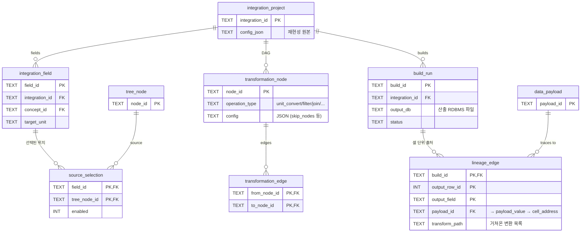

---

## 2. 모듈/클래스 다이어그램

백엔드는 함수형 모듈 + 단일 저장 클래스(`KgStore`) 구조다. 모든 모듈이
`KgStore`를 첫 인자로 받고, 웹 계층(webapp)이 Lock으로 직렬화한다.

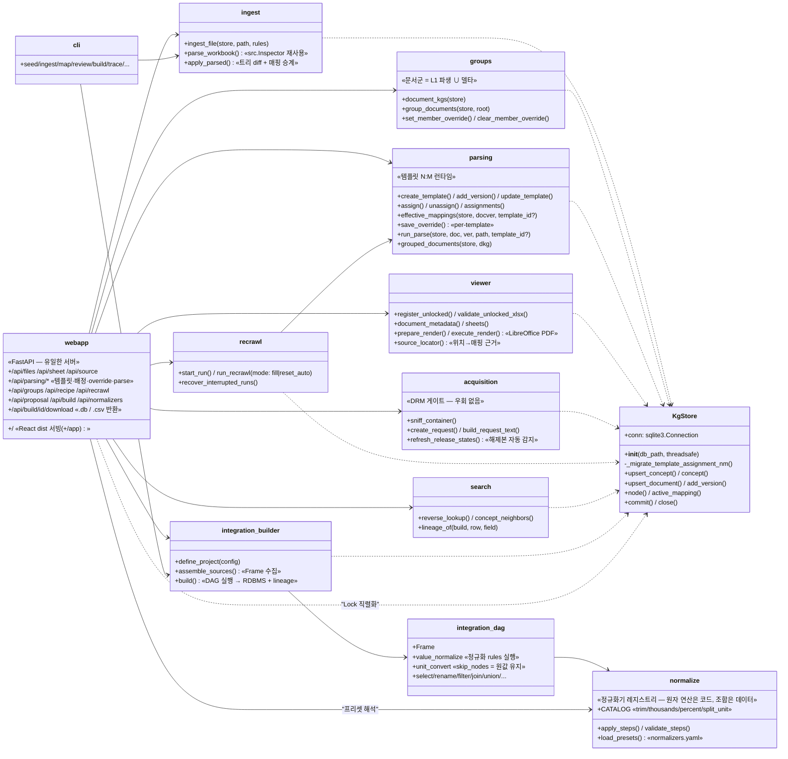

프론트(React, `frontend/`)는 5탭 화면이 Context 스토어 하나를 공유한다:

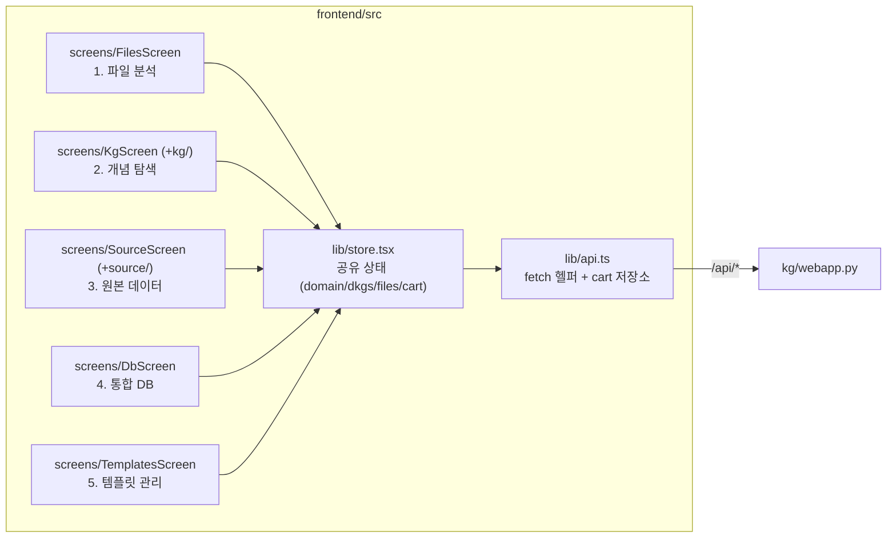

---

## 3. 시나리오별 시퀀스 다이어그램

### 3.1 신규 파일 등록 (분석 → 문서군 제안 → 레시피 이식)

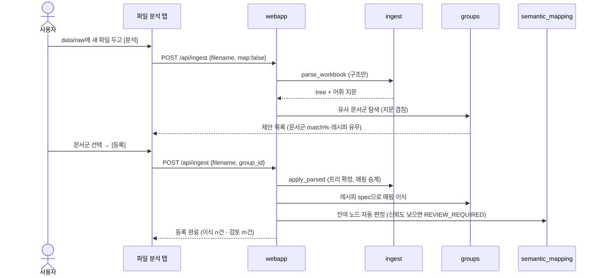

### 3.2 DRM 잠금 파일 — 정식 해제 흐름 (우회 없음)

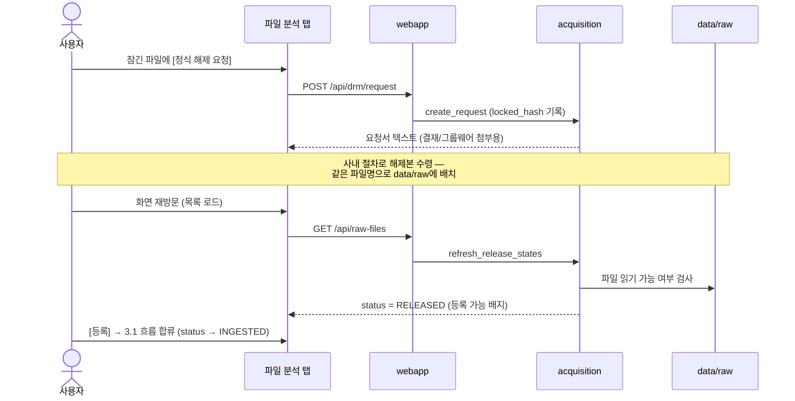

### 3.3 원본 데이터 뷰어 — 렌더 4단 우선순위

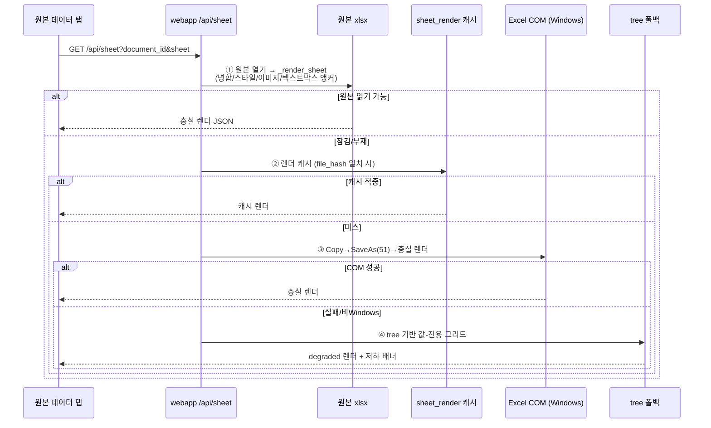

### 3.4 템플릿 N:M — 배정·파싱·override

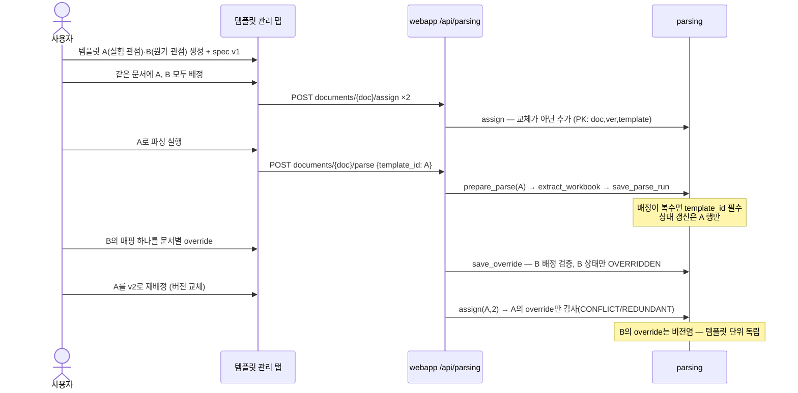

### 3.5 통합 DB 빌드 (개념 트리 → 전처리 프리셋 → 생성·다운로드)

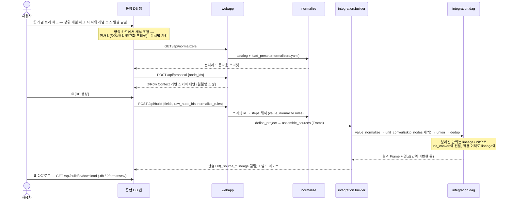

### 3.6 재크롤링 (사람 승인 불가침)

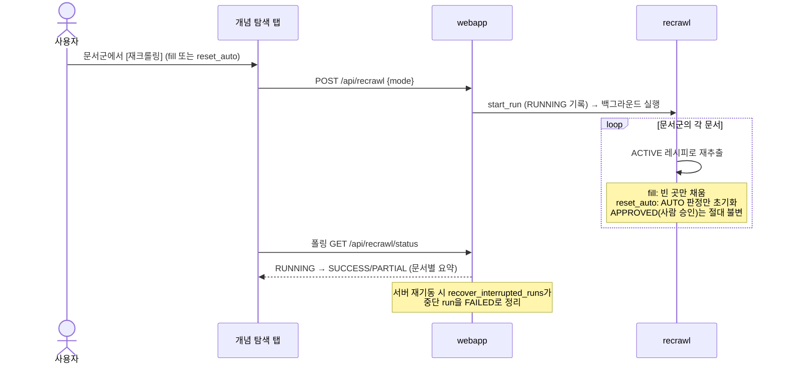

---

## 4. EL 데이터 플로우

문서를 표준 양식으로 변환(T)하지 않고 **구조 보존 적재(EL) 후 의미 연결**한다.
변환은 마지막 통합 빌드 단계에서만, 선택적으로 일어난다.

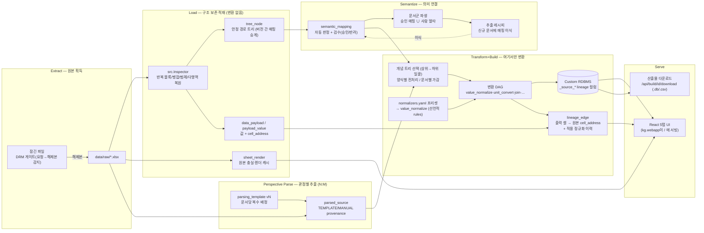

핵심 불변식:

1. **원본은 불변** — 적재·렌더 어느 단계도 원본 파일을 고치지 않는다 (DRM 우회 없음).
2. **변환은 빌드에서만** — Load 단계는 구조·값을 있는 그대로 보존한다.
3. **사람 판단 불가침** — APPROVED 매핑·수동 override는 재크롤링/재배정이 덮지 않는다.
4. **모든 출력 셀은 원본 셀로 추적 가능** — lineage_edge → payload_value.cell_address.
5. **정규화는 코드에 고정하지 않는다** — 원자 연산만 코드(kg/normalize.py 카탈로그,
   선언적 파라미터만)에 두고, 조합·선택은 데이터(normalizers.yaml 프리셋 + 빌드
   rules)로 관리한다. 단위 변환 규칙의 원본도 units.yaml이다.
