# 아키텍처 — Parsing Schema / Parsing Profile 런타임

런타임(`schema/`, `db/`, `frontend/src/app/`, `e2e/specs/`)의 구조를 그림과 표로 정리한다.
설계 근거는 `docs/design/`의 입력 문서군(시스템 정체성 · 18개 코어안 · 개발 기준안 · 렌더 아키텍처)이고,
코드 단위 계약은 [design/contracts.md](design/contracts.md), 문서 간 충돌의 결정은 [design/decisions.md](design/decisions.md)에 있다.
**스키마나 모듈이 바뀌면 이 문서도 같은 커밋에서 갱신한다.** ERD는 DDL을 `PRAGMA table_info/foreign_key_list`로 읽어 생성했다(컬럼·PK·FK가 실제와 일치).

## 0. 한 장 요약

```text
NASCA/DRM/로컬 Excel ─▶ Reader(격리 프로세스) ─▶ describe(+match) ─▶ document / document_snapshot / sheet
                                                       │
                          approved 파싱 프로파일 ◀──────┘ 매치 서명 identical → 자동 승인 → 추출 → 발행
                                                       └ compatible / draft → proposed → 작업 내역(검수) → Source Review
                                                                                             │
                          파싱 스키마(필드·alias·관계) ◀── mapping_revision.field_id ◀── 승인 ◀┘
                                                       │
                          extracted_value + extracted_value_region(원본 위치) ─▶ 데이터 빌드(일회성 CSV/XLSX/SQLite + manifest)
```

- **정체성**: 보호 문서를 검증된 파싱 스키마(무엇)와 파싱 프로파일(어떻게)로 단일 테이블 데이터로 바꾸어 Agent에 주는 Document-to-Table Adapter. 최종 파일은 산출물이지 Source of Truth가 아니다.
- **DB는 관계·검수 상태·provenance**, 정의 파일(`<ws>/schemas/`, `<ws>/profiles/`)이 스키마·프로파일의 진실이며 DB는 projection이다(삭제 대신 `deprecated`).
- **렌더는 별도 서버**(캐시 키 snapshot + sheet + renderer_version, 밴드 파일, 창 응답, asset 분리). 메인 API는 렌더 완료를 기다리지 않는다.

---

## 1. DB 스키마 (ERD)

`<ws>/workspace.db` 하나에 코어 18개 + 삭제 가드 `purge_guard` + `schema_meta` + 런타임 3개(`runtime_job`, `snapshot_signature`, `source_digest`; `schema/db.py`가 만든다) = 23개 테이블,
트리거 35개(불변성·CAS·발행 조건·레벨·projection 보호), 뷰 1개(`current_value`), 명시 인덱스 39개.
PostgreSQL 번역은 [db/schema_postgres.sql](../db/schema_postgres.sql)(pglast 구문·객체 집합 검증, 런타임 미검증).

핵심 규칙:

- 문서의 정체성은 `document_id`, 내용은 `document_snapshot`(불변, `change_token`으로 새 snapshot 판정). 자식 테이블은 모두 `snapshot_id`를 갖고 복합 FK로 같은 snapshot임을 DB가 강제한다.
- 프로파일은 snapshot에 적용된다(`parsing_application`). 규칙별 `mapping`의 헤드는 **마지막 리비전**이고 `edit_seq = 헤드 revision_no`(CAS 트리거). 헤드가 바뀌면 `published_run_id`가 NULL이 된다.
- 값은 `extracted_value`(불변)이고 출처는 **항상** `extracted_value_region`(단일 출처도 행 1개). `source_region_id` 컬럼은 없다.
- `parsing_rule`은 DELETE가 금지된다(정의 파일에서 사라지면 `status='deprecated'`). `parsing_field`는 **쓰이지 않을 때만** 지울 수 있다:
  트리거 `parsing_field_in_use_no_delete`가 자식 `parent_of` 간선 · `parsing_rule.default_field_id` · `mapping_revision.field_id` · `extracted_value.field_id` 중
  하나라도 걸려 있으면 거부한다(계약 §1.2). 스키마 삭제(§4.2.1)·필드 삭제(§4.2.2)만 이 문을 쓰고, 서비스가 먼저 같은 조건을 검사해 409로 돌려준다.
- `source_digest`는 로컬 원본의 `(byte_size, mtime_ns)` → 내용 SHA-256 캐시다(폴더 일괄 등록 미리보기가 같은 stat이면 파일을 다시 읽지 않게 한다). 진실은 `document_snapshot.change_token`이라 언제 지워도 되고, 다음 스캔이 다시 채운다(계약 §1.6).
- **불변식은 "살아 있는 문서의 기록은 고칠 수 없다"이지 "영원히 지울 수 없다"가 아니다**(계약 §1.10, 결정 [decisions.md §19](design/decisions.md)). 불변 테이블 여덟 개(`document_snapshot`·`sheet`·`source_region`·`mapping_revision`·`mapping_region`·`extracted_value`·`extracted_value_region`·`extraction_run`)의 **DELETE 거부 트리거만** `WHERE NOT EXISTS (SELECT 1 FROM purge_guard)` 조건을 달아, 문서 삭제(§4.13)가 같은 트랜잭션에서 `purge_guard` 행을 넣고 지운 뒤 그 행을 지우는 동안에만 통과한다. `purge_guard`는 커밋된 DB에서 언제나 비어 있고(`schema/db.py`가 열 때 한 번 더 비운다), 가드 밖에서 친 `DELETE FROM extracted_value`는 여전히 ABORT다. **`<table>_no_update` 여덟 개는 그대로다** — 이번 완화는 삭제에만 적용한다.

### 문서·snapshot·원본 위치

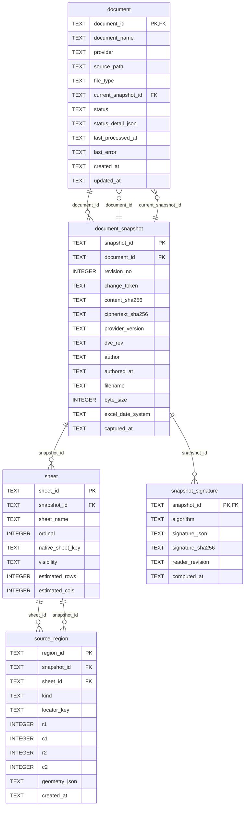

### Parsing Schema (projection)

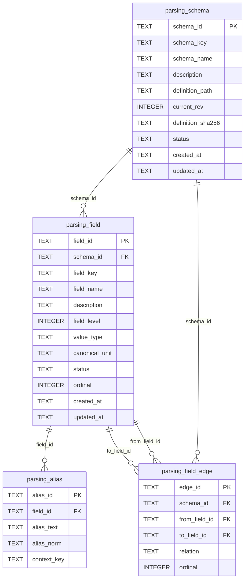

### Parsing Profile (projection)

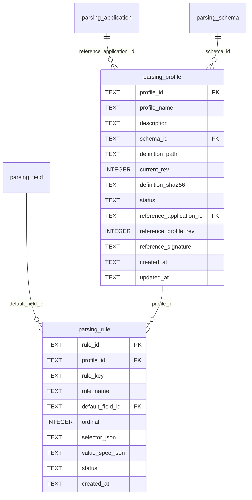

### 적용 건·매핑·리비전

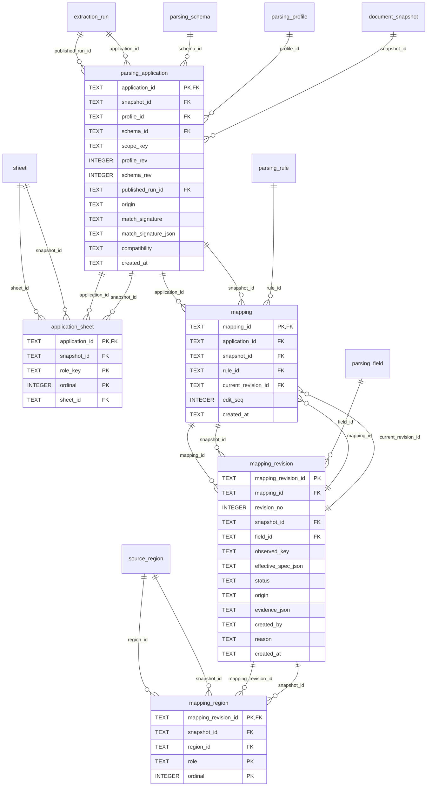

### 추출 실행·값·출처

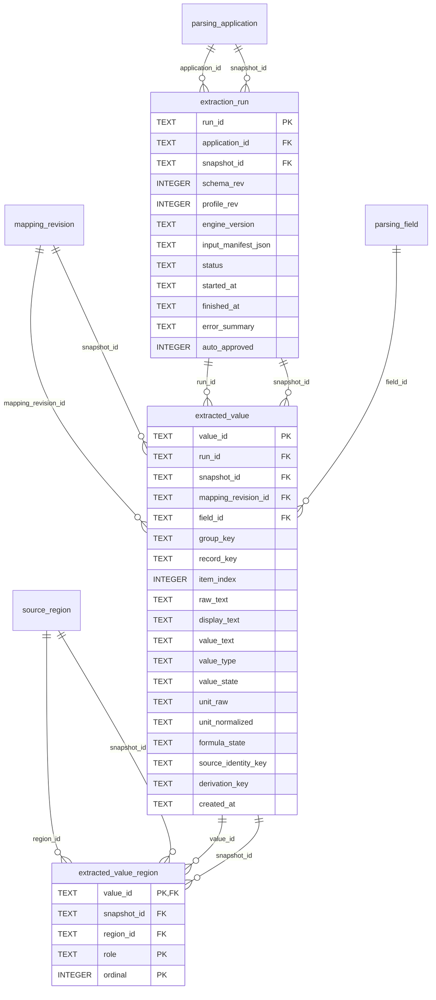

### 런타임

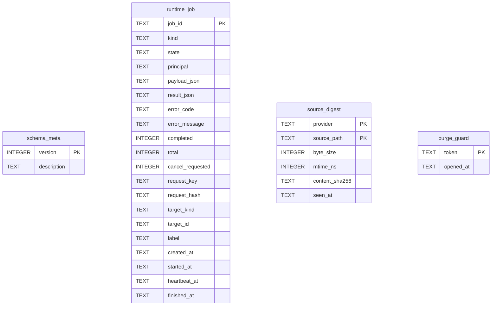

테이블 23개 · 트리거 35개 · 뷰 1개(current_value) · 명시 인덱스 39개

트리거 목록: `application_identity`, `application_starts_unpublished`, `document_snapshot_no_delete`, `document_snapshot_no_update`, `extracted_value_no_delete`, `extracted_value_no_update`, `extracted_value_region_no_delete`, `extracted_value_region_no_update`, `extraction_run_no_delete`, `extraction_run_no_update`, `field_edge_level`, `field_edge_level_update`, `field_edge_same_schema`, `field_group_guard`, `field_group_not_target_revision`, `field_group_not_target_rule`, `field_group_not_target_rule_update`, `field_level_guard`, `mapping_edit_seq`, `mapping_edit_seq_advance`, `mapping_head_guard`, `mapping_head_invalidates`, `mapping_identity`, `mapping_region_no_delete`, `mapping_region_no_update`, `mapping_revision_no_delete`, `mapping_revision_no_update`, `parsing_field_in_use_no_delete`, `parsing_rule_in_use_no_delete`, `publish_run`, `run_state_transition`, `sheet_no_delete`, `sheet_no_update`, `source_region_no_delete`, `source_region_no_update`

---

## 2. 백엔드 모듈 (`schema/`)

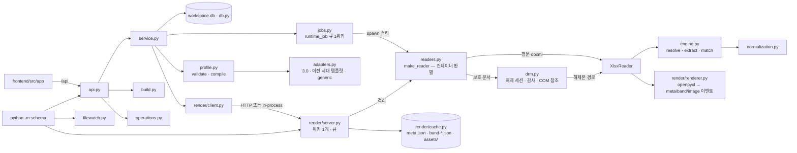

| 모듈 | 책임 | 계약 |
|---|---|---|
| `db.py` | SQLite 저장소(WAL·FK·busy_timeout), 런타임 DDL, `Problem`, 커서/페이지 헬퍼, 옛 작업 공간 이관 2건(`runtime_job.kind`에 `'delete'` 추가는 `CREATE TABLE IF NOT EXISTS`로 안 되므로 표 재작성 · `purge_guard`와 DELETE 거부 트리거 여덟 개를 코어 DDL 파일에서 그대로 읽어 추가) | §1.6, §1.10 |
| `jobs.py` | `runtime_job` 큐(단일 워커, heartbeat, 취소, `wait`), Reader 프로세스 격리(`reader_events`·`reader_result`, 시간·메모리·8MB 이벤트 한도) | §1.6, §3.2 |
| `profile.py` | DSL 3.0 검증(`validate_profile`), 앵커 인라인 컴파일(`compile_rule`·`compile_profile`), 관계 위상 정렬 | §2 |
| `adapters.py` | 외부 프로파일 JSON → canonical(`detect_format`, `to_canonical` + 경고 보고) | §2 Import Adapter |
| `normalization.py` | 정규화 op 실행(`trim_text`·`strip_thousands`·`split_unit_suffix`·`percent_to_ratio`·`automatic`·`split_delimiter`), 파이프라인 검증, 프리셋 | §2 normalization |
| `engine.py` | 영역 해결(range/find/regex/relative/anchor/composite), 추출 스트림(group → values → verified), 시트 바인딩, 매치 판정(`match_profile`·`match_specs`, 매치 서명) | §3.1, §3.3 |
| `readers.py` | Reader 계약: `describe(profiles)`(등록 시 프로세스 1회) · `match` · `match_specs` · `extract` · `render`. `make_reader(root, provider, principal, source_ref)`가 **컨테이너를 보고 한 곳에서만** Reader를 고른다(평문 → `XlsxReader`, 보호 → 팩토리) | §3.2, §3.5 |
| `drm.py` | 보호 문서 접근: 앞 32바이트 컨테이너 판별(`sniff_container`), snapshot당 1회 해제 세션(`SESSIONS.acquire`, 작업 공간 밖 0700 폴더·TTL·총량 상한), 감사(`<ws>/data/audit/drm-*.jsonl`), 설정 카드 값(`settings_snapshot`), 점검(`probe`), 윈도우 Excel COM 참조 구현(`ExcelComReader`, 기본 비연결) | §3.5 |
| `service.py` | 등록·snapshot 판정·자동 적용·승계·검수(CAS)·추출·발행·프로파일 테스트/승인/재파싱(프로파일 전체 `reparse` · **적용 건 하나 `reparse_application`** — 판정은 둘 다 `_reparse_application` 하나가 내린다)·문서 상태 캐시·조회, 폴더 재귀 스캔·분류(`scan_sources`)와 폴더 일괄 등록 작업(`register_directory`), **문서 삭제**(`delete_document` 단건 동기 · `delete_documents` 다중 작업 · `_purge_source_file` 원본 파일), 스키마·필드 삭제(`delete_schema`·`delete_field` — 사용 중이면 409)와 **스키마 폐기/폐기 해제**(`deprecate_schema`·`activate_schema`) | §4, §4.1.1, §4.2.1, §4.2.2, §4.2.3, §4.13 |
| `build.py` | 후보 판정 · 미리보기 · CSV/XLSX/SQLite 생성 · manifest · `build_key` 재사용 · 단위 변환(`UnitRegistry`) | §4.10 |
| `operations.py` | 검수 큐 5종(같은 원인·서명 묶음), 멤버, 묶음 처리 작업 | §4.11 |
| `api.py` | FastAPI `/api`(§6 전부), 오류 봉투, `?wait=`, 렌더 프록시(권한 → ETag/304), 정적 프런트 | §6 |
| `contracts.py` | Pydantic 요청 모델(`extra=forbid`) | §6 |
| `render/*` | 렌더 서버(§5): `renderer`(이벤트) · `assemble`(밴드 파일) · `cache`(창·LRU·세대·asset 검증) · `server`(POST/GET/DELETE/status, 멱등 큐, 실패 보관) · `client`(HTTP·in-process 동일 형태, `RenderUnavailable`) | §5 |
| `watch.py` · `filewatch.py` | 원본 폴더 감시 → 등록+자동 적용(기본 하위 폴더까지, `--no-recursive`로 최상위만; 제외 규칙은 폴더 스캔과 같다). `filewatch.py`는 파일 안정화 판정(`FileEventWatcher`·`StabilityGuard`) | §4.1.1, §9 |
| `__main__.py` | `serve · render-serve · watch · register · drm-probe · import-schema · import-profile · build · seed-demo`(`.env` 자동 로드; 서브커맨드를 생략하면 `serve`. `serve`·`render-serve`는 시작할 때 해제본 임시 폴더를 검사·비운다) | §9 |

### 2.1 등록 → 자동 적용 → 추출 → 발행

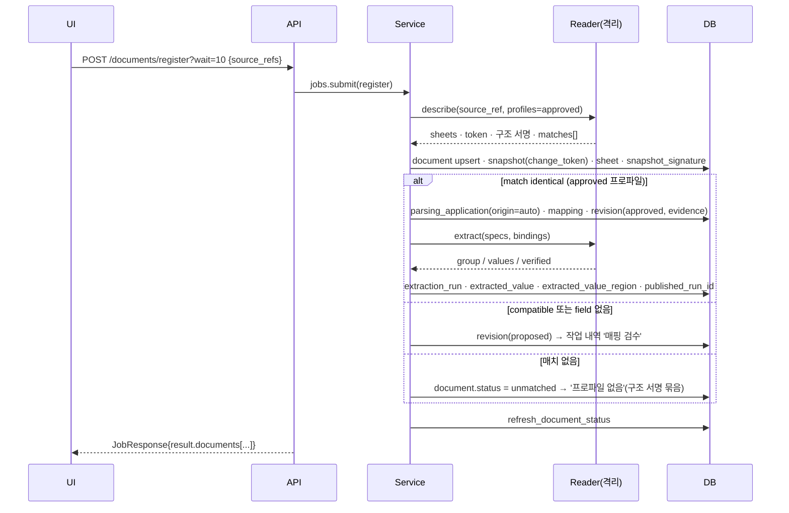

- 같은 문서에 다른 `change_token`이 오면 새 snapshot을 만들고 이전 application을 `match_specs`로 재판정해 **항상 `proposed`(origin inherited)**로 승계한다(자동 승인 없음, [decisions.md §1](design/decisions.md)). 작업 내역 '변경 감지'의 `approve_all`이 승인+추출+발행을 요청 1회로 처리한다.
- 보호 문서인데 Reader 어댑터가 없으면 `document.status='locked'` + 실패 작업으로 남는다(§2.5). 어댑터를 붙인 뒤 `변경 없는 문서·잠긴 문서도 다시 읽기`로 같은 파일을 다시 등록한다.

**폴더 일괄 등록(§4.1.1)** — 파일을 하나씩 고르는 대신 루트 폴더 하나를 지정하면 그 아래(하위 폴더 포함) 전부가 대상이다.

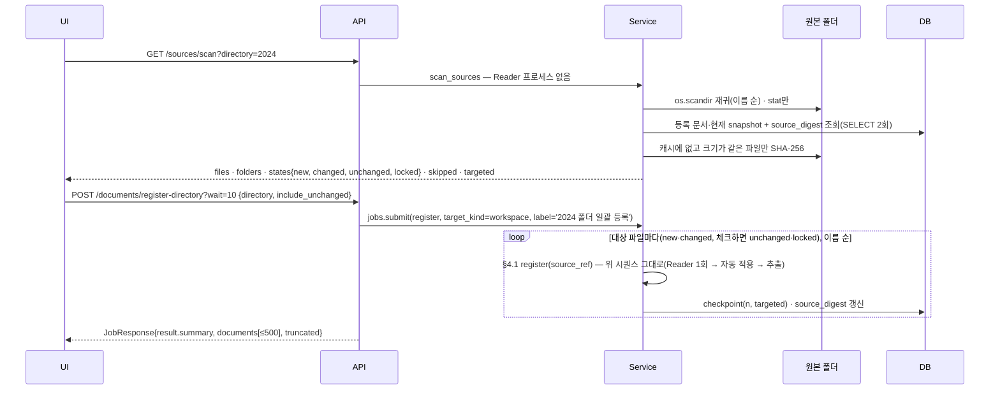

- 스캔은 **Reader 프로세스를 띄우지 않는다**. 메인 프로세스에서 stat을 보고, 크기가 같은 기존 문서만 내용 해시(Reader의 `change_token`과 같은 SHA-256)로 비교하며, 해시는 `source_digest`에 `(byte_size, mtime_ns)` 키로 캐시된다. 단일 등록·watch·일괄 등록 어느 경로로 들어온 문서든 등록 직후 캐시가 채워지므로, 같은 폴더를 다시 미리보기 해도 파일을 읽지 않는다.
- Reader는 **등록 대상에만** 붙는다: 기본은 `new + changed`(다른 provider는 `registered` 포함), `include_unchanged: true`면 `unchanged`·`locked`까지 다시 읽는다. 변경 없는 파일이 많은 폴더를 다시 돌리는 비용은 스캔 비용이다.
- 파일 하나의 Problem은 그 행의 `error`로 남기고 다음 파일로 간다 — **전부 실패해도 작업은 `succeeded`**이고 요약이 결과물이다(스캔 자체의 Problem만 작업 `failed`). 취소하면 그때까지 등록된 문서는 남는다.
- 한도: 걸은 항목 200,000개 또는 대상 파일 `SCHEMA_REGISTER_DIRECTORY_LIMIT`(기본 10,000)를 넘으면 413 `DIRECTORY_LIMIT`("하위 폴더를 나누어 등록하세요"). 심볼릭 링크와 `.`으로 시작하는 폴더는 따라가지 않고, `~$` 임시 파일·대상 외 확장자는 `skipped`로 센다.
- 일괄이어도 등록 규칙은 §4.1과 같다: 이미 있는 문서의 새 내용은 새 snapshot으로 승계되고 **여전히 `proposed`**(자동 승인 없음, [decisions.md §1](design/decisions.md)·[§11](design/decisions.md)).

### 2.2 검수 (Source Review)

`POST /mappings/{mid}/revisions {expected_seq, status, field_key?, effective_spec?, regions?, extract}` → `mapping_revision(revision_no = expected_seq + 1)` 삽입(트리거가 CAS 검사 후 헤드 갱신) → `mapping_region` 기록 → 헤드가 전부 approved면 같은 요청에서 추출·발행(`?wait`). 충돌은 409 `EDIT_CONFLICT`(리비전·영역 롤백).

### 2.3 렌더(원본 보기)

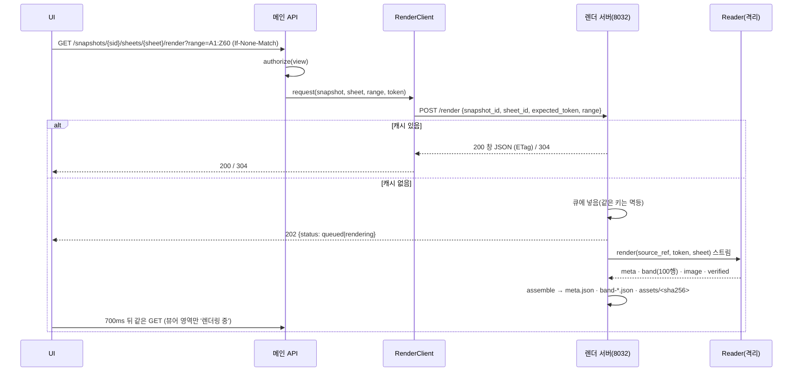

창 JSON은 `rows/columns`(스크롤 기하, 전체)와 `cells/merges/images`(창 안만)를 담고, 이미지는 `/api/snapshots/{sid}/render-assets/{asset_id}`(권한 확인 후 스트리밍, `private, no-cache` + ETag)로 따로 받는다. 새 snapshot이 생기면 이전 snapshot 캐시를 무효화한다.

### 2.4 데이터 빌드

`POST /builds/candidates` → 문서별 사용 가능/제외 사유·필드별 값 있는 문서 수 → `POST /builds/preview`(50행, 셀마다 원본 위치) → `POST /builds {format}` → `<ws>/data/exports/<build_key>/data.{csv|xlsx|sqlite}` + `manifest.json`(sources·columns·excluded·conflicts). `build_key`는 입력(문서·스키마 rev·컬럼·행 모드·발행 실행)의 해시라 같은 입력은 재사용한다. 문서 200개·행 20만 초과는 작업으로 돌리고 작업 내역에서 내려받는다.

### 2.5 보호 문서(DRM) 접근

**전제는 보호 문서가 기본이고 평문 OOXML이 예외다**(계약 §3.5, 결정 [decisions.md §16](design/decisions.md)). 확장자가 아니라 원본 **앞 32바이트**로 컨테이너를 판별하고, 보호 문서는 잠금으로 끝내지 않고 운영자가 연결한 Reader에게 넘긴다. `DRM_READER_REQUIRED`는 넘길 Reader가 없을 때만 남는 마지막 상태이고, 그 문구는 무엇을 설정해야 하는지 말한다.

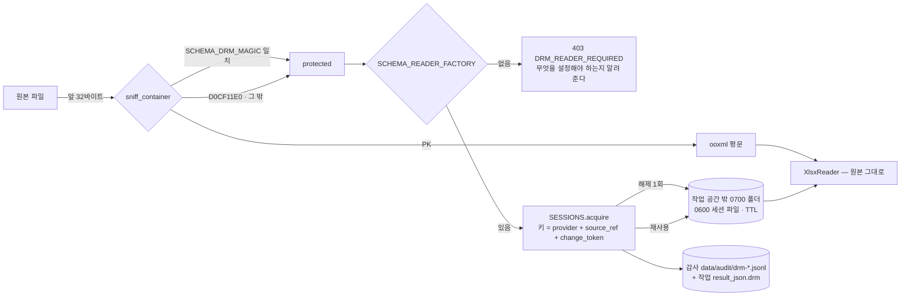

- **판별은 `make_reader` 한 곳에서만** 한다. `XlsxReader.authorize`는 컨테이너로 잠금을 판정하지 않는다 — 두 곳에서 판정하면 어댑터를 붙여도 계속 잠기는 화면이 남는다.
- **해제 비용은 snapshot마다 한 번**이다. 세션 키가 `document_snapshot.change_token`이라 같은 snapshot의 `describe`·`match`·`match_specs`·`extract`·`render`는 같은 해제본을 다시 쓴다(설계 문서 기준 건당 약 5초를 연산마다 치르지 않는다). `SCHEMA_DRM_CACHE_TTL_SECONDS=0`이면 재사용 없이 연산마다 해제하고 즉시 지운다.
- **해제본은 작업 공간 안에 만들지 않는다.** 폴더가 `<ws>` 아래를 가리키면 서버가 `DRM_TEMP_IN_WORKSPACE`로 시작을 거부한다. 임시 폴더는 0700으로 **새로** 만들고, 이미 있으면 `lstat`으로 (심볼릭 링크가 아닌지 · 내 소유인지 · 남에게 열려 있지 않은지) 확인해 하나라도 어긋나면 `DRM_TEMP_UNSAFE`로 시작을 막는다(예측 가능한 공용 경로에 남이 만들어 둔 폴더를 그대로 쓰지 않는다). 서버는 시작할 때 **살아 있는 프로세스가 붙잡고 있지 않은** 항목만 비운다(진행 중인 해제의 부분 파일과 잠금 파일은 남긴다 — 그것까지 지우면 상호 배제가 깨진다).
- **지우는 자리는 연산이 끝나는 자리다.** 각 Reader 연산(`describe`·`match`·`match_specs`·`extract`·`render`)이 `finally`에서 세션을 놓고, Reader 자식 프로세스는 SIGTERM을 받아도(타임아웃·취소·스트림 중단) 감사와 삭제를 마치고 끝낸다. `atexit`에만 기대면 forkserver 자식(`os._exit`)과 강제 종료 경로에서 평문이 그대로 남는다.
- **해제된 내용에서 나온 파생물도 작업 공간에 남기지 않는다.** 보호 문서 snapshot의 렌더 결과(셀·서식·워크북에 박힌 이미지)는 `<ws>/data/render-cache`가 아니라 렌더 서버 메모리(`MemoryRenderCache`, `SCHEMA_RENDER_MEMORY_MB`·`_TTL_SECONDS`)에만 둔다. 평문 문서는 그대로 디스크 캐시를 쓴다.
- **모든 접근이 기록에 남는다**: `<ws>/data/audit/drm-<YYYYMMDD>.jsonl`(append-only, 0600)과 그 접근을 일으킨 작업의 `result_json.drm{unlocked, reused, failed}`. 해제본 경로·자격 증명·파일 내용은 쓰지 않는다.
- 운영자 확인은 `python -m schema drm-probe --ws <ws> [--unlock]`(종료 코드 0 정상 · 1 해제 실패 · 2 어댑터 없음)와 설정 화면의 Reader 카드다. 윈도우 Excel COM 참조 구현(`schema.drm:excel_com_reader`)은 **기본으로 연결되지 않고** 운영자가 `SCHEMA_READER_FACTORY`로 가리켜야 쓰인다. 해제 경로 선택지와 담당자 확인 목록은 [design/drm-integration.md](design/drm-integration.md).

### 2.6 문서 삭제와 정의 폐기

치우는 길이 둘로 갈린다. **문서는 진짜 지우고, 파싱 스키마·프로파일은 지우지 않고 폐기한다** — 문서 아래 기록은 원본 파일에서 다시 만들 수 있는 파생물이지만 정의는 그 자체가 자산이고 과거 추출값의 근거이기 때문이다(계약 §4.13·§4.2.3, 결정 [decisions.md §19](design/decisions.md)).

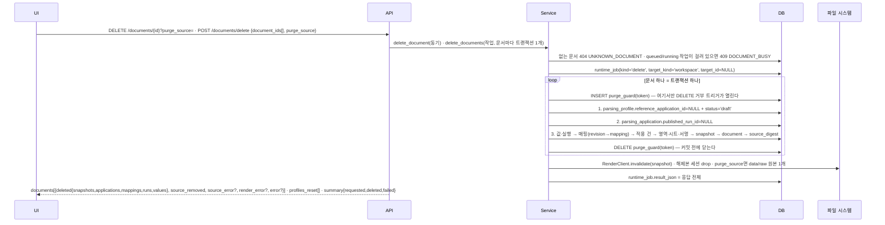

- **지우는 것**: `document`와 그 아래 `document_snapshot`·`sheet`·`snapshot_signature`·`source_region`, `parsing_application`·`application_sheet`·`mapping`·`mapping_revision`·`mapping_region`, `extraction_run`·`extracted_value`·`extracted_value_region`, 그 snapshot들의 렌더 캐시와 `source_digest` 행. **남기는 것**: 원본 파일(기본), 스키마·프로파일 정의와 projection, 작업 내역.
- 삭제 순서는 FK가 강제한다: `parsing_profile.reference_application_id`와 `parsing_application.published_run_id`를 먼저 NULL로 내리고, `mapping.current_revision_id`는 DEFERRABLE이고 `mapping_head_guard`가 직접 UPDATE를 막으므로 **NULL로 내리지 않고** 같은 트랜잭션에서 `mapping_revision` → `mapping` 순으로 지운다.
- **대표 문서가 사라진 프로파일은 초안으로 내려간다**(`status='draft'`, 참조는 NULL). 자동 승인을 계속할 근거가 사라졌기 때문이고, 그 사실을 응답 `profiles_reset[]`과 작업 기록에 함께 남긴다.
- `purge_source=true`면 `<ws>/data/raw`의 원본 파일 **하나**만 지운다. 경로는 등록 때와 같은 규칙으로 정규화하고 중간 폴더·마지막 파일 어디에 심볼릭 링크가 있으면 따라가지 않으며 raw 밖이면 지우지 않는다(폴더는 지우지 않는다). **판정은 provider가 아니라 위치다** — 보호 문서(DRM)도 원본은 raw에 있고 Reader가 거기서 읽으므로 같은 규칙으로 지우고, `PURGE_UNSUPPORTED`는 raw 아래에 파일이 없는 비로컬 provider(진짜 원격 vault)에만 남는다. 원본 삭제가 실패해도 **DB 삭제는 유효하고** 그 행의 `source_error{code}`(`SOURCE_MISSING`·`SOURCE_SYMLINK`·`SOURCE_OUTSIDE_RAW`·`PURGE_UNSUPPORTED`·`SOURCE_REMOVE_FAILED`)로만 알린다 — `summary.failed`에는 세지 않는다.
- 렌더 캐시 무효화가 실패하면(렌더 서버 중단) 그 행에 `render_error{code, message}`를 실어 **셀 내용 파생물이 디스크에 남았다**는 것을 화면과 작업 기록에 드러내고, 다음 서버 시작에서 `Service.reclaim_render_cache()`가 `document_snapshot`에 없는 snapshot 디렉터리를 회수한다.
- 되돌릴 수 없는 일이라 **문서마다** 그때까지의 요약을 `runtime_job.result_json`에 먼저 적는다. 취소하면 `Cancelled`에 실어 보낸 부분 요약이 그대로 남고(`cancelled` + `completed`), 서버가 중단돼도(`INTERRUPTED`) 마지막 문서까지의 요약이 남는다 — '무엇을 지웠는지'를 잃지 않는 것이 규칙의 목적이다.
- 진행 중 작업 가드(409 `DOCUMENT_BUSY`)는 `target_kind`가 `document`·`application`인 작업뿐 아니라 **그 문서에 적용된 프로파일을 대상으로 하는 재파싱**(`profile`)도 본다. 재파싱은 한 작업에서 여러 문서를 돌기 때문이다. 문서 상세의 한 건 재파싱(§4.9)도 **같은 가드**를 쓴다 — 같은 적용 건을 두 작업이 동시에 잡지 않게 한다.
- 다중 삭제는 한 번에 200개까지(`TOO_MANY_DOCUMENTS`)이고, 한 건이 실패해도 작업은 `succeeded`다(폴더 일괄 등록과 같은 원칙 — 요약이 결과물이다). 작업 행의 `target_id`는 **언제나 NULL**이다: 지워진 문서를 가리키면 작업 내역이 죽은 링크가 된다.
- **스키마 폐기**는 `POST /schemas/{key}/deprecate` · `POST /schemas/{key}/activate`이고 두 응답 모두 `GET /schemas/{key}`와 같은 형태라 화면이 응답 하나로 헤더·칩·버튼을 갱신한다. 새 리비전을 저장해도 `status`는 유지되며(되돌리는 길은 `activate` 하나다), 폐기한 스키마는 목록 기본(`GET /schemas?status=active`)·새 프로파일 대화상자·데이터 빌드의 스키마 선택에서 빠지고 `POST /profiles`가 422 `SCHEMA_DEPRECATED`로 막히지만, **이미 승인된 프로파일은 새 문서에 계속 자동 적용된다** — 그것을 멈추는 것은 프로파일 폐기다. 조회(상세·트리·그래프·필드·연관 목록)는 상태와 무관하게 열린다.
- 기존의 조건부 삭제(`DELETE /schemas/{key}` 409 `SCHEMA_IN_USE` · `DELETE /profiles/{id}` 409 `PROFILE_IN_USE`)는 "한 번도 쓰이지 않은 것을 치우는" 탈출구로 그대로 있다. 일상 경로는 폐기다.

---

## 3. API 지도 (화면 → `/api`)

| 화면 | 진입 호출(≤3) | 주요 쓰기 |
|---|---|---|
| 문서 | `GET /documents`, `GET /profiles`(필터), `GET /status`(쉘 공유) | `POST /documents/register?wait`, `GET /sources/scan?directory=`(폴더 미리보기) → `POST /documents/register-directory?wait`, `POST /snapshots/{sid}/applications?wait`, `DELETE /documents/{id}?purge_source=`(단건·동기) · `POST /documents/delete?wait {document_ids[], purge_source}`(선택 체크박스 → 작업, 200개 상한) |
| 문서 상세 | `GET /documents/{id}`, `GET /snapshots/{sid}/sheets`, 탭별 1건(`GET /snapshots/{sid}/values` · `GET /snapshots/{sid}/applications`) | `POST /applications/{aid}/reparse?wait`(적용 프로파일 행의 `다시 파싱` — 이 적용 건 **하나**만 현재 프로파일 리비전으로 다시 맞추고 추출한다. 이미 최신이면 아무것도 하지 않고, 폐기된 프로파일은 422다), `POST /snapshots/{sid}/applications?wait`(다른 프로파일로 파싱), `DELETE /documents/{id}?purge_source=` |
| 파싱 프로파일 | `GET /profiles`, `GET /profiles/{id}`, `GET /profiles/{id}/revisions/{rev}`, `GET /profiles/{id}/revisions`(목록과 상세를 한 화면에 그려 목록 호출만큼 예산 +1) | `POST /profiles`, `PUT /profiles/{id}`(새 리비전), `POST /profiles/import-preview`, `POST /profiles/{id}/test`(저장된 리비전만), `approve`, `reparse` |
| 파싱 스키마 | `GET /schemas?status=`(`active` 기본 · `deprecated` · `all`), `GET /schemas/{key}`, `GET /schemas/{key}/tree` (그래프는 토글 시, 리비전 JSON은 `GET .../revisions/{rev}` — `rev`는 1 이상, 0은 422) | `POST /schemas`(생성 전용 — 있는 키는 409 `SCHEMA_EXISTS`) · `PUT /schemas/{key}`(새 리비전) · `POST /schemas/{key}/deprecate`·`/activate`(응답은 스키마 상세와 같은 형태) · `DELETE /schemas/{key}`(409 `SCHEMA_IN_USE`) · `POST/PATCH/DELETE .../fields/{key}`(409 `FIELD_IN_USE`·`FIELD_HAS_CHILDREN`·`LAST_FIELD`) |
| 데이터 빌드 | `POST /builds/candidates` (스키마 선택 시 1회 더) | `POST /builds/preview`, `POST /builds?wait` |
| 작업 내역 | `GET /queues`, `GET /jobs`, `GET /queues/{kind}` | `POST /queues/{kind}/groups/{key}/actions?wait`, `POST /jobs/{id}/cancel` |
| Source Review | `GET /applications/{aid}`, 렌더 창 ≤2 | `POST /mappings/{mid}/revisions`, `rollback`, `POST /applications/{aid}/approve-all?wait` |
| 설정 | `GET /settings`(`reader.drm` 포함), `GET /normalization-presets` | — |

전체 경로와 응답 형태는 [design/contracts.md §6](design/contracts.md).
메인 API에는 **사용자 인증이 없다** — `python -m schema serve`는 기본으로 `127.0.0.1`에 바인딩하고, `--host`로 그 밖에 열면 시작할 때 stderr에 경고 한 줄이 나온다(결정 [decisions.md §15](design/decisions.md)). 렌더 서버와 주고받는 내부 bearer(`SCHEMA_RENDER_TOKEN`, 옛 이름 `SCHEMA_ACCESS_TOKEN`)는 서버 대 서버라 그대로 있다. 인증이 없는 자리는 **출처 검사**가 메운다: `/api/*`는 `Host`가 루프백(또는 `SCHEMA_ALLOWED_HOSTS`)이 아니면 400 `HOST_NOT_ALLOWED`, 교차 출처 쓰기는 403 `CROSS_ORIGIN_DENIED`로 끊는다 — DNS 리바인딩 방어다.

---

## 4. 프런트 (`frontend/src/app/`)

승인 목업([design/assets/ui-approved-mockup.svg](design/assets/ui-approved-mockup.svg)) 그대로 좌측 사이드바 `문서 · 파싱 프로파일 · 파싱 스키마 · 데이터 빌드 · 작업 내역`(+ 설정), 상단 통합 검색, Source Review는 독립 메뉴가 아닌 오버레이(`?review=` / `?test=<profile_id>&snapshot=<snapshot_id>`)다. 테스트 오버레이는 **저장된 리비전만** 연다 — 저장 전 초안에는 리비전이 없어 테스트가 성립하지 않는다(결정 [decisions.md §14](design/decisions.md)).

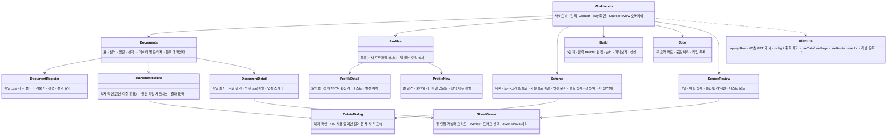

- `+ 문서 등록` 대화상자는 두 모드다: 파일 체크박스(`POST /documents/register`)와 **폴더 일괄 등록**(툴바 `이 폴더 전체 등록`·폴더 행 `전체 등록` → `GET /sources/scan?directory=` 미리보기 칩 `새 파일 · 변경된 문서 · 변경 없음 · 잠김`, 체크박스 `변경 없는 문서·잠긴 문서도 다시 읽기`, 주 행동 `N개 등록 시작` → `POST /documents/register-directory?wait=10` → 진행률 `(completed/total)` → 요약 `N개 중 R개 등록 · U개 변경 없음 · F개 실패`와 파일별 결과 표). 미리보기는 폴더당 1회 호출이고 대상이 0이면 시작 버튼이 비활성이다.
- 화면 문자열에 내부 ID(UUID·SHA-256)를 쓰지 않는다(`frontend/tests/ids.test.tsx`), 금지 용어(`템플릿·문서군·KG·Concept·Integration·Template·비활성화`)를 쓰지 않는다(`frontend/tests/terms.test.tsx` — '비활성화' 대신 '폐기'), `src/app/**`의 import 대상은 정적으로 검사한다(`frontend/tests/imports.test.tsx`), 화면 진입 호출 ≤3(`frontend/tests/entry-calls.test.tsx`).
- 파일·라우트·픽스처 설명은 [frontend/src/app/README.md](../frontend/src/app/README.md).
- 프로파일 상세에 **탭이 없다**. 요약줄(프로파일명·리비전·상태·연결 스키마·대표 문서·적용 문서 수) + 정의 JSON 편집기(검증 오류·경고, 저장하면 새 리비전) + `테스트`(문서를 고르면 Source Review 테스트 모드) + 하단 `변경 이력` 하나로 합쳤다. 목록 버튼도 `+ 새 프로파일` 하나이고 외부 정의 붙여넣기·파일 올리기가 그 대화상자 안에 들어간다(결정 [decisions.md §14](design/decisions.md)).
- 문서 목록에서 행을 고르면 하단 선택 바가 `N개 선택 · 선택 해제 · 데이터 빌드에 추가 · 삭제`다. `삭제`와 상세 드로어의 단건 삭제는 같은 확인 대화상자(`DocumentDelete` → `DeleteDialog`)를 쓰고, 기본이 해제된 체크박스 `원본 파일도 함께 지우기 (data/raw)`가 붙는다. 결과는 지운 문서 수·원본 파일·실패·초안으로 내려간 프로파일 수를 한 줄씩 요약한다.
- 스키마 화면의 쓰기 행동은 `+ 새 스키마`(생성 전용) · `새 리비전` · `이름 바꾸기` · `폐기`/`폐기 해제` · `삭제` · `+ 필드 추가` · 필드 `편집`/`삭제`다. `폐기`/`폐기 해제`는 상태에 따라 **둘 중 하나만** 그리고(`폐기`만 확인 모달을 거친다 — 되돌릴 수 있는 `폐기 해제`는 바로 호출), `삭제`는 `profile_count === 0 && application_count === 0`일 때만 그린다. 삭제는 확인 모달을 거치고, 409(`SCHEMA_IN_USE`·`FIELD_IN_USE`·`FIELD_HAS_CHILDREN`·`LAST_FIELD`)면 모달을 **열어 둔 채** 서버 `message`와 `사용 프로파일 보기`·`하위 필드 보기` 버튼을 붙인다. 화면 낱말은 프로파일과 맞춰 **'폐기'** 하나로 쓴다 — '비활성화'는 쓰지 않는다(`frontend/tests/terms.test.tsx`의 금지어).
- 설정 화면에 사용자 접근 토큰 입력칸이 없다. Reader 카드가 보안 읽기 어댑터 연결 상태·해제본 임시 폴더·해제 캐시 유지 시간·등록된 시그니처 수를 보여 준다(`GET /settings`의 `reader.drm`).
- `App.tsx`에 버전 분기가 없다. 화면은 이것 하나이고 URL 질의는 `?screen=`·`?review=`·`?test=` 등 화면 상태에만 쓴다.

---

## 5. 테스트와 E2E

| 계층 | 위치 | 내용 |
|---|---|---|
| 스키마 불변식 | `tests/test_schema.py`, `tests/test_schema_postgres.py` | 리비전 불변·CAS·발행 조건·projection 삭제 조건(참조 있으면 거부·없으면 통과)·snapshot 바인딩·레벨·group 필드·pglast, **삭제 가드**(가드 없는 `DELETE`는 여전히 ABORT · `<table>_no_update` 여덟 개는 가드 안에서도 그대로) |
| DSL·엔진·정규화 | `tests/test_profile.py`, `test_engine.py`, `test_normalization.py` | 문법·기본값·adapter·앵커/composite/relations/regex·매치 판정·split_delimiter |
| 렌더 | `tests/test_render.py` | 밴드·창 불변식·asset 격리·202/200/304·멱등 큐·세대·격리 중 응답 시간 |
| 서비스·API | `tests/test_service.py`, `test_api.py`, `test_build.py`, `test_operations.py`, `test_runtime.py` | 등록→자동 적용→검수→승인→재파싱→추출→빌드→큐→새 snapshot 승계→테스트→검색·상태 전이, 2,000건 목록 성능 |
| 스키마 쓰기 | `tests/test_schema_write.py` | `POST /schemas` 생성 전용(409 `SCHEMA_EXISTS`, 아무것도 쓰지 않음)·`PUT` 새 리비전·스키마/필드 삭제와 409 네 가지(`LAST_FIELD` 포함)·`PATCH` 필드 상세 응답·`revisions/{rev}`의 `rev ≥ 1`(0은 422)·메인 API 무인증, **폐기/폐기 해제**(응답이 상세와 같은 형태·기본 목록에서 숨음·`status=` 필터·두 번 부르면 409·폐기 스키마의 `POST /profiles`는 422 `SCHEMA_DEPRECATED`이고 편집·빌드는 열려 있음) |
| 한 건 재파싱 | `tests/test_reparse_application.py` | 새 리비전이 **그 문서에만** 닿음(다른 문서의 헤드·발행 불변)·건너뛴 사유(`up_to_date`·`review_required`·`incompatible`)·승인되지 않은 프로파일의 재추출 갈래와 422 `PROFILE_NOT_APPROVED`·진행 중 작업 가드 409 `DOCUMENT_BUSY`·작업 행(`kind=reparse` · `target_kind=application` · 라벨)·404·추출 실패가 작업을 실패로 만들지 않음 |
| 문서 삭제 | `tests/test_delete.py` | 자기 행만 지우고 원본은 남김·작업 내역 기록·`purge_source`(심볼릭 링크 거부·없는 파일·로컬 아닌 provider)·대표 문서 삭제 시 프로파일 초안 강등·다시 등록하면 새 문서·다중 삭제(중복 제거·계속 진행·요약·빈 목록/200개 초과)·`DOCUMENT_BUSY`·404·렌더 캐시 무효화와 해제본 정리·렌더 실패가 DB 삭제를 되돌리지 않음 |
| 보호 문서(DRM) | `tests/test_drm.py` | 컨테이너 판별·시그니처 설정·Reader 선택 한 곳·snapshot당 1회 해제와 재사용·작업 공간 밖 강제·TTL/총량 정리·감사 줄·`drm-probe` 출력과 종료 코드 |
| 폴더 일괄 등록 | `tests/test_register_directory.py`, `tests/test_watch.py` | 스캔 분류(new/changed/unchanged/locked)·건너뜀·숨김 폴더·`source_digest` 재사용(해시 호출 0회)·진행률·요약/`truncated`/취소·`include_unchanged`·경로 오류·413 한도·API 두 경로·CLI `register`·watch 재귀 |
| 컴포넌트 | `frontend/tests/*.test.tsx` | 화면별 상호작용 + 규칙 테스트(용어·ID·import·진입 호출·접근성) |
| 브라우저 | `e2e/specs/*.spec.ts` (`cd e2e && npm test`) | 임시 작업 공간 + 렌더 서버 별도 프로세스; `register-directory.spec.ts`가 폴더 트리 등록 → 재스캔(변경 없음) → 다시 읽기 → 변경 감지를, `reparse-application.spec.ts`가 프로파일 v2 저장 → 대표 문서 재승인 → 문서 상세의 `다시 파싱` → 그 문서만 새 리비전으로 발행 → 다시 누르면 `이미 최신` 건너뜀 → 다른 문서 불변을 한 흐름으로 확인한다. 결과는 [e2e-results.md](e2e-results.md) |

---

## 6. 운영

```bash
pip install -e ".[web,test]"
python -m schema seed-demo --workspace /tmp/demo-ws          # 가상 문서·스키마·프로파일
python -m schema render-serve --ws /tmp/demo-ws --port 8032  # 렌더 서버(별도 프로세스)
SCHEMA_RENDER_URL=http://127.0.0.1:8032 python -m schema serve --ws /tmp/demo-ws --port 8010
python -m schema watch --ws /tmp/demo-ws                     # 원본 폴더 감시 → 등록 + 자동 적용(기본 하위 폴더 포함, --no-recursive로 최상위만)
python -m schema register --ws /tmp/demo-ws --directory 2024 # 폴더 아래 전부 등록(요약 JSON; --include-unchanged로 다시 읽기)
python -m schema drm-probe --ws /tmp/demo-ws --unlock        # 보호 문서를 실제로 읽을 수 있는지 점검(0 정상 · 1 해제 실패 · 2 어댑터 없음)
```

**메인 API는 기본으로 `127.0.0.1`에만 바인딩하고, `/api/*`는 `Host`·`Origin`을 검사한다(`SCHEMA_ALLOWED_HOSTS`로 넓힌다).** 사용자 대상 인증은 없다 — `--host`로 그 밖에 열면 시작할 때 stderr에 경고 한 줄이 나오고, 앞단에 인증을 두는 것은 운영자 책임이다(결정 [decisions.md §15](design/decisions.md)). 렌더 서버도 기본이 `127.0.0.1`이고, 루프백이 아닌 host로 열려면 내부 bearer `SCHEMA_RENDER_TOKEN`이 반드시 있어야 한다(403 `RENDER_TOKEN_REQUIRED`).

환경변수(모두 `SCHEMA_` 접두 하나, 구 변수 폴백 없음 — 옛 접두가 설정돼 있으면 시작할 때 stderr로 한 번 경고하고 무시한다. 전체 키와 기본값은 [.env.sample](../.env.sample)):

| 묶음 | 키 |
|---|---|
| 렌더 | `SCHEMA_RENDER_URL`(없으면 in-process 렌더) · `SCHEMA_RENDER_TOKEN`(서버 대 서버 내부 bearer; 옛 이름 `SCHEMA_ACCESS_TOKEN`은 한 릴리스 동안 경고와 함께 폴백) · `SCHEMA_RENDER_CONCURRENCY`(기본 1) · `SCHEMA_RENDER_LRU_MB`/`_CACHE_MB` · `SCHEMA_RENDER_MEMORY_MB`/`_MEMORY_TTL_SECONDS`(보호 문서 파생물은 디스크가 아니라 여기에만) · `SCHEMA_RENDER_QUEUE` |
| Reader | `SCHEMA_READER_FACTORY`(보안 읽기 어댑터 `<모듈>:<함수>`) · `SCHEMA_READER_REVISION` · `SCHEMA_READER_TIMEOUT_SECONDS`/`_MEMORY_MB` · `SCHEMA_READER_CONTEXT` |
| 보호 문서 해제(§2.5) | `SCHEMA_DRM_MAGIC`(벤더 시그니처 목록) · `SCHEMA_DRM_TEMP_DIR` · `SCHEMA_DRM_CACHE_TTL_SECONDS`(900, `0`이면 재사용 없음) · `SCHEMA_DRM_CACHE_MB`(2048) · `SCHEMA_DRM_CACHE_MAX_SESSIONS`(64) · `SCHEMA_DRM_OPEN_TIMEOUT_SECONDS`(60) · `SCHEMA_DRM_COM_LOCK` |
| 그 밖 | `SCHEMA_REGISTER_DIRECTORY_LIMIT`(폴더 일괄 등록 한 번의 대상 파일 상한, 기본 10,000 — 넘으면 413과 함께 하위 폴더로 나누라고 안내한다) · `SCHEMA_PRINCIPAL` |

작업 공간 백업 대상은 정의 파일(`<ws>/schemas/`·`<ws>/profiles/`)과 원본(`<ws>/data/raw/`)이다.
`<ws>/workspace.db`·`<ws>/data/exports/`·`<ws>/data/render-cache/`는 정의와 원본에서 다시 만들 수 있어 Git에 넣지 않는다.
같은 이유로 **문서 등록 기록은 지워도 진실이 사라지지 않는다** — 원본 파일을 남겨 두면 다시 등록해 같은 문서를 만들 수 있다(§2.6).
원본까지 지우는 것은 `purge_source=true`를 고른 사용자의 명시적 선택이고, 그때만 되돌릴 수 없다.
`<ws>/data/audit/drm-*.jsonl`은 보호 문서 접근 기록이라 다시 만들 수 없다 — 보존 기간은 운영 정책을 따르고, 해제본 임시 폴더는 작업 공간 밖이라 백업 대상이 아니다.
