# 아키텍처 — Parsing Schema / Parsing Profile 런타임

런타임(`schema/`, `db/`, `frontend/src/app/`, `e2e/specs/`)의 구조를 그림과 표로 정리한다.
설계 근거는 `docs/design/`의 입력 문서군(시스템 정체성 · 18개 코어안 · 개발 기준안 · 렌더 아키텍처)이고,
코드 단위 계약은 [design/contracts.md](design/contracts.md), 문서 간 충돌의 결정은 [design/decisions.md](design/decisions.md)에 있다.
**스키마나 모듈이 바뀌면 이 문서도 같은 커밋에서 갱신한다.** ERD는 DDL을 `PRAGMA table_info/foreign_key_list`로 읽어 생성했다(컬럼·PK·FK가 실제와 일치).

## 0. 한 장 요약

```text
NASCA/DRM/로컬 Excel ─▶ Reader(격리 프로세스) ─▶ describe(+match) ─▶ document / document_snapshot / sheet
                                                       │
                          approved 파싱 프로파일 ◀──────┘ 매치 서명 identical → 자동 승인 → 추출 → 발행
                                                       └ compatible / draft → proposed → 작업 내역(검수) → Source Review
                                                                                             │
                          파싱 스키마(필드·alias·관계) ◀── mapping_revision.field_id ◀── 승인 ◀┘
                                                       │
                          extracted_value + extracted_value_region(원본 위치) ─▶ 데이터 빌드(일회성 CSV/XLSX/SQLite + manifest)
```

- **정체성**: 보호 문서를 검증된 파싱 스키마(무엇)와 파싱 프로파일(어떻게)로 단일 테이블 데이터로 바꾸어 Agent에 주는 Document-to-Table Adapter. 최종 파일은 산출물이지 Source of Truth가 아니다.
- **DB는 관계·검수 상태·provenance**, 정의 파일(`<ws>/schemas/`, `<ws>/profiles/`)이 스키마·프로파일의 진실이며 DB는 projection이다(삭제 대신 `deprecated`).
- **렌더는 별도 서버**(캐시 키 snapshot + sheet + renderer_version, 밴드 파일, 창 응답, asset 분리). 메인 API는 렌더 완료를 기다리지 않는다.

---

## 1. DB 스키마 (ERD)

`<ws>/workspace.db` 하나에 코어 18개 + `schema_meta` + 런타임 3개(`runtime_job`, `snapshot_signature`, `source_digest`; `schema/db.py`가 만든다) = 22개 테이블,
트리거 35개(불변성·CAS·발행 조건·레벨·projection 보호), 뷰 1개(`current_value`), 명시 인덱스 39개.
PostgreSQL 번역은 [db/schema_postgres.sql](../db/schema_postgres.sql)(pglast 구문·객체 집합 검증, 런타임 미검증).

핵심 규칙:

- 문서의 정체성은 `document_id`, 내용은 `document_snapshot`(불변, `change_token`으로 새 snapshot 판정). 자식 테이블은 모두 `snapshot_id`를 갖고 복합 FK로 같은 snapshot임을 DB가 강제한다.
- 프로파일은 snapshot에 적용된다(`parsing_application`). 규칙별 `mapping`의 헤드는 **마지막 리비전**이고 `edit_seq = 헤드 revision_no`(CAS 트리거). 헤드가 바뀌면 `published_run_id`가 NULL이 된다.
- 값은 `extracted_value`(불변)이고 출처는 **항상** `extracted_value_region`(단일 출처도 행 1개). `source_region_id` 컬럼은 없다.
- `parsing_field`·`parsing_rule`은 DELETE가 금지된다(정의 파일에서 사라지면 `status='deprecated'`).
- `source_digest`는 로컬 원본의 `(byte_size, mtime_ns)` → 내용 SHA-256 캐시다(폴더 일괄 등록 미리보기가 같은 stat이면 파일을 다시 읽지 않게 한다). 진실은 `document_snapshot.change_token`이라 언제 지워도 되고, 다음 스캔이 다시 채운다(계약 §1.6).

### 문서·snapshot·원본 위치

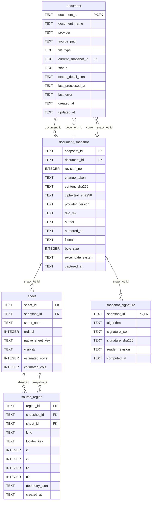

### Parsing Schema (projection)

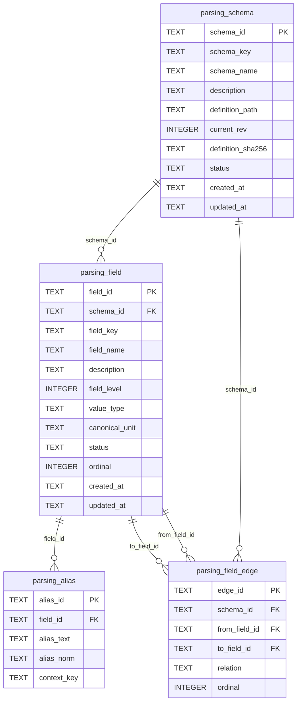

### Parsing Profile (projection)

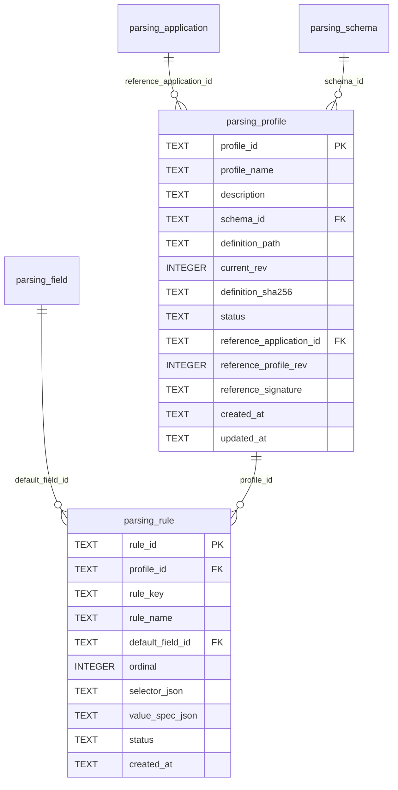

### 적용 건·매핑·리비전

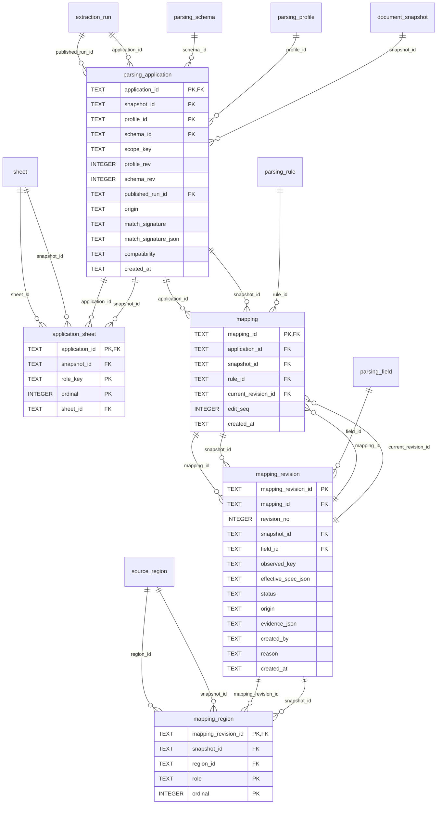

### 추출 실행·값·출처

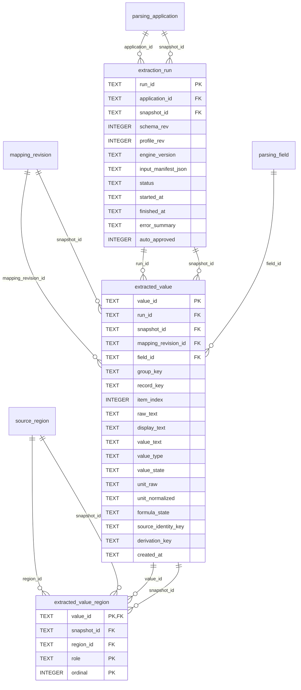

### 런타임

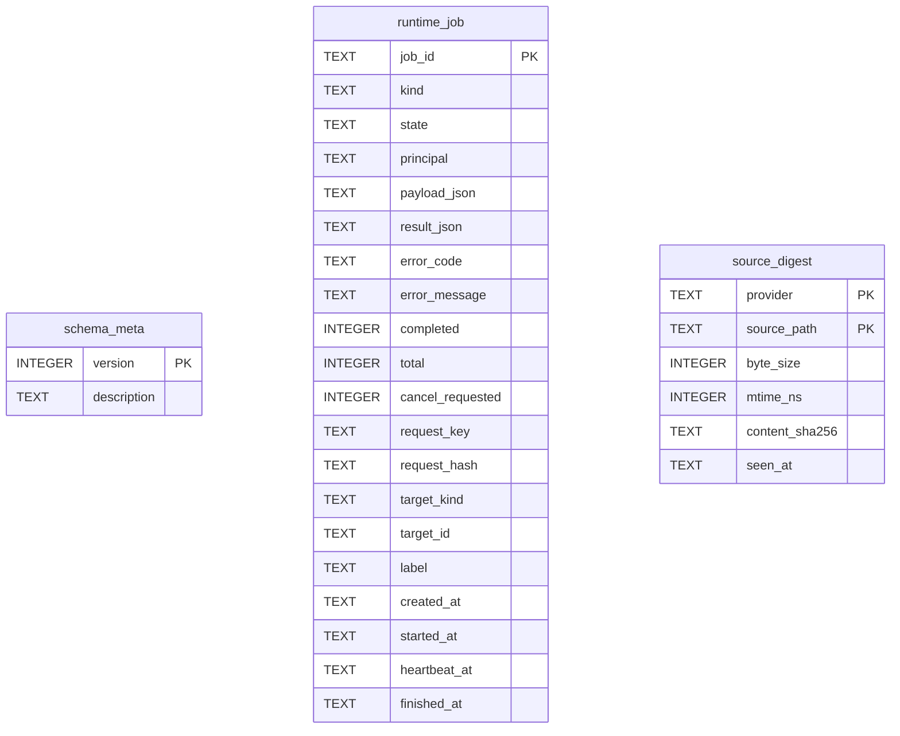

테이블 22개 · 트리거 35개 · 뷰 1개(current_value) · 명시 인덱스 39개

트리거 목록: `application_identity`, `application_starts_unpublished`, `document_snapshot_no_delete`, `document_snapshot_no_update`, `extracted_value_no_delete`, `extracted_value_no_update`, `extracted_value_region_no_delete`, `extracted_value_region_no_update`, `extraction_run_no_delete`, `extraction_run_no_update`, `field_edge_level`, `field_edge_level_update`, `field_edge_same_schema`, `field_group_guard`, `field_group_not_target_revision`, `field_group_not_target_rule`, `field_group_not_target_rule_update`, `field_level_guard`, `mapping_edit_seq`, `mapping_edit_seq_advance`, `mapping_head_guard`, `mapping_head_invalidates`, `mapping_identity`, `mapping_region_no_delete`, `mapping_region_no_update`, `mapping_revision_no_delete`, `mapping_revision_no_update`, `parsing_field_no_delete`, `parsing_rule_no_delete`, `publish_run`, `run_state_transition`, `sheet_no_delete`, `sheet_no_update`, `source_region_no_delete`, `source_region_no_update`

---

## 2. 백엔드 모듈 (`schema/`)

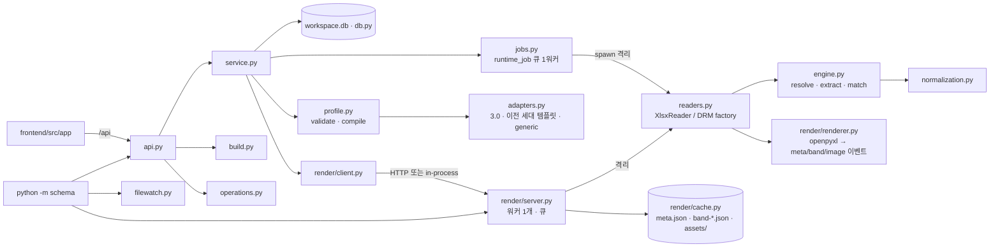

| 모듈 | 책임 | 계약 |
|---|---|---|
| `db.py` | SQLite 저장소(WAL·FK·busy_timeout), 런타임 DDL, `Problem`, 커서/페이지 헬퍼 | §1.6 |
| `jobs.py` | `runtime_job` 큐(단일 워커, heartbeat, 취소, `wait`), Reader 프로세스 격리(`reader_events`·`reader_result`, 시간·메모리·8MB 이벤트 한도) | §1.6, §3.2 |
| `profile.py` | DSL 3.0 검증(`validate_profile`), 앵커 인라인 컴파일(`compile_rule`·`compile_profile`), 관계 위상 정렬 | §2 |
| `adapters.py` | 외부 프로파일 JSON → canonical(`detect_format`, `to_canonical` + 경고 보고) | §2 Import Adapter |
| `normalization.py` | 정규화 op 실행(`trim_text`·`strip_thousands`·`split_unit_suffix`·`percent_to_ratio`·`automatic`·`split_delimiter`), 파이프라인 검증, 프리셋 | §2 normalization |
| `engine.py` | 영역 해결(range/find/regex/relative/anchor/composite), 추출 스트림(group → values → verified), 시트 바인딩, 매치 판정(`match_profile`·`match_specs`, 매치 서명) | §3.1, §3.3 |
| `readers.py` | Reader 계약: `describe(profiles)`(등록 시 프로세스 1회) · `match` · `match_specs` · `extract` · `render`; `SCHEMA_READER_FACTORY`로 DRM Reader 교체 | §3.2 |
| `service.py` | 등록·snapshot 판정·자동 적용·승계·검수(CAS)·추출·발행·프로파일 테스트/승인/재파싱·문서 상태 캐시·조회, 폴더 재귀 스캔·분류(`scan_sources`)와 폴더 일괄 등록 작업(`register_directory`) | §4, §4.1.1 |
| `build.py` | 후보 판정 · 미리보기 · CSV/XLSX/SQLite 생성 · manifest · `build_key` 재사용 · 단위 변환(`UnitRegistry`) | §4.10 |
| `operations.py` | 검수 큐 5종(같은 원인·서명 묶음), 멤버, 묶음 처리 작업 | §4.11 |
| `api.py` | FastAPI `/api`(§6 전부), 오류 봉투, `?wait=`, 렌더 프록시(권한 → ETag/304), 정적 프런트 | §6 |
| `contracts.py` | Pydantic 요청 모델(`extra=forbid`) | §6 |
| `render/*` | 렌더 서버(§5): `renderer`(이벤트) · `assemble`(밴드 파일) · `cache`(창·LRU·세대·asset 검증) · `server`(POST/GET/DELETE/status, 멱등 큐, 실패 보관) · `client`(HTTP·in-process 동일 형태, `RenderUnavailable`) | §5 |
| `watch.py` · `filewatch.py` | 원본 폴더 감시 → 등록+자동 적용(기본 하위 폴더까지, `--no-recursive`로 최상위만; 제외 규칙은 폴더 스캔과 같다). `filewatch.py`는 파일 안정화 판정(`FileEventWatcher`·`StabilityGuard`) | §4.1.1, §9 |
| `__main__.py` | `serve · render-serve · watch · register · import-schema · import-profile · build · seed-demo`(`.env` 자동 로드; 서브커맨드를 생략하면 `serve`) | §9 |

### 2.1 등록 → 자동 적용 → 추출 → 발행

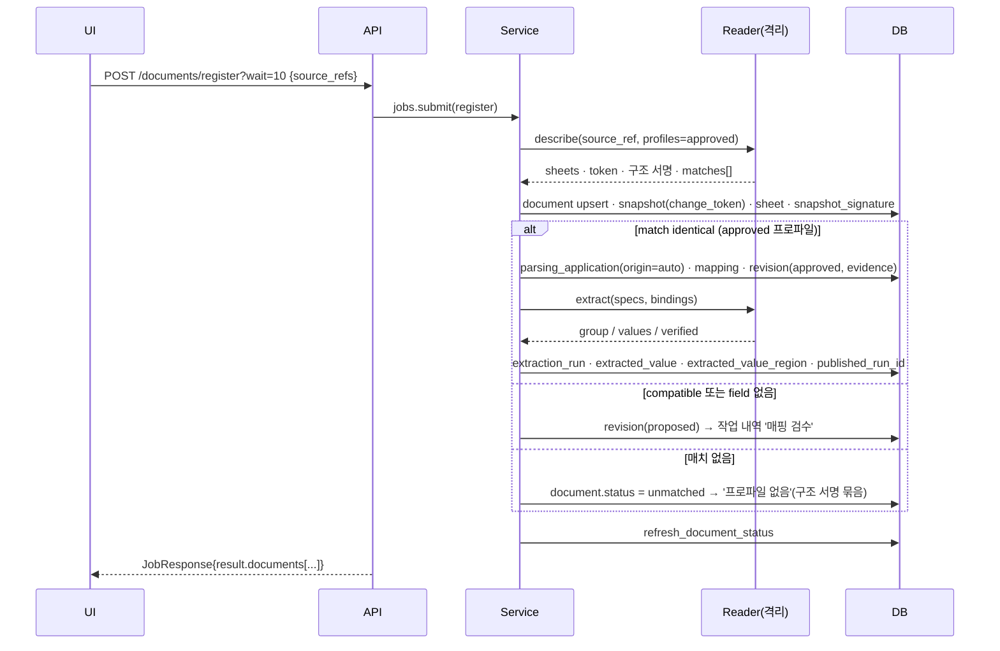

- 같은 문서에 다른 `change_token`이 오면 새 snapshot을 만들고 이전 application을 `match_specs`로 재판정해 **항상 `proposed`(origin inherited)**로 승계한다(자동 승인 없음, [decisions.md §1](design/decisions.md)). 작업 내역 '변경 감지'의 `approve_all`이 승인+추출+발행을 요청 1회로 처리한다.
- 잠긴 파일(DRM Reader 미등록)은 `document.status='locked'` + 실패 작업으로 남는다.

**폴더 일괄 등록(§4.1.1)** — 파일을 하나씩 고르는 대신 루트 폴더 하나를 지정하면 그 아래(하위 폴더 포함) 전부가 대상이다.

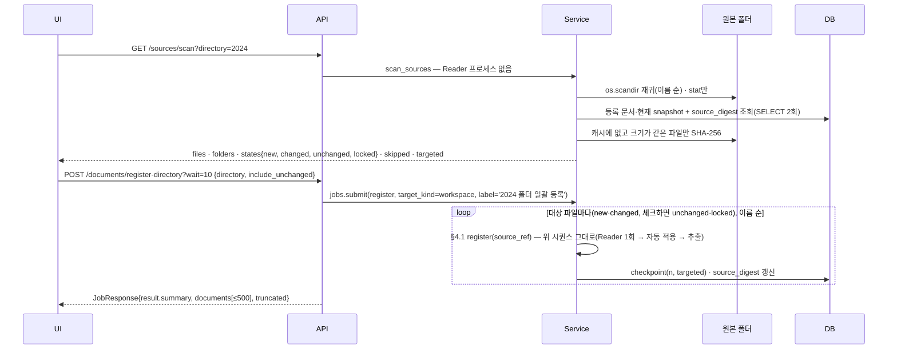

- 스캔은 **Reader 프로세스를 띄우지 않는다**. 메인 프로세스에서 stat을 보고, 크기가 같은 기존 문서만 내용 해시(Reader의 `change_token`과 같은 SHA-256)로 비교하며, 해시는 `source_digest`에 `(byte_size, mtime_ns)` 키로 캐시된다. 단일 등록·watch·일괄 등록 어느 경로로 들어온 문서든 등록 직후 캐시가 채워지므로, 같은 폴더를 다시 미리보기 해도 파일을 읽지 않는다.
- Reader는 **등록 대상에만** 붙는다: 기본은 `new + changed`(다른 provider는 `registered` 포함), `include_unchanged: true`면 `unchanged`·`locked`까지 다시 읽는다. 변경 없는 파일이 많은 폴더를 다시 돌리는 비용은 스캔 비용이다.
- 파일 하나의 Problem은 그 행의 `error`로 남기고 다음 파일로 간다 — **전부 실패해도 작업은 `succeeded`**이고 요약이 결과물이다(스캔 자체의 Problem만 작업 `failed`). 취소하면 그때까지 등록된 문서는 남는다.
- 한도: 걸은 항목 200,000개 또는 대상 파일 `SCHEMA_REGISTER_DIRECTORY_LIMIT`(기본 10,000)를 넘으면 413 `DIRECTORY_LIMIT`("하위 폴더를 나누어 등록하세요"). 심볼릭 링크와 `.`으로 시작하는 폴더는 따라가지 않고, `~$` 임시 파일·대상 외 확장자는 `skipped`로 센다.
- 일괄이어도 등록 규칙은 §4.1과 같다: 이미 있는 문서의 새 내용은 새 snapshot으로 승계되고 **여전히 `proposed`**(자동 승인 없음, [decisions.md §1](design/decisions.md)·[§11](design/decisions.md)).

### 2.2 검수 (Source Review)

`POST /mappings/{mid}/revisions {expected_seq, status, field_key?, effective_spec?, regions?, extract}` → `mapping_revision(revision_no = expected_seq + 1)` 삽입(트리거가 CAS 검사 후 헤드 갱신) → `mapping_region` 기록 → 헤드가 전부 approved면 같은 요청에서 추출·발행(`?wait`). 충돌은 409 `EDIT_CONFLICT`(리비전·영역 롤백).

### 2.3 렌더(원본 보기)

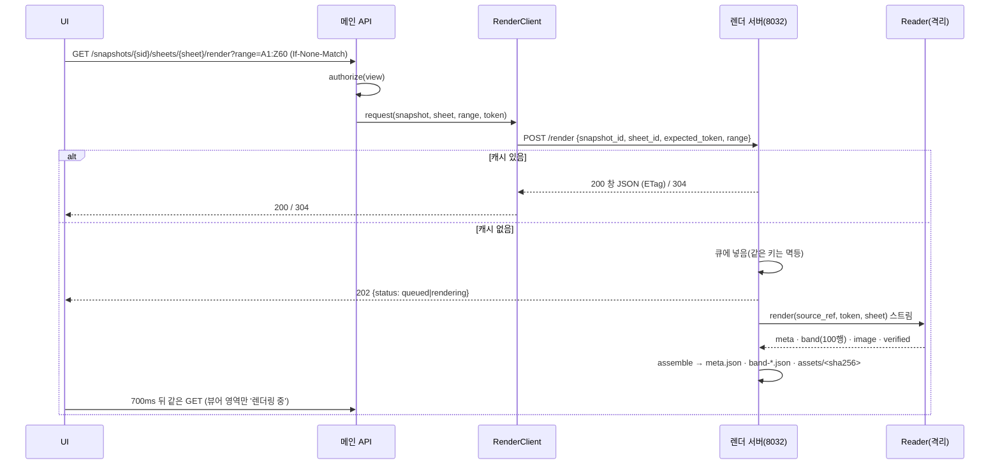

창 JSON은 `rows/columns`(스크롤 기하, 전체)와 `cells/merges/images`(창 안만)를 담고, 이미지는 `/api/snapshots/{sid}/render-assets/{asset_id}`(권한 확인 후 스트리밍, `private, no-cache` + ETag)로 따로 받는다. 새 snapshot이 생기면 이전 snapshot 캐시를 무효화한다.

### 2.4 데이터 빌드

`POST /builds/candidates` → 문서별 사용 가능/제외 사유·필드별 값 있는 문서 수 → `POST /builds/preview`(50행, 셀마다 원본 위치) → `POST /builds {format}` → `<ws>/data/exports/<build_key>/data.{csv|xlsx|sqlite}` + `manifest.json`(sources·columns·excluded·conflicts). `build_key`는 입력(문서·스키마 rev·컬럼·행 모드·발행 실행)의 해시라 같은 입력은 재사용한다. 문서 200개·행 20만 초과는 작업으로 돌리고 작업 내역에서 내려받는다.

---

## 3. API 지도 (화면 → `/api`)

| 화면 | 진입 호출(≤3) | 주요 쓰기 |
|---|---|---|
| 문서 | `GET /documents`, `GET /profiles`(필터), `GET /status`(쉘 공유) | `POST /documents/register?wait`, `GET /sources/scan?directory=`(폴더 미리보기) → `POST /documents/register-directory?wait`, `POST /snapshots/{sid}/applications?wait` |
| 문서 상세 | `GET /documents/{id}`, `GET /snapshots/{sid}/sheets`, 탭별 1건 | — |
| 파싱 프로파일 | `GET /profiles`, `GET /profiles/{id}`, `GET /profiles/{id}/documents` | `POST/PUT /profiles`, `import-preview`, `test`, `approve`, `reparse` |
| 파싱 스키마 | `GET /schemas`, `GET /schemas/{key}`, `GET /schemas/{key}/tree` (그래프는 토글 시) | `POST/PUT /schemas`, `PATCH .../fields/{key}` |
| 데이터 빌드 | `POST /builds/candidates` (스키마 선택 시 1회 더) | `POST /builds/preview`, `POST /builds?wait` |
| 작업 내역 | `GET /queues`, `GET /jobs`, `GET /queues/{kind}` | `POST /queues/{kind}/groups/{key}/actions?wait`, `POST /jobs/{id}/cancel` |
| Source Review | `GET /applications/{aid}`, 렌더 창 ≤2 | `POST /mappings/{mid}/revisions`, `rollback`, `POST /applications/{aid}/approve-all?wait` |
| 설정 | `GET /settings`, `GET /normalization-presets` | — |

전체 경로와 응답 형태는 [design/contracts.md §6](design/contracts.md).

---

## 4. 프런트 (`frontend/src/app/`)

승인 목업([design/assets/ui-approved-mockup.svg](design/assets/ui-approved-mockup.svg)) 그대로 좌측 사이드바 `문서 · 파싱 프로파일 · 파싱 스키마 · 데이터 빌드 · 작업 내역`(+ 설정), 상단 통합 검색, Source Review는 독립 메뉴가 아닌 오버레이(`?review=` / `?test=`)다.

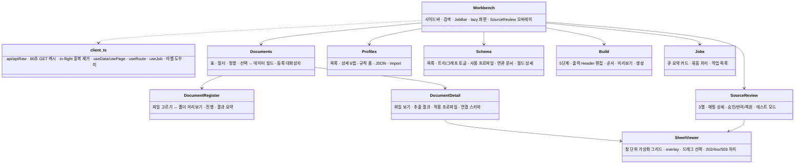

- `+ 문서 등록` 대화상자는 두 모드다: 파일 체크박스(`POST /documents/register`)와 **폴더 일괄 등록**(툴바 `이 폴더 전체 등록`·폴더 행 `전체 등록` → `GET /sources/scan?directory=` 미리보기 칩 `새 파일 · 변경된 문서 · 변경 없음 · 잠김`, 체크박스 `변경 없는 문서·잠긴 문서도 다시 읽기`, 주 행동 `N개 등록 시작` → `POST /documents/register-directory?wait=10` → 진행률 `(completed/total)` → 요약 `N개 중 R개 등록 · U개 변경 없음 · F개 실패`와 파일별 결과 표). 미리보기는 폴더당 1회 호출이고 대상이 0이면 시작 버튼이 비활성이다.
- 화면 문자열에 내부 ID(UUID·SHA-256)를 쓰지 않는다(`frontend/tests/ids.test.tsx`), 금지 용어(`템플릿·문서군·KG·Concept·Integration·Template`)를 쓰지 않는다(`frontend/tests/terms.test.tsx`), `src/app/**`의 import 대상은 정적으로 검사한다(`frontend/tests/imports.test.tsx`), 화면 진입 호출 ≤3(`frontend/tests/entry-calls.test.tsx`).
- 파일·라우트·픽스처 설명은 [frontend/src/app/README.md](../frontend/src/app/README.md).
- `App.tsx`에 버전 분기가 없다. 화면은 이것 하나이고 URL 질의는 `?screen=`·`?review=`·`?test=` 등 화면 상태에만 쓴다.

---

## 5. 테스트와 E2E

| 계층 | 위치 | 내용 |
|---|---|---|
| 스키마 불변식 | `tests/test_schema.py`, `tests/test_schema_postgres.py` | 리비전 불변·CAS·발행 조건·projection 삭제 금지·snapshot 바인딩·레벨·group 필드·pglast |
| DSL·엔진·정규화 | `tests/test_profile.py`, `test_engine.py`, `test_normalization.py` | 문법·기본값·adapter·앵커/composite/relations/regex·매치 판정·split_delimiter |
| 렌더 | `tests/test_render.py` | 밴드·창 불변식·asset 격리·202/200/304·멱등 큐·세대·격리 중 응답 시간 |
| 서비스·API | `tests/test_service.py`, `test_api.py`, `test_build.py`, `test_operations.py`, `test_runtime.py` | 등록→자동 적용→검수→승인→재파싱→추출→빌드→큐→새 snapshot 승계→테스트→검색·상태 전이, 2,000건 목록 성능 |
| 폴더 일괄 등록 | `tests/test_register_directory.py`, `tests/test_watch.py` | 스캔 분류(new/changed/unchanged/locked)·건너뜀·숨김 폴더·`source_digest` 재사용(해시 호출 0회)·진행률·요약/`truncated`/취소·`include_unchanged`·경로 오류·413 한도·API 두 경로·CLI `register`·watch 재귀 |
| 컴포넌트 | `frontend/tests/*.test.tsx` | 화면별 상호작용 + 규칙 테스트(용어·ID·import·진입 호출·접근성) |
| 브라우저 | `e2e/specs/*.spec.ts` (`cd e2e && npm test`) | 임시 작업 공간 + 렌더 서버 별도 프로세스; `register-directory.spec.ts`가 폴더 트리 등록 → 재스캔(변경 없음) → 다시 읽기 → 변경 감지를 한 흐름으로 확인한다. 결과는 [e2e-results.md](e2e-results.md) |

---

## 6. 운영

```bash
pip install -e ".[web,test]"
python -m schema seed-demo --workspace /tmp/demo-ws          # 가상 문서·스키마·프로파일
python -m schema render-serve --ws /tmp/demo-ws --port 8032  # 렌더 서버(별도 프로세스)
SCHEMA_RENDER_URL=http://127.0.0.1:8032 python -m schema serve --ws /tmp/demo-ws --port 8010
python -m schema watch --ws /tmp/demo-ws                     # 원본 폴더 감시 → 등록 + 자동 적용(기본 하위 폴더 포함, --no-recursive로 최상위만)
python -m schema register --ws /tmp/demo-ws --directory 2024 # 폴더 아래 전부 등록(요약 JSON; --include-unchanged로 다시 읽기)
```

환경변수: `SCHEMA_RENDER_URL`(없으면 in-process 렌더), `SCHEMA_READER_FACTORY`(DRM Reader), `SCHEMA_READER_TIMEOUT_SECONDS`/`_MEMORY_MB`, `SCHEMA_RENDER_CONCURRENCY`(기본 1), `SCHEMA_RENDER_LRU_MB`/`_CACHE_MB`, `SCHEMA_REGISTER_DIRECTORY_LIMIT`(폴더 일괄 등록 한 번의 대상 파일 상한, 기본 10,000 — 넘으면 413과 함께 하위 폴더로 나누라고 안내한다), `SCHEMA_ACCESS_TOKEN`, `SCHEMA_PRINCIPAL`. 모두 `SCHEMA_` 접두 하나이며 구 변수 폴백은 없다 — 옛 접두가 설정돼 있으면 시작할 때 stderr로 한 번 경고하고 무시한다(키 목록은 [.env.sample](../.env.sample)).

작업 공간 백업 대상은 정의 파일(`<ws>/schemas/`·`<ws>/profiles/`)과 원본(`<ws>/data/raw/`)이다.
`<ws>/workspace.db`·`<ws>/data/exports/`·`<ws>/data/render-cache/`는 정의와 원본에서 다시 만들 수 있어 Git에 넣지 않는다.
