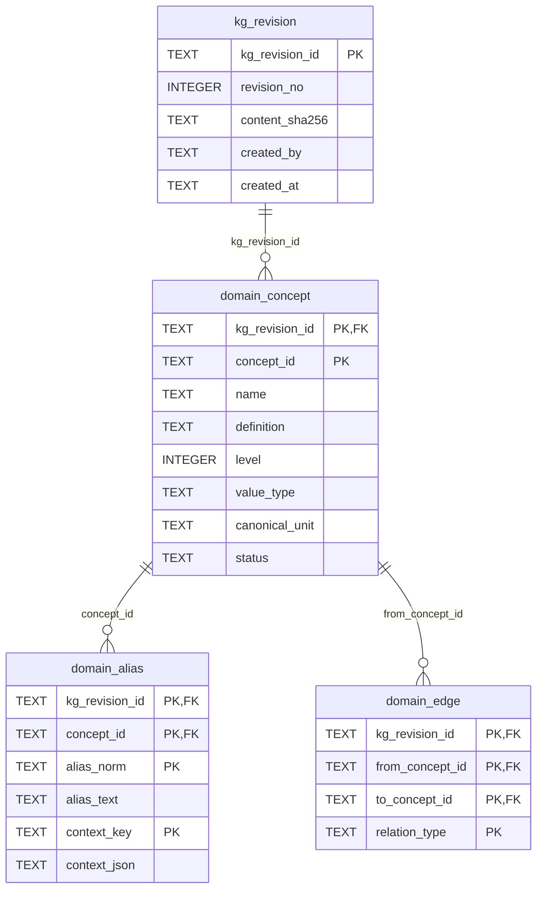
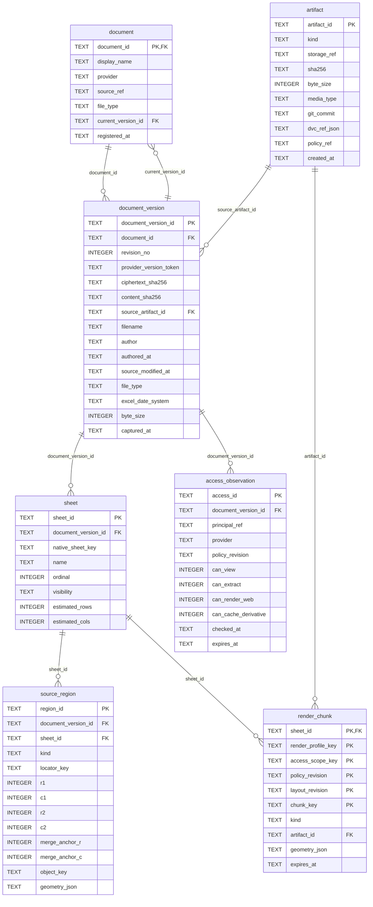
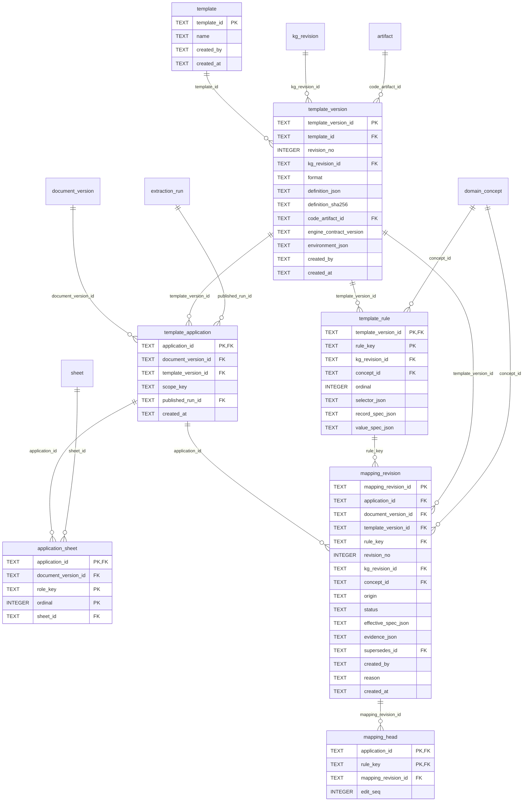
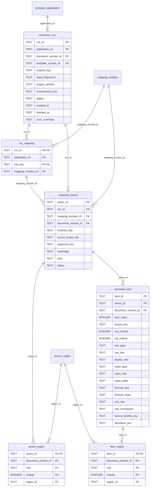
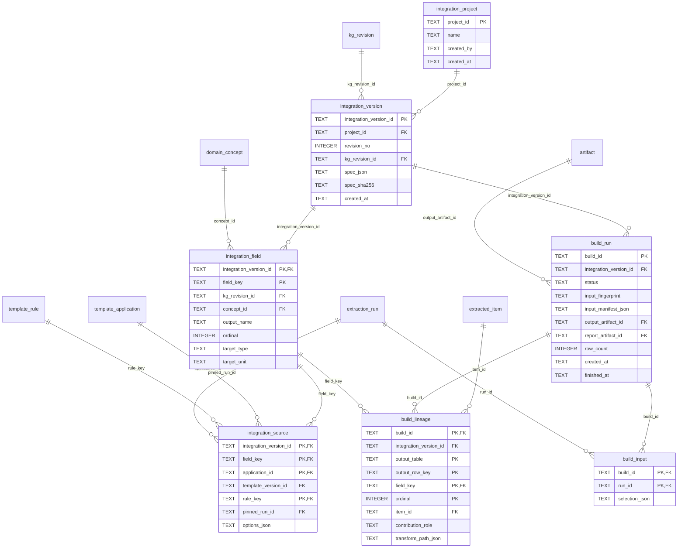
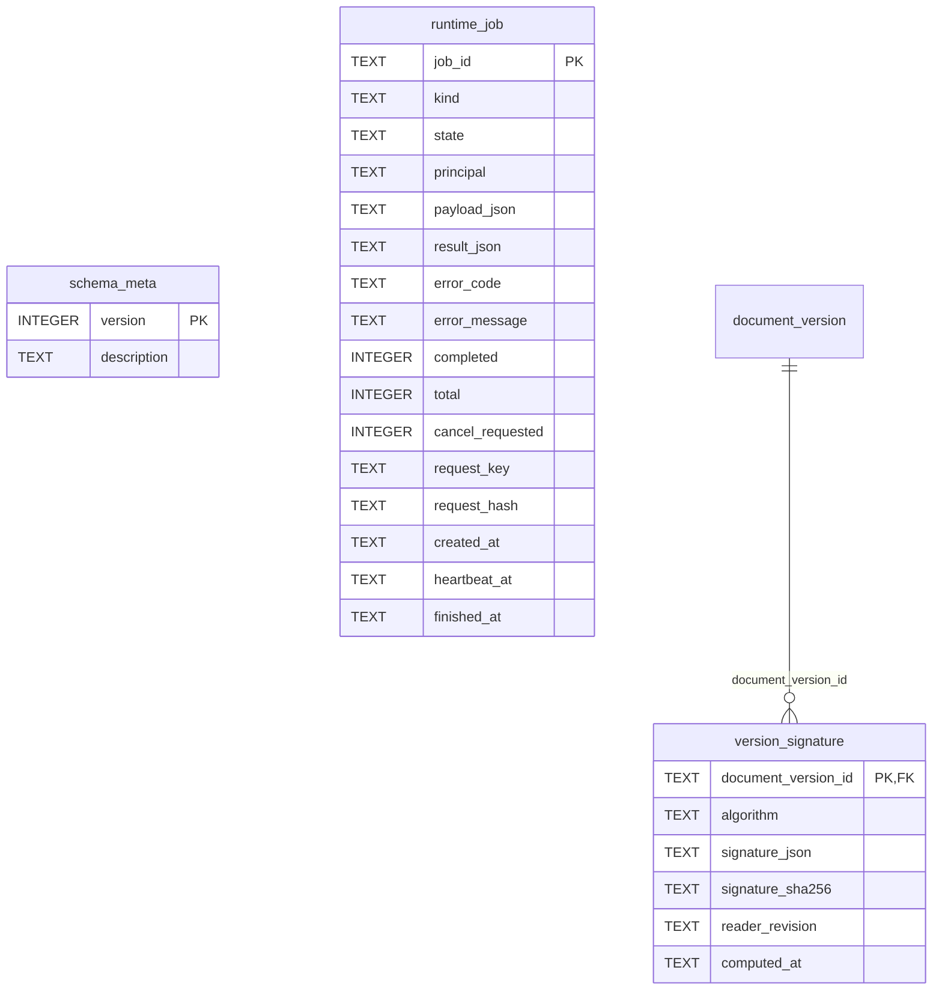
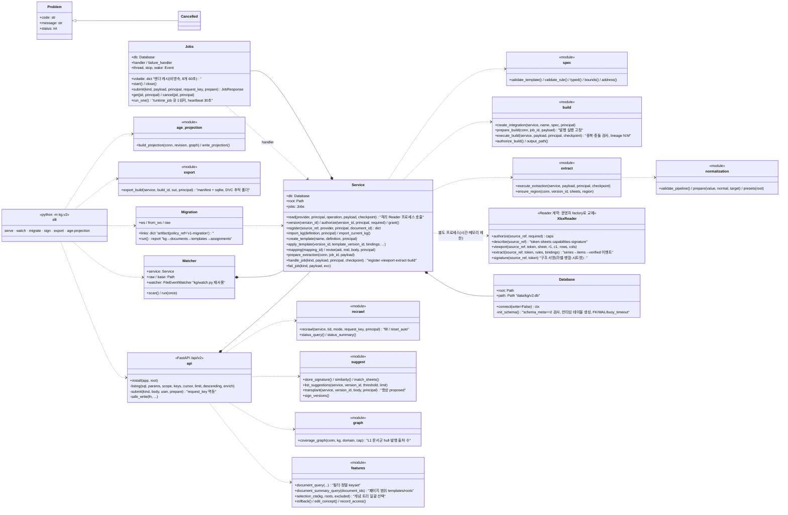
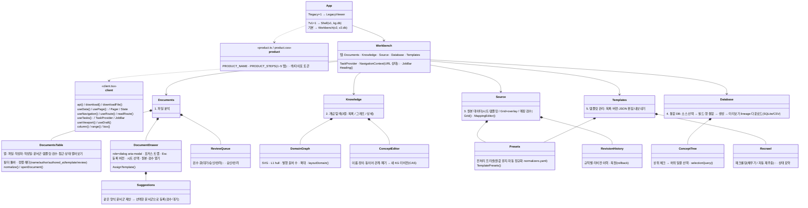
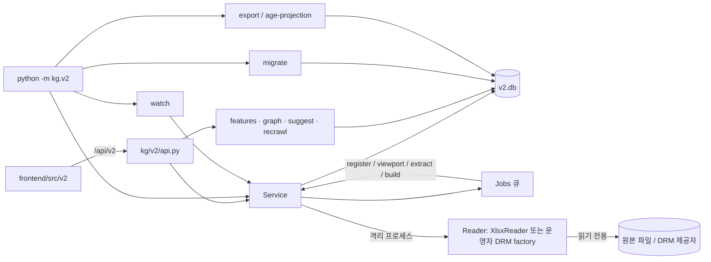

# v2 아키텍처 다이어그램 — DB 스키마(ERD)와 클래스 다이어그램

v2 런타임(`kg/v2/`, `frontend/src/v2/`)의 구조를 그림으로 정리한다. v1(`kg/`, `kg/schema.sql`)은
[ARCHITECTURE.md](ARCHITECTURE.md)가 담당한다. 원본 근거는 [db/v2/schema_sqlite.sql](../db/v2/schema_sqlite.sql),
[kg/v2/db.py](../kg/v2/db.py)의 런타임 테이블, 각 모듈 소스이며 **스키마나 모듈이 바뀌면 이 문서도 같은 커밋에서 갱신한다**.
(GitHub에서 mermaid가 바로 렌더된다.)

- 설계 근거와 규칙: [design/db-schema-v2.md](design/db-schema-v2.md) · 실행 안내: [design/db-schema-v2-runtime.md](design/db-schema-v2-runtime.md)
- PostgreSQL 이식: [design/db-schema-v2-postgres.md](design/db-schema-v2-postgres.md) · 후속 구현 기록: [design/v2-followup.md](design/v2-followup.md)

---

## 1. DB 스키마 (ERD)

워크스페이스 DB `<ws>/data/kg/v2.db` 하나에 DDL 테이블 32개 + 런타임 테이블 2개(`runtime_job`, `version_signature`는
`kg/v2/db.py`가 `CREATE TABLE IF NOT EXISTS`로 만든다), 트리거 72개(불변성·발행 조건·레벨 규칙), 뷰 1개(`current_extracted_item`)가 산다.
아래 ERD는 DDL을 `PRAGMA table_info`/`foreign_key_list`로 읽어 생성한 것이라 컬럼·PK·FK가 실제와 일치한다
(총 34개 테이블, 영역별로 나눠 그림; 다른 영역의 테이블을 참조하는 FK는 그 영역에 빈 상자로 나타난다).

핵심 규칙(자세한 것은 설계 문서 §4·§6):

- 문서의 정체성은 `document_id`(안정 ID)이고 내용은 `document_version`이다. 해시·이름으로 문서를 병합하지 않는다.
- 규칙은 `template_version`(불변)에, 문서별 수정은 `mapping_revision`(추가 전용, `mapping_head`가 현재 승인본과 `edit_seq` CAS)에 남는다.
- 값은 `extracted_item`(불변)이고 모든 항목은 `item_region`으로 원자 출처(셀/병합 앵커/시트)를 가진다. `series_region`은 선택 영역 단위 출처다.
- 사용자 DB는 `integration_version`(불변 명세) → `build_run`(입력 실행 고정 `build_input`) → 결과 한 칸당 `build_lineage` N행이다.
- KG는 `kg_revision` 단위 스냅샷이며 매핑·추출·빌드는 특정 리비전을 참조한다.

### KG — 사람이 발행하는 불변 스냅샷

### 문서·버전·원본 위치

### 템플릿·적용 건·매핑 리비전

### 추출 실행·원자 출처

### 사용자 DB·lineage

### 운영·런타임

### 트리거·뷰 요약

| 종류 | 대상 | 규칙 |
|---|---|---|
| 불변성(`*_immutable`) | `kg_revision`·`domain_*`·`document_version`·`sheet`·`source_region`·`template_version`·`template_rule`·`mapping_revision`·`extraction_run`(완료 후)·`extracted_*`·`*_region`·`build_*` 등 | UPDATE/DELETE 거부 (`... is immutable`) |
| 발행 조건 | `template_application.published_run_id` | 성공한 실행이고 실행이 사용한 매핑이 현재 head와 같을 때만 발행; head가 바뀌면 `published_run_id`를 NULL로 |
| CAS | `mapping_head.edit_seq` | 새 리비전 삽입 시 기대 seq와 일치해야 하며 증가 |
| 계층 | `domain_edge(parent_of)` | 부모→자식 레벨이 정확히 1 증가 (다부모 허용) |
| 뷰 | `current_extracted_item` | 현재 문서 버전의 발행 실행에 속한 항목만 |

---

## 2. 클래스 다이어그램

### 2.1 백엔드 코어 (`kg/v2/`)

### 2.2 요청/명세 계약 (`kg/v2/contracts.py`, Pydantic)

```mermaid
classDiagram
    class Contract {
        <<BaseModel, extra=forbid>>
    }
    class JobRequest {
        +request_key: str
    }
    class RegisterRequest {
        +provider: str
        +source_refs: list~str~
    }
    class ViewportRequest {
        +version_id, sheet_id
        +r1, c1, rows, cols
    }
    class RecrawlRequest {
        +mode: fill|reset_auto
    }
    Contract <|-- JobRequest
    JobRequest <|-- RegisterRequest
    JobRequest <|-- ViewportRequest
    JobRequest <|-- RecrawlRequest

    class TemplateDefinition {
        +sheet_roles: list~SheetRole~
        +rules: list~RuleSpec~
    }
    class SheetRole {
        +role_key
        +cardinality: one|many
    }
    class RuleSpec {
        +rule_key, concept_id
        +selector: SelectorSpec
        +value_spec: ValueSpec
        +record_spec: RecordSpec
        +normalization: NormalizationSpec
    }
    class SelectorSpec {
        +key / value / unit / context: SelectionSpec
    }
    class SelectionSpec {
        +areas: list~AreaSpec~
        +repeat, combine
    }
    class AreaSpec {
        +sheet_role
        +range | find: FindSpec | relative: RelativeSpec
    }
    class ValueSpec {
        +type: text|decimal|boolean|date|datetime
        +shape, direction, element_layout
        +unit, source_unit
        +stop: StopSpec
    }
    class RecordSpec {
        +scope
        +key: coordinate | physical_row | physical_column | column:A | row:1
    }
    class NormalizationSpec {
        +operation: identity|trim|affine|pipeline
        +steps: list~NormalizationStep~
    }
    TemplateDefinition *-- SheetRole
    TemplateDefinition *-- RuleSpec
    RuleSpec *-- SelectorSpec
    RuleSpec *-- ValueSpec
    RuleSpec *-- RecordSpec
    RuleSpec *-- NormalizationSpec
    SelectorSpec *-- SelectionSpec
    SelectionSpec *-- AreaSpec
    AreaSpec *-- FindSpec
    AreaSpec *-- RelativeSpec
    ValueSpec *-- StopSpec
    NormalizationSpec *-- NormalizationStep
    Contract <|-- TemplateDefinition
    class TemplateRequest {
        +name
        +definition: TemplateDefinition
    }
    class ApplicationRequest {
        +template_version_id
        +sheet_bindings: role→sheet_id[]
        +name
    }
    class RevisionRequest {
        +expected_seq
        +effective_spec, concept_id
        +status: proposed|approved|rejected
        +reason
    }
    class RollbackRequest {
        +expected_seq, target_revision_id, reason
    }
    class FromSuggestionRequest {
        +source_application_id
        +sheet_bindings, name
    }
    Contract <|-- TemplateRequest
    Contract <|-- ApplicationRequest
    Contract <|-- RevisionRequest
    Contract <|-- RollbackRequest
    Contract <|-- FromSuggestionRequest

    class KGRequest {
        +concepts: list~ConceptDefinition~
        +relations
    }
    class ConceptEditRequest {
        +expected_kg_revision_id
        +name, definition, aliases, relations: RelationEdit
        +status
    }
    Contract <|-- KGRequest
    Contract <|-- ConceptEditRequest
    KGRequest *-- ConceptDefinition
    ConceptEditRequest *-- RelationEdit

    class IntegrationRequest {
        +name, project_id
        +spec: IntegrationSpec
    }
    class IntegrationSpec {
        +kg_revision_id
        +row_mode: record_scope|business_key|aggregate
        +fields: list~OutputField~
    }
    class OutputField {
        +field_key, output_name, concept_id
        +target_type, target_unit, aggregate
        +sources: list~SourceSelection~
    }
    class SourceSelection {
        +application_id, rule_key, pinned_run_id
    }
    Contract <|-- IntegrationRequest
    IntegrationRequest *-- IntegrationSpec
    IntegrationSpec *-- OutputField
    OutputField *-- SourceSelection

    class JobResponse {
        +job_id, kind
        +state: queued|running|succeeded|failed|cancelled
        +completed, total, error_code, error_message, result
    }
    class MigrationReport {
        +format, dry_run, counts
        +links: list~MigrationLink~
        +skipped: list~MigrationSkip~
        +re_extract_required: list~ReExtractItem~
    }
    Contract <|-- JobResponse
    Contract <|-- MigrationReport
    MigrationReport *-- MigrationLink
    MigrationReport *-- MigrationSkip
    MigrationReport *-- ReExtractItem
```

### 2.3 프론트엔드 컴포넌트 (`frontend/src/`)

### 2.4 모듈 의존과 데이터 경로 (요약)

