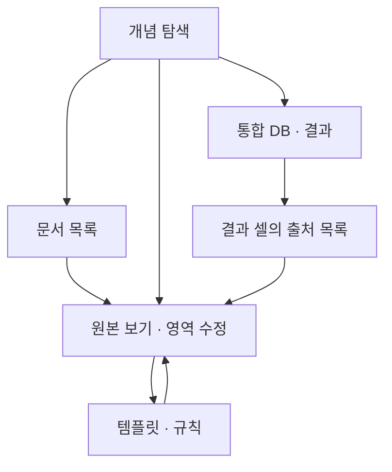

# data_gathering v2 화면·API 설계

**원본 보기에서 키·값·연결 개념을 수정하고, 모든 화면은 같은 문서 버전·매핑·실행을 공유한다.**
화면 확대/축소, 데이터 페이지네이션, 서버의 범위 조회를 함께 적용한다.
전체 데이터를 먼저 받아 CSS로 축소하는 방식으로는 대용량 문제를 해결할 수 없다.

이 문서는 [DB 스키마 설계](db-schema-v2.md)의 후속 구현 계약이다. 현재 React 앱에 적용한 변경 사항이 아니다.

## 1. 다섯 화면과 연결

| 화면 | 기본 표시 | 핵심 동작 | 연결 |
|---|---|---|---|
| 문서 | 검색/작성자/일자/접근 상태/적용 템플릿/추출 상태, 50개씩 | 문서 등록·버전 선택·템플릿 배정·추출 작업 | 원본 보기, 적용 템플릿, 연결된 KG 부분 |
| 개념 | 상위 개념과 연결 수, 선택 개념 주변 | 하위/관련 관계 펼치기, 문서군·시트·소스 필터 | 해당 개념의 문서 목록, 원본 위치, 통합 DB 필드 추가 |
| 원본 | 선택 문서 버전·시트의 가시 영역 | 키/값/단위 영역 추가·개념 변경·검수·재추출 | 원래 문서/KG/결과 화면으로 복귀, 템플릿 규칙 열기 |
| 템플릿 | 템플릿 목록/버전/적용 문서 수 | 시트 역할·규칙·반복/끝 조건 편집, 샘플 적용, 새 버전 발행 | 샘플 원본 보기, 영향 문서 목록, 실행 이력 |
| 통합 DB | 프로젝트별 선택 개념/필드/소스와 최근 빌드 | 필드·타입·단위·업무키·중복/충돌 규칙, 미리보기·빌드 | 결과 셀의 다중 출처 → 원본 보기 |



문서 KG는 선택 문서의 `문서→시트→반복 블록/선택 영역→키·값·객체` 투영으로 보여준다.
전체 도메인 KG에서 선택 문서가 연결된 개념과 상위 경로를 강조하고, 개념별 문서 목록을 페이지로 연다.
“문서군”은 선택 도메인/승인 매핑을 기준으로 하는 필터다. 템플릿 자체를 도메인 개념으로 취급하지 않는다.
서로 겹치는 템플릿의 물리 영역은 같은 위치로 표시하고, inspector에서 모든 적용 건을 선택할 수 있게 한다.

## 2. 원본 보기 배치와 편집

| 위치 | 내용 |
|---|---|
| 상단 | 문서명, 고정 문서 버전, 시트 검색/선택, 확대율, 원본 표시 상태, 이전 화면 복귀 |
| 좌측 패널 | 이 문서의 적용 템플릿/규칙, 검수 대기 목록; 필요 부분만 로딩 |
| 중앙 | 승인된 원본 뷰어 + 독립 overlay; 드래그/다중 영역 선택·이동·확대/축소 |
| 우측 inspector | 연결 개념, 관찰 키, 키 영역 목록, 값 영역 목록, 가로/세로·반복·끝 조건, 단위, 항목 미리보기 |
| 하단 | 범위 적용·검수 상태, 재추출 진행률/취소, 다음 검수 항목 |

키는 청록 실선과 `K1,K2`, 값은 파랑 점선과 `V1,V2`, 단위는 보라와 `U1`을 함께 표시한다.
색만으로 구분하지 않는다. 원본의 배경색은 덮어쓰지 않고 테두리·번호·옅은 overlay로 표시한다.
선택한 템플릿은 강조하고 다른 템플릿은 옅게 표시한다. 한 셀 클릭 시 처음 찾은 매핑 하나로 고정하지 않는다.
겹친 매핑 목록에서 적용 건/규칙을 고르면 그 키와 모든 값 영역이 함께 강조된다.

수정 흐름:

1. inspector에서 `키 영역 선택` 또는 `값 영역 선택`을 누른다.
2. 원본에서 영역을 드래그한다. `영역 추가`로 다른 위치/시트를 선택하고 순서를 조정한다. 병합 셀은 경계를 표시하고 전체 병합 범위로 선택한다.
3. 개념 선택기로 연결 개념을 변경한다. 동의어 후보의 문맥과 근거도 볼 수 있다.
4. 목록이면 방향·레코드 키·끝 조건·빈칸 처리·결합 방식을 설정한다. 현재 시트만 보더라도 다른 시트의 선택 영역을 칩으로 유지한다.
5. 서버에서 제한된 샘플을 읽어 `예상 전체 수/확인한 항목 수/잘림·검수 필요`를 표시한다. 샘플을 전체 성공으로 표시하지 않는다.
6. 기본 저장은 `이 문서에 적용`. 새 매핑 리비전과 head를 한 트랜잭션으로 저장한다.
7. 영향받은 적용 건의 재추출 작업을 실행한다. UI는 바로 돌아오고 상태/취소 버튼을 표시한다.
8. 성공 결과 발행 후 현재 overlay와 값이 새 버전으로 바뀐다. 원본 뷰어의 위치·확대율은 유지한다.

`템플릿 새 버전으로 저장`을 선택하면 공통 규칙 diff, 적용 대상 문서 수, 샘플 결과를 표시한다.
문서별 수동 수정은 새 템플릿으로 자동 덮어쓰지 않는다. 충돌 목록에서 새 규칙과 문서 override를 선택한다.
원본 버전이 바뀌면 이전 절대 좌표는 제안으로만 보여주고 앵커/시트/범위를 다시 검증한다.

## 3. 화면 간 상태와 직접 링크

예시 라우트 계약:

```text
/documents?after=...&author=...&template=...
/concepts?kg=kg-1&focus=temperature
/source/doc-1/versions/dv-1/sheets/sheet-main?application=app-main&mapping=map-main-temperature&item=item-main-temperature-3
/templates/main/versions/tv-main?rule=temperature
/integrations/project-1/builds/build-1?row=total&field=temperature
```

URL에 문서/템플릿/KG/실행의 정확한 버전과 선택 항목 ID를 담는다.
스크롤/확대율/좌측 필터/선택 목록은 탭별 상태 또는 session history에 저장하고 복귀 때 복원한다.
접근 토큰·실제 파일 경로·대규모 데이터 배열은 URL이나 전역 store에 넣지 않는다.
다른 문서로 전환하면 이전 요청을 취소하고 request sequence를 확인하여 늦게 온 응답이 현재 화면을 덮지 않게 한다.
닫힌 탭의 큰 셀/렌더/graph 데이터는 LRU에서 해제한다.

## 4. 대용량 처리 계약

아래 수치는 **PoC 시작 설정**이며 측정된 성능이나 보장치가 아니다. 실제 문서 크기·DRM 지연·브라우저 메모리로 조정한다.

| 대상 | 서버 요청/응답 범위 | 브라우저 표시 |
|---|---|---|
| 문서·템플릿·시트 목록 | 기본 50개, 최대 200개, 안정 정렬 + cursor | 가상 목록, 검색/필터 변경 시 초기화 |
| KG | 상위 집계부터, 선택 노드 이웃/자식; 예: 200노드·400엣지 한도와 continuation | 줌 단계별 라벨/집계/세부 노드, 누적 노드 상한 |
| 문서 구조 | 문서 메타 → 시트 → 해당 시트의 선택 영역/반복 블록 | 접힌 하위 트리는 조회하지 않음 |
| 원본 렌더 | 가시 타일/페이지 + 좁은 여유 영역; 예: 타일 512px, 동시 요청 4개 | canvas/승인 뷰어, 보이지 않는 페이지 해제 |
| 셀·선택 geometry | 현재 viewport에 해당하는 희소 셀 블록; 예: 200행×30열 상한 | 행과 열 양쪽 가상화, 병합 앵커/객체 중첩 정합 |
| overlay | 현재 화면과 교차하는 region; 예: 1,000개 상한 + cursor/집계 | 각 영역 사각형으로 그림; 포함된 모든 셀로 전개하지 않음 |
| 값 목록/출처 | 기본 100항목, 최대 500항목; `item_index` cursor | inspector 가상 목록; 클릭 항목만 추가 상세 조회 |
| 추출/렌더/빌드 | `202 + job_id`; durable 상태와 진행/취소 | polling 또는 SSE; 한 HTTP 요청에서 전체 작업을 기다리지 않음 |
| DB 미리보기/다운로드 | 미리보기는 페이지, 다운로드는 완성 artifact 스트림 | 전체 파일을 JS 메모리에서 먼저 합치지 않음 |

API에 행 수 제한뿐 아니라 바이트·셀 수·CPU 시간·워크북 동시 열기·응답 생성량 한도를 둔다.
서버의 파서/렌더러도 HTTP 요청과 분리하며 streaming 또는 범위 배치 읽기를 사용한다.
압축된 XLSX 크기만으로 메모리를 추정하지 않는다. 과도한 사용 영역/빈 서식 영역/대형 이미지도 별도로 제한한다.
전체 workbook 로딩이 필수인 엔진은 워커 RSS 한도와 대기열을 사용하고 세션을 제한적으로 재사용한다.

`LIMIT`으로 자른 결과는 `has_more`/`next_cursor`/잘림 사유를 반환한다. 시트의 최초 N행만 보여주고 끝이라고 하지 않는다.
중간 빈칸이나 필터로 숨긴 행도 정책에 따라 원본 인덱스와 레코드 키를 보존한다.
정렬은 `(display_name,document_id)` 또는 `(item_index,item_id)`처럼 유일한 보조키를 포함한다.
목록 중간 데이터 변경은 명시적 refresh로 처리하고, 값 목록은 불변 run_id에 고정한다.

SQLite의 tuple cursor와 OFFSET 비용 관련 근거:
[Row Values, scrolling window queries](https://www.sqlite.org/rowvalue.html).

### 제안 API 예시

| API | 반환 범위/동작 |
|---|---|
| `GET /api/v2/documents?after=&limit=50` | 메타데이터와 상태 요약 |
| `GET /api/v2/document-versions/{id}/sheets?after=&limit=50` | 시트 이름/ID/상태 |
| `GET /api/v2/concepts/{id}/neighbors?kg=&after=&limit=200` | 제한된 주변 관계와 더보기 |
| `GET /api/v2/concepts/{id}/sources?kg=&after=&limit=100` | 승인된 현재 소스 목록, 값 전체 제외 |
| `POST /api/v2/viewer/sessions` | 제공자 권한 확인 후 원본 버전 세션 생성 |
| `GET /api/v2/viewer/sessions/{id}/viewport?sheet=&clip=&scale=` | 제한된 렌더/geometry 참조 또는 준비 작업 ID |
| `GET /api/v2/sheets/{id}/regions?viewport=&after=&limit=1000` | 화면과 겹치는 overlay |
| `GET /api/v2/series/{id}/items?after_index=&limit=100` | 값과 최소 출처 요약 |
| `POST /api/v2/applications/{id}/mapping-revisions` | 완전한 유효 규칙, 기존 head/기대 edit_seq; 원자 저장 |
| `POST /api/v2/extractions` | application, pinned mapping IDs, idempotency key → `202` |
| `GET /api/v2/jobs/{id}` / `POST /api/v2/jobs/{id}/cancel` | 진행/실패/재시도·취소 상태 |
| `POST /api/v2/builds` | Integration 버전과 실행 입력 고정 → `202` |
| `GET /api/v2/builds/{id}/rows?after=&limit=100` | 결과 미리보기 |
| `GET /api/v2/builds/{id}/lineage?row=&field=&after=&limit=100` | 결과 한 칸의 여러 출처 |

복잡한 viewport/clip/다중 영역은 구조화 POST body를 사용할 수 있다. 쿼리 문자열을 실제 SQL로 연결하지 않는다.
`413/422`는 과도한 요청/규칙 오류, `409`는 버전·동시 수정 충돌을 의미한다.
DRM 기능 미지원/권한 부족/캐시 만료를 빈 배열로 숨기지 않고 각각 구분된 상태로 보낸다.

### 실제 조회 형태

```sql
-- 전 페이지 마지막 (name,id)를 cursor로 사용한다. filter·정렬 기준도 cursor와 함께 검증한다.
SELECT document_id, display_name, current_version_id
FROM document
WHERE (display_name, document_id) > (:last_name, :last_id)
ORDER BY display_name, document_id
LIMIT :bounded_limit;

-- 불변 series_id 안에서 값 목록만 페이지로 읽는다.
SELECT item_id, item_index, record_key, value_type, value_text, value_state
FROM extracted_item
WHERE series_id=:series_id AND item_index>:last_index
ORDER BY item_index
LIMIT :bounded_limit;

-- 직사각형 교차 판정. viewport와 겹치는 영역만 overlay로 보낸다.
SELECT region_id, r1, c1, r2, c2
FROM source_region
WHERE sheet_id=:sheet_id AND r1<=:view_r2 AND r2>=:view_r1
  AND c1<=:view_c2 AND c2>=:view_c1
ORDER BY r1, region_id
LIMIT :bounded_limit;
```

마지막 공간 조회의 복합 B-tree는 모든 2차원 겹침 분포를 효율적으로 처리하는 보장이 없다.
선택 영역이 매우 많아지면 SQLite R-tree/행 블록 인덱스 또는 PostgreSQL 공간/범위 인덱스를 추가한다.
viewport API는 먼저 영역 수를 제한하고, 서버 쿼리 시간 상한/작업 격리와 실제 query plan을 검증한다.
최초 페이지 뒤에는 `(r1,region_id)` cursor도 적용한다. 예시 SQL은 첫 페이지의 교차 판정이다.

## 5. 렌더·좌표 일치와 캐시

캐시 키에는 문서 버전에 종속된 sheet ID, 렌더러 버전·폰트/locale 설정, 권한 범위·정책 리비전,
layout revision, zoom 단계, 타일/페이지 번호를 포함한다.
geometry와 렌더가 같은 layout revision인지 확인한 뒤 overlay를 붙인다.
권한이 다른 사용자나 워터마크가 다른 세션 사이에 렌더 캐시를 공유하지 않는다.
좌표는 viewport 픽셀 좌표가 아닌 원본 셀/객체 좌표로 저장한다. 확대율은 화면에서의 변환이다.

병합 앵커가 viewport 밖에 있어도 화면에 들어온 병합 셀의 경계를 조회한다.
이미지/차트가 셀 밖으로 넘치거나 다른 객체를 덮는 경우 z-order·오프셋과 원본 레이어를 유지한다.
축소 시 작은 글자를 새 텍스트로 다시 배치하지 않는다. 선택은 hit-test 결과의 실제 영역에 연결한다.
PDF 페이지가 하나의 시트를 분할하거나 인쇄 제목을 반복하더라도 원본 셀 주소와 표시 조각의 N:M을 허용한다.
PDF가 원본 시트 전체를 담지 않는 경우 이를 원본 전체로 표시하지 않는다.

## 6. 구현 인수 조건

| 시나리오 | 기대 결과 |
|---|---|
| 한 시트에 템플릿 두 개 | 원본에서 둘 다 선택 가능; 하나의 수정이 다른 템플릿 이력을 바꾸지 않음 |
| 두 시트로 구성된 한 템플릿 | 키/값/단위의 각 시트로 즉시 이동, 적용 건과 실행은 하나 |
| 다중 병합 키/떨어진 값 영역 | 선택 순서와 병합 경계 유지; 영역 사이 불필요한 셀 포함 안 됨 |
| 세로 목록 중간 빈칸 | 이후 값의 레코드 대응이 밀리지 않음 |
| 가로 반복·서로 다른 길이의 목록 | 방향 유지; 업무키 없는 자동 zip/Cartesian product 안 됨 |
| 두 사용자가 동시에 개념/영역 수정 | 뒤 요청에 409; 승인 이력과 앞선 수정 보존 |
| 추출 중 매핑 수정 | 이전 입력의 실행을 현재 결과로 발행하지 않음 |
| 합계·중복 병합 결과 클릭 | 모든 기여 출처를 페이지로 확인하고 당시 원본 영역으로 이동 |
| 원본의 새 버전 감지 | 이전 결과는 버전 표시와 함께 유지; 현재 결과로 자동 혼합 안 됨 |
| DRM 읽기/웹 렌더/추출 권한이 다름 | 가능한 작업과 부족한 권한을 분리 표시; 원본 저장/해제본 요구 없이 지원 경로 사용 |
| 권한 만료·취소·렌더 실패 | 현재 UI가 응답하며 캐시 접근 차단/진행 취소/재시도 상태 표시 |
| 큰 문서·깊은 KG·다수 탭 왕복 | 요청/DOM/캐시/노드 수가 설정 상한 내이며 위치·필터를 복원 |

실제 UI 인수 테스트는 DRM 대표 샘플과 성능 부하 환경이 연결된 후 수행한다.
이번 브랜치의 테스트는 DB 관계·스냅샷·발행·중복/lineage 계약 검증이며 위 UI 테스트를 실행한 것은 아니다.
