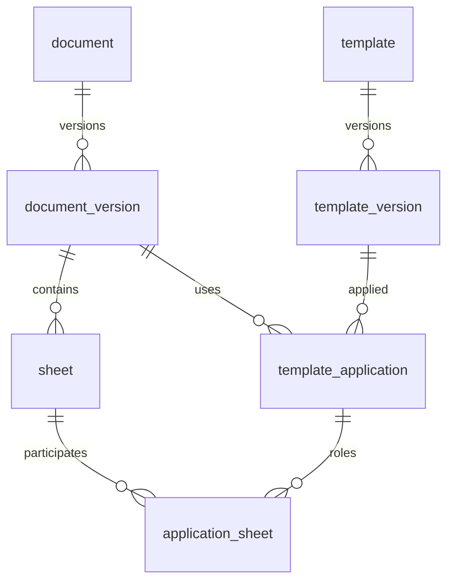
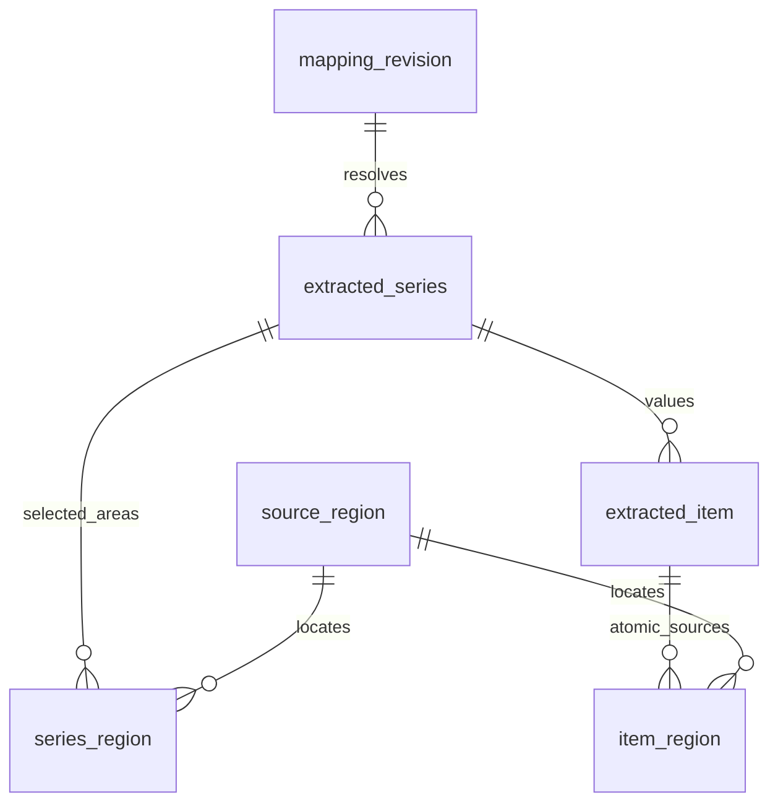
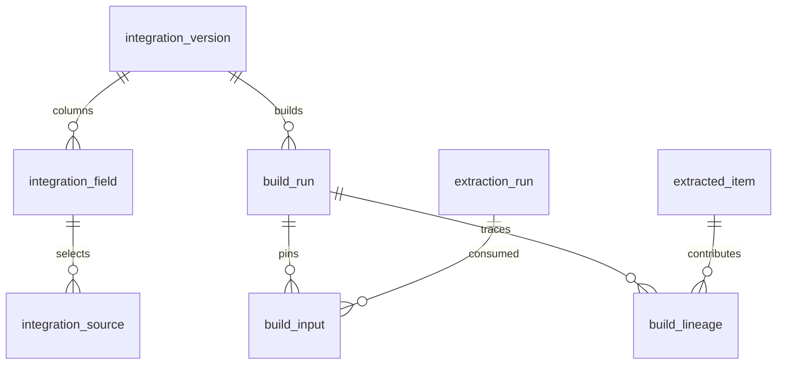

# data_gathering DB 스키마 재설계

**권고안: 문서의 정체성·버전, 템플릿 규칙, 문서별 매핑, 추출값·원자 출처, 목적별 통합 DB를 분리한다.**
사용자가 제안한 `템플릿매핑` 한 테이블을 이 책임별로 나누는 것이 핵심이다.
도메인 KG는 사람이 정의한다. 시스템은 기존 개념에 문서 표현을 연결하며, 선택한 정보만 추출한다.

검토일: 2026-09-08. 기준: `ujajuck/data_gathering`, `dev`,
[`be1c75ab46ebbe96918a4f6de830e0e8a4d026e9`](https://github.com/ujajuck/data_gathering/commit/be1c75ab46ebbe96918a4f6de830e0e8a4d026e9).
작업 브랜치: `codex/db-schema-redesign`.

이 브랜치는 **새 빈 DB용 SQLite DDL, 합성 데이터 예시, 제약 검증, UI/API 및 이행 설계**를 제공한다.
현행 앱의 실행 스키마는 `kg/schema.sql`이다. 새 DDL을 기존 `kg.db`에 실행하지 않는다.
DRM 제품 연동, Excel 렌더러 교체, v2 API/UI 구현과 실제 데이터 마이그레이션은 후속 구현 범위다.

- [실행 가능한 SQLite DDL](../../db/v2/schema_sqlite.sql)
- [여러 시트·여러 영역 템플릿 JSON](../../examples/schema_v2/template_multisheet.json)
- [합성 데이터 예시](../../examples/schema_v2/demo.py)
- [요구조건 검증](../../tests/test_schema_v2.py)
- [화면 연결·원본 편집·대용량 API 설계](db-schema-v2-ui.md)

## 1. 제안 스키마에서 바꿀 부분

| 사용자 초안 | 권고 | 이유 |
|---|---|---|
| 문서해시 PK | `document_id` + `document_version_id`; 해시는 버전 속성 | 수정·파일 이동·동명 파일·재암호화에 따라 문서의 정체성이 바뀌면 안 된다. |
| `excelFile` 문서 상속 | `document.file_type` 및 버전별 Excel 메타데이터 | 모든 입력이 Excel인 현재 단계에서 동일 컬럼의 상속 테이블은 필요하지 않다. |
| 시트해시 PK | 버전에 종속된 `sheet_id` | 같은 내용의 시트 두 장도 서로 다른 위치다. 해시만으로 합치지 않는다. |
| 템플릿해시·버전 혼합 | `template` + 불변 `template_version` | 이름 변경과 규칙 변경을 분리하고 과거 실행이 정확한 규칙을 참조하게 한다. |
| 시트–템플릿 단순 매핑 | `template_application` + `application_sheet` | 한 적용 건이 여러 시트를 역할별로 쓰고, 한 시트는 여러 적용 건에 참여한다. |
| 키·키위치·값·값위치 한 행 | `mapping_revision` + `extracted_series` + 영역 연결 + `extracted_item` | 규칙과 결과의 수명이 다르며, 키/값 모두 복수 영역·복수 항목일 수 있다. |
| 도메인명·레벨 | KG 리비전 + 개념 정의·단위·타입·동의어·관계 | 같은 단어의 다른 의미와 과거 판단 기준을 구분해야 한다. |
| 타임스탬프 하나 | 원본 작성일/버전 관찰일/매핑 수정일/실행일 분리 | 문서가 바뀐 것인지, 사람이 매핑을 고친 것인지, 다시 읽은 것인지 구분한다. |
| 추출 결과만 저장 | 목적별 통합 설정·빌드 입력·N:M lineage 추가 | 사용자 맞춤 컬럼·조인·중복 정책과 결과의 모든 근거를 재현해야 한다. |

**값을 도메인 노드 속성이나 엣지에 전부 넣지 않는다.** KG는 개념과 관계, 값은 관계형 저장소가 담당한다.
같은 문서의 결과를 여러 목적에 쓰므로 공통 Canonical DB 하나로 모든 중복 정책을 강제하지 않는다.

## 2. 기존 구현에서 확인한 차이

| 확인한 코드 | 이미 있는 기능 | 이번 요구에서 보완할 부분 |
|---|---|---|
| [`kg/schema.sql`](https://github.com/ujajuck/data_gathering/blob/be1c75ab46ebbe96918a4f6de830e0e8a4d026e9/kg/schema.sql) | 문서/템플릿 버전, 문서–템플릿 N:M, 도메인 별칭 | `parsed_source`의 단일 `sheet_name/source_range`, 큰 `value_json`, 단일 출처인 `lineage_edge` PK |
| [`kg/parsing.py`](https://github.com/ujajuck/data_gathering/blob/be1c75ab46ebbe96918a4f6de830e0e8a4d026e9/kg/parsing.py) | 시트 matcher, 범위/오프셋, 문서 override | `save_override`가 한 `range`를 요구하고 기존 행을 갱신한다. `_read_range`는 한 직사각형을 읽는다. |
| [`kg/webapp.py`](https://github.com/ujajuck/data_gathering/blob/be1c75ab46ebbe96918a4f6de830e0e8a4d026e9/kg/webapp.py) | 시트 렌더, 검수·개념 변경 API | `_render_sheet_drm`의 시트 Copy→임시 XLSX SaveAs 경로는 이번 읽기 전용 전제의 기본 경로로 사용할 수 없다. |
| [`kg/viewer.py`](https://github.com/ujajuck/data_gathering/blob/be1c75ab46ebbe96918a4f6de830e0e8a4d026e9/kg/viewer.py) | 버전별 뷰어 등록·PDF 미리보기 | `unlocked_path`와 해제본 등록을 필수 전제로 삼지 않는 어댑터가 필요하다. |
| [`SheetGrid.tsx`](https://github.com/ujajuck/data_gathering/blob/be1c75ab46ebbe96918a4f6de830e0e8a4d026e9/frontend/src/screens/source/SheetGrid.tsx) | 병합·스타일·이미지·overlay | 전달된 전체 행/열 DOM과 영역 내 셀별 overlay 전개를 viewport 방식으로 바꿔야 한다. |
| [`kg/integration/builder.py`](https://github.com/ujajuck/data_gathering/blob/be1c75ab46ebbe96918a4f6de830e0e8a4d026e9/kg/integration/builder.py) | 목적별 DB·DAG·lineage | 결과 한 칸의 여러 입력과 중복 병합의 모든 근거를 저장해야 한다. |

위 내용은 해당 커밋의 코드 확인 결과다. 새 설계의 기능을 현재 앱에 이미 구현된 기능으로 해석하지 않는다.

## 3. 물리 스키마의 구성

PK는 기본키, FK는 다른 행에 대한 참조다. 정확한 타입·NULL·UNIQUE·CHECK·인덱스는 DDL이 기준이다.
JSON에는 탐색 규칙·정규화·표시 설정처럼 형태가 달라지는 작은 명세를 넣는다.
조회·연결의 기준이 되는 ID, 값 항목, 좌표, 버전, 필드 소스는 별도 컬럼/행으로 둔다.

| 영역 | 테이블 | 핵심 컬럼과 역할 |
|---|---|---|
| KG | `kg_revision` | PK `kg_revision_id`; 사람이 발행한 기준 스냅샷과 해시 |
| KG | `domain_concept` | PK `(kg_revision_id, concept_id)`; 이름, 정의, 레벨, 타입, 기준 단위 |
| KG | `domain_alias` | 개념 FK + 정규 단어 + 문맥; 동일 표현의 복수 개념 후보 허용 |
| KG | `domain_edge` | 양 끝 개념의 같은 KG 리비전 FK + 관계 종류 |
| 문서 | `document` | 안정 ID, 표시명, provider, 원본 참조, 현재 버전 FK |
| 문서 | `document_version` | 문서 FK, 순번, 제공자 버전, 암호문/가능한 내용 해시, 원본 메타데이터 |
| 문서 | `sheet` | 문서 버전 FK, 시트명, 순서, 공개 상태, 내부 키 |
| 원본 위치 | `source_region` | 문서 버전·시트 FK, 셀 직사각형/객체, 병합 앵커, 정밀 geometry |
| 템플릿 | `template` / `template_version` | 안정 ID와 불변 규칙·KG·코드·엔진 버전 |
| 템플릿 | `template_rule` | PK `(template_version_id, rule_key)`; 키/값 탐색, 레코드, 값 변환 명세 |
| 적용 | `template_application` | 문서 버전 FK + 템플릿 버전 FK + 목적/적용 범위; 현재 발행 실행 FK |
| 적용 | `application_sheet` | 적용 건의 `sheet_role`을 실제 시트 1개 이상에 연결 |
| 수정 | `mapping_revision` | 적용 건·규칙 FK, 실제 개념, 유효 명세, 근거, 수정자, 이전 리비전 FK |
| 수정 | `mapping_head` | 적용 건·규칙별 현재 승인 리비전; 동시 수정 검사용 `edit_seq` |
| 추출 | `extraction_run` | 적용 건 FK, 입력 지문, 엔진/환경, 요청 키, 상태, 시작/종료 |
| 추출 | `run_mapping` | 실행이 사용한 정확한 매핑 리비전 목록 |
| 추출 | `extracted_series` | 실행·매핑 FK, 반복 블록, 키 표현, 값 모양/방향, 레코드 범위 |
| 추출 | `series_region` | series의 key/value/unit/context/record_key별 순서 있는 복수 영역 |
| 추출 | `extracted_item` | 목록의 원소 하나; 원값·표시값·타입·정규값·단위·수식·레코드 키 |
| 추출 | `item_region` | 항목의 원자 value/input/record_key/unit/context 영역 N:M |
| 사용자 DB | `integration_project` / `integration_version` | 목적 이름과 불변 소스선택·조인·변환·중복 정책 |
| 사용자 DB | `integration_field` | 버전별 출력 컬럼과 도메인 개념·타입·단위 |
| 사용자 DB | `integration_source` | 출력 필드가 사용할 적용 건·규칙 FK; 필요하면 실행 버전 고정 |
| 사용자 DB | `build_run` / `build_input` | 빌드 명세·입력 실행들의 고정 스냅샷·출력 참조 |
| 사용자 DB | `build_lineage` | 결과 한 칸에 기여한 여러 항목 FK와 변환/병합 역할 |
| 운영 | `access_observation` | 제공자가 판정한 열람/추출/웹 표시/파생 캐시 권한 관찰 이력 |
| 운영 | `render_chunk` | 시트·렌더 설정·권한 범위·정책·layout·타일/페이지별 캐시 참조 |
| 운영 | `artifact` | DB 밖 원본/코드/렌더/산출물의 참조·해시·크기·Git/DVC 메타데이터 |
| 운영 | `schema_meta` | 새 DB의 스키마 버전 식별 |

32개 물리 테이블에는 캐시·실행 이력·버전·연결 테이블이 포함된다. 사용자에게 이 구성을 노출하지 않는다.
공통 화면은 문서, 개념, 원본, 템플릿, 통합 DB의 5개로 유지한다.

### 문서와 템플릿의 관계



`sheet→template` 직결만으로는 여러 시트를 하나의 실행으로 묶기 어렵다.
적용 건이 `measurements=가열시험`, `metadata=기준정보`처럼 시트 역할을 연결한다.
동일 시트/영역에 다른 템플릿 또는 다른 목적의 적용 건을 추가할 수 있다.
한 역할에 여러 시트가 매칭되면 `ordinal`로 순서를 고정하고, 각 시트는 독립 레코드 범위를 가진다.
여러 문서를 합치는 처리는 Integration 단계가 담당하며, 현재 템플릿 적용 범위는 한 문서 버전 안이다.

### 키·값·원자 출처의 관계



`series_region`은 선택한 큰 영역과 키를 보여주고, `item_region`은 특정 값의 정확한 셀을 보여준다.
두 층이 있어야 “값 목록 전체 하이라이트”와 “결과 37번째 값의 원본 보기”를 모두 제공할 수 있다.
한 항목을 여러 셀에서 계산했다면 `item_region`에 입력 셀을 모두 연결한다.

## 4. 문서·시트·KG 버전의 규칙

1. 문서 ID는 이름/경로/해시에서 만들지 않는다. 등록 시 UUID 등으로 만들고 이동·이름 변경 때 유지한다.
2. 동일한 이름이나 내용의 다른 문서를 자동으로 같은 문서로 간주하지 않는다. 업무상 동일성이 확인되면 별도 연결한다.
3. 수정된 문서는 새 `document_version`이다. 기존 위치와 추출 결과는 과거 버전에 남는다.
4. DRM 재암호화만으로 암호문 해시가 바뀔 수 있다. `ciphertext_sha256`, 제공자 버전, 허용 시 `content_sha256`을 구분한다.
5. 해시가 없더라도 등록할 수 있다. 제공자 버전도 없다면 “관찰한 버전”만 보장하며 전체 원본 재현 가능성을 주장하지 않는다.
6. 시트명·순번·내부 ID만으로 버전 간 시트 동일성을 단정하지 않는다. 내용/앵커를 확인하고 새 버전의 매핑은 재검증한다.
7. 값 읽기 시작/종료의 제공자 버전이 달라지면 결과를 발행하지 않는다. 열람 세션이 고정 버전을 보장하는지도 어댑터 계약에 포함한다.
8. `concept_id`는 KG 리비전 간 논리적으로 유지하되, 추출과 빌드는 특정 KG 리비전을 참조한다. 다른 리비전의 동의어/단위를 조용히 섞지 않는다.
9. `parent_of`는 부모→자식이며 레벨이 정확히 1 증가한다. 다부모를 허용하고, 일반 관계는 레벨을 제한하지 않는다. 엣지에 단일 `parent_id`를 강제하지 않는다.
10. 별칭이 모호하면 후보 상태로 둔다. 검수 없이 KG를 성장시키거나 사용자 매핑을 새 후보로 덮어쓰지 않는다.

## 5. 복수 영역·병합 셀·목록·수식

예시 템플릿의 온도 규칙:

| 역할 | 원본 | 의미 |
|---|---|---|
| 키 0 | 가열시험!B3:C3, 병합 셀 | `공정` |
| 키 1 | 가열시험!F3 | `온도`; 두 키를 순서대로 결합 → `공정온도` |
| 값 영역 0 | 가열시험!B5:B7 | `180`, `185`, 빈칸 |
| 값 영역 1 | 가열시험!B10:C11 | 각 행 B:C가 병합된 값 `190`, `195` |
| 단위 | 기준정보!B2 | `℃`; 같은 템플릿이 다른 시트를 참조 |

이 결과는 `[180,185,빈칸,190,195]`다. **B8:B9를 포함한 B5:C11로 범위를 합치지 않는다.**
`item_index`는 0~4이고 원본 `record_key`는 r5,r6,r7,r10,r11이다. 빈칸 때문에 뒤 값의 대응 행을 당기지 않는다.
별도 가로 규칙은 B15:D15를 오른쪽으로 읽어 c2,c3,c4를 레코드 키로 남긴다.

- 병합 셀은 전체 병합 범위를 하이라이트하고, 값은 병합 앵커에서 한 번 읽는다. 여러 선택 영역이 같은 앵커와 겹칠 때의 중복 정책도 명세에 둔다.
- 키 결합은 `concat`/`hierarchical_path`, 값 결합은 `ordered_union`/`zip`/`matrix`/`aggregate`를 명시한다. 예시 계약은 ordered_union과 가로/세로 목록을 보여준다.
- `zip`은 같은 레코드 키 또는 사용자 승인 대응표가 있어야 한다. 길이만 같다는 이유로 두 시트의 같은 순번을 붙이지 않는다.
- 서로 독립인 두 목록을 wide 컬럼으로 펼쳐서 자동 Cartesian product를 만들지 않는다. 명시적 업무키로 조인하거나 목록별 자식 테이블로 출력한다.
- 반복 블록별 `record_scope_key`를 둔다. 행번호 5만으로 문서·시트·표를 넘어 조인하지 않는다.
- 동적 끝 범위는 다음 헤더, 빈 행 N개, 종료 마커, 명시 범위, 최대 항목 수를 선언한다. B:B 전체를 무조건 스캔하지 않는다. 부분 결과이면 continuation과 상태를 표시한다.
- 수식 문자열, 원시 타입·원값, 표시 문자열, 정규값을 구분한다. `cached_unknown_age`, `missing_cache` 등 캐시 상태를 남긴다.
- 날짜는 Excel의 1900/1904 체계를 버전에 남긴다. 시각의 시간대가 불명확하면 UTC라고 추정하지 않는다.
- `blank`/`missing`/`excel_error`/`unavailable`을 구분하고 오류를 0으로 바꾸지 않는다. 정밀 수치는 십진 문자열로 저장하고 Python Decimal/이후 PostgreSQL NUMERIC으로 처리한다.
- 이미지/차트/텍스트박스는 `kind`, 객체 키, 앵커/오프셋을 남긴다. 차트의 참조 데이터와 시각적 차트 자체를 구분한다. 이미지 OCR·차트 역추정은 추출 방식·근거와 검수 상태를 남긴다.

openpyxl 공식 문서에서 `data_only`는 마지막 저장된 수식 값을 선택하는 옵션이며,
읽기 전용 모드는 이미지·차트 등 모든 기능을 지원하지 않는다고 설명한다.
따라서 이 옵션을 DRM 권한 또는 원본 충실 렌더의 해결책으로 보지 않는다.
출처: [openpyxl tutorial](https://openpyxl.readthedocs.io/en/stable/tutorial.html).

## 6. 수정·재추출·중복 처리

**문서 한 건에서의 수정은 새 `mapping_revision`, 공유 양식의 수정은 새 `template_version`이다.**
매핑 리비전에는 키 영역, 값 영역, 반복 방향, 개념, 정규화, 실제 시트 바인딩을 해석할 수 있는 유효 명세를 함께 저장한다.
원본 셀의 내용·서식은 바꾸지 않는다. 사용자에게는 저장 범위를 “이 문서에 적용”과 “템플릿 새 버전으로 저장”으로 표시한다.

처리 순서는 새 리비전 작성 → `mapping_head` 조건부 갱신 → 영향받는 적용 건 재추출 → 검증 → 새 실행 발행이다.
`edit_seq`가 달라졌으면 전체 수정 트랜잭션을 롤백하고 충돌을 보여준다.
head 변경은 `published_run_id`를 비워 오래된 값이 현재 값으로 조회되지 않게 한다. 과거 실행·통합 결과는 유지한다.
작업 실패/취소 시 현재 성공 결과를 덮어쓰지 않는다. 단, 매핑이 바뀐 적용 건의 이전 값은 “재추출 전 과거 결과”로 표시한다.

실행은 `queued→running→succeeded/failed/cancelled`이며, HTTP 재전송은 `(application_id,request_key)`로 한 작업을 반환한다.
실패 작업 재시도는 새 실행 ID/요청 키다. 실행 지문은 원본/템플릿/KG/매핑/시트 바인딩/엔진/정규화/코드·환경 버전을 포함한다.
같은 지문의 과거 성공 결과 재사용은 입력 실재성과 현재 접근 권한까지 확인해야 한다.

중복은 다음처럼 구분한다.

| 상황 | 처리 |
|---|---|
| 같은 HTTP 요청 재전송 | 같은 작업 반환; 새 관찰값 생성하지 않음 |
| 같은 셀을 같은 의미·변환으로 두 템플릿이 추출 | 추출 이력 둘 다 보존; 선택한 출력 필드 안에서 묶을 수 있음 |
| 같은 값이 다른 셀/다른 문서/다른 측정 회차에 있음 | 별도 관찰로 유지 |
| 같은 셀을 다른 개념·단위 변환·집계 방식으로 사용 | 별도 의미 결과로 유지 |
| 같은 출처·의미·변환인데 결과 값이 다름 | 충돌; 기본은 빌드 보류, 명시적 우선순위/사용자 선택 필요 |
| 두 원본이 업무상 같은 실험을 중복 기재 | 사용자가 선택한 업무키/범위/버전 우선순위로 통합 단계에서 처리 |

목적별 중복 판별 튜플은 출력 필드 + KG 개념/리비전 + 원자 출처의 정규 위치 집합 + 레코드 범위/키 + 의미 문맥 + 정규 변환 명세다.
계산에서는 입력 순서·역할을 보존하고, 단순 집합 연산일 때만 명세에 따라 순서를 정규화한다.
그 안에 **템플릿 ID나 실행 ID를 넣으면 템플릿 간 중복이 제거되지 않는다. 값만 넣으면 다른 측정이 사라진다.**
식별 튜플이 같은 항목끼리 정규 타입·값·단위를 비교하여 동일/충돌을 나눈다. 해시는 인덱스 보조이며 최종 판단은 정규 튜플과 값 비교다.
`source_identity_key`와 `derivation_key`는 추출기가 실제 `item_region`·문맥·규칙에서 생성/검증해야 한다.
예시는 단일 값 원자 위치와 동일 단위 규칙을 사용하며, 모든 범용 변환의 동치 판정기를 구현한 것은 아니다.

## 7. 사용자 맞춤 DB와 출처



사용자는 개념과 실제 소스, 출력 이름/타입/단위, 레코드 업무키, 조인 종류, 중복·충돌 정책을 저장한다.
`integration_source`가 FK로 필드별 적용 건/규칙을 연결한다. 빌드 시 현재 발행 실행을 해석하거나 명시한 과거 실행을 고정한다.
서로 다른 KG 리비전의 의미를 합칠 때는 사람이 검토한 변환/대응이 필요하다.

출력 DB는 사용자 목적에 맞는 일반 타입 컬럼과 필요한 목록 자식 테이블을 생성한다.
중간 저장소의 EAV에 가까운 항목 모델을 그대로 사용자 DB 스키마로 강요하지 않는다.
출력 식별자와 SQL 타입은 검증된 계약으로 생성하고 값은 바인딩한다.

결과 한 칸에는 `build_lineage` 여러 행을 연결한다. 합계의 각 입력, 조인 키, 제거된 동일 출처 관찰도 역할을 구분해 남긴다.
화면은 결과 셀 → 원본 후보 목록 → 특정 문서 버전/시트/원자 영역으로 이동한다.
오래된 원본 버전을 제공자가 다시 열 수 없으면 “당시 원본 버전 열람 불가”로 표시하며 현재 파일의 같은 좌표를 대신 보여주지 않는다.

## 8. DRM과 원본 충실 렌더의 조건

**읽기 전용은 원본 수정 금지라는 조건이고, 웹에 표시하거나 값을 추출할 수 있는지는 DRM 제공자 기능·권한에 달려 있다.**
현재 정보만으로 특정 벤더의 지원 여부는 확정할 수 없다. `VIEW`, `EXTRACT`, `EXPORT`를 구분하는 실제 사례는
[Microsoft 권한 문서](https://learn.microsoft.com/en-us/purview/rights-management-usage-rights)에서 확인할 수 있다.
이 명칭을 모든 벤더에 그대로 적용하지 않고 어댑터가 실제 기능으로 변환한다.

| 어댑터 기능 | 계약 |
|---|---|
| `open_readonly(source_ref, version_token)` | 승인된 원본 세션. 원본 수정/다른 이름 저장을 요구하지 않음 |
| `get_capabilities()` | 열람, 구조화 추출, 웹 렌더, 파생물 보관 가능 여부와 만료·정책 버전 |
| `list_sheets(cursor, limit)` | 시트 메타데이터만 반환 |
| `read_regions(selectors, budget)` | 허용된 선택 범위의 값/수식/좌표. 범위별 continuation 제공 |
| `render_viewport(sheet, clip, scale)` | 지원되는 원본 렌더러의 가시 영역과 layout revision |
| `hit_test` / `locate_ranges` | 표시 좌표와 시트 좌표/객체 앵커의 양방향 대응 |
| `cancel` / `close` | 작업 취소와 세션/파생 캐시 정리 |

웹 표시를 지원하는 벤더 뷰어/SDK가 있으면 그것을 우선 사용한다.
렌더러가 원본 워크북을 내부적으로 전부 읽어야 한다면 비용을 백그라운드 워커에 격리하고, 브라우저에는 필요한 타일/페이지와 geometry만 전달한다.
페이지 렌더를 쓰는 경우 인쇄 영역 밖의 데이터·숨김 시트·페이지 분할·반복 인쇄 제목을 따로 처리해야 한다.
PDF 픽셀 좌표만으로 Excel 셀 주소를 역산하지 않는다. 동일 layout revision의 페이지–시트–셀 변환을 제공자가 제공하거나 검증된 어댑터가 생성해야 한다.

셀 데이터로 HTML을 다시 그리는 경로는 빠른 탐색에는 유용하지만 이미지·차트·조건부 서식·폰트까지 완전 일치한다고 보장하지 않는다.
원본 보기에서 검증되지 않은 대체 렌더는 “간략 보기”로 명시한다. 충실한 렌더나 셀 좌표 연동을 제공자가 지원하지 않으면 해당 기능은 미지원으로 표시한다.
전체 워크북을 읽지 않고 파싱/렌더링할 수 있는지 역시 엔진별 검증 사항이다.

`read_only=True` 또는 `ReadOnly=True` 플래그가 모든 DRM 작업을 허용하지 않는다.
시트 복사, SaveAs, 임시 해제 XLSX, 화면 캡처/OCR을 권한 제한 우회 수단으로 쓰지 않는다.
Office 자동화를 선택한다면 무인 서버에서의 안정성을 가정하지 말고, 지원되는 사용자 세션/제품 조건에서 별도 워커로 검증한다.
근거: [Microsoft 서버 Office 자동화 고려사항](https://support.microsoft.com/en-us/visio/considerations-for-server-side-automation-of-office),
[무인 RPA 환경 고려사항](https://learn.microsoft.com/en-us/office/client-developer/integration/considerations-unattended-automation-office-microsoft-365-for-unattended-rpa).

권한 관찰 행은 감사용이다. 매 원본/타일/추출/산출물 요청에서 실제 권한을 확인한다.
파생 값/렌더/통합 DB도 원본의 접근 정책과 연결하고, 권한 만료/철회 시 캐시·산출물 접근을 차단한다.
세션 토큰과 실제 비밀 경로를 프런트/API 응답에 저장하지 않는다. 보관 금지이면 `render_chunk`를 영속 생성하지 않는다.

## 9. JSON과 Python 템플릿

**기본은 구조화 JSON, 복잡한 변환만 버전 고정 Python 확장**을 권고한다.

| 형식 | 용도 | 관리/성능 원칙 |
|---|---|---|
| JSON | 시트 선택, 키/값 범위, 방향, 반복, 레코드키, 단위·검수 규칙 | 스키마 검증·UI 편집·diff가 쉽다. 버전별 한 번 파싱하고 실행 계획 캐시. |
| Python | JSON 계약으로 표현하기 어려운 선택·정규화·계산 | 파일/패키지 해시, entrypoint, 의존성 잠금, 제한된 Reader API, 표준 결과+lineage 필수. |
| Hybrid | 대부분 선언형 + 일부 함수 참조 | 동일한 적용·버전·원본 근거 계약을 유지한다. |

Python이라는 이유로 자동으로 빨라지지 않는다. Excel 열기/DRM 왕복/렌더 비용이 클 수 있으므로 범위 배치 읽기와 실행 계획 재사용을 먼저 측정한다.
파일 경로만 저장하면 같은 경로의 코드가 바뀌어 재현성이 깨진다. artifact checksum과 환경 lock/hash까지 버전에 묶는다.
웹 요청 프로세스에서 임의 `exec`/`eval`을 실행하지 않는다. 승인된 코드의 제한된 워커가 원본 Reader를 통해 필요한 범위만 접근한다.
CPU/메모리/실행시간/출력량 제한 및 취소를 제공한다. Python 확장도 입력 출처를 내보내지 못하면 결과를 발행하지 않는다.
예시 JSON은 `2.0-proposal` 계약이며 현재 `kg/parsing.py`에 바로 입력하는 형식은 아니다.

## 10. SQLite → PostgreSQL + AGE, DVC

SQLite PoC는 로컬 디스크의 DB 하나와 짧은 쓰기 트랜잭션을 사용한다.
각 연결에서 `foreign_keys=ON`, `busy_timeout`을 설정하고 배포 시 WAL을 활성화한다.
읽기/렌더/파싱 워커가 파일을 읽는 동안 DB 쓰기 트랜잭션을 잡지 않는다.
큰 작업은 작은 batch로 running 결과를 적재한 후 마지막 트랜잭션에서 검증하고 발행한다.
WAL이어도 writer는 한 번에 하나이므로 쓰기 큐를 두고 checkpoint를 관리한다.
네트워크 공유 폴더에 활성 WAL DB를 두지 않는다.
근거: [SQLite WAL](https://www.sqlite.org/wal.html), [외래키 활성화](https://www.sqlite.org/foreignkeys.html).

| 항목 | SQLite PoC | PostgreSQL 확장 |
|---|---|---|
| 논리 ID | 애플리케이션 발급 TEXT | UUID 타입; ID 관계 유지 |
| 시각/권한 플래그 | ISO 8601 TEXT, 0/1 | TIMESTAMPTZ, BOOLEAN |
| 작은 명세 | 검증된 JSON TEXT | JSONB; 검색이 필요한 키만 인덱스 |
| 정밀 값 | 십진 문자열 + Decimal | NUMERIC, 날짜/시각/타입별 컬럼으로 변환 |
| 원본 영역 | 정수 좌표 + 시트 인덱스 | 정수 범위/공간 인덱스; 크기와 겹침 분포에 맞춰 선택 |
| KG | 개념/엣지 테이블이 원본 | 관계형 테이블 원본 + AGE 조회 projection |
| 동시성 | 단일 writer 큐, 짧은 트랜잭션 | 연결 풀·행 잠금·조건부 갱신 |
| 불변/발행 제약 | 명시적 trigger | 같은 불변식을 migration + trigger/서비스 트랜잭션으로 이식 |

AGE에는 개념·관계 및 필요한 연결만 projection한다. 값·리스트·렌더 BLOB는 계속 RDB/외부 artifact에 둔다.
AGE 내부 vertex ID를 서비스의 FK로 사용하지 않는다. 서비스 ID를 그래프 속성으로 유지한다.
KG 리비전 단위 projection을 만들고 검증 후 활성 리비전을 전환한다. 비동기 갱신 시 outbox/워터마크를 사용하여 RDB와 AGE의 부분 갱신이 현재 결과로 섞이지 않게 한다.
AGE projection·outbox 테이블은 PoC DDL에 미리 생성하지 않는다. 실제 확장 시 추가한다.
설치할 PostgreSQL major와 AGE 릴리스 조합을 고정하고 검증한다. “Postgres 최신판이면 모두 지원”한다고 가정하지 않는다.
근거: [AGE 설치 문서](https://age.apache.org/age-manual/master/intro/setup.html), [공식 릴리스](https://github.com/apache/age/releases).

작은 템플릿 JSON/Python과 환경 lock은 Git으로 버전 관리한다.
DVC는 정책상 복제/보관 가능한 암호화 원본, 승인된 대용량 추출 snapshot, 큰 산출물에 선택 적용한다.
템플릿 파일은 DVC stage의 `deps`로 포함할 수 있으나 작은 텍스트를 DVC cache에 넣을 필요는 없다.
활성 `kg.db`, 수정 이력 DB, 잠금 중인 SQLite 파일은 DVC `outs`로 두지 않는다.
필요한 데이터 snapshot은 트랜잭션 일관성이 보장되는 SQLite backup API 또는 불변 export를 통해 만든다.
DRM 원본 보관이 허용되지 않으면 DVC에는 manifest/설정만 남기고, 원본 재실행은 제공자의 당시 버전 접근 가능성에 의존한다고 표시한다.
기존 [`dvc.yaml`](https://github.com/ujajuck/data_gathering/blob/be1c75ab46ebbe96918a4f6de830e0e8a4d026e9/dvc.yaml)도 활성 `kg.db`를 outs로 잡지 않는다.
근거: [DVC deps/outs/lock](https://doc.dvc.org/user-guide/project-structure/dvcyaml-files).

## 11. DB에서 강제하는 것과 서비스가 검증할 것

| DB 제약/trigger로 구현 | v2 서비스 구현 시 필수 검증 |
|---|---|
| 문서 버전–시트–영역–매핑–실행의 일치 | 제공자의 실제 권한·버전 고정·만료/철회 |
| 규칙과 적용 템플릿 버전의 일치 | JSON Schema, selector 시트 역할, 실제 영역 경계/병합/중복 |
| 스냅샷 UPDATE/DELETE 금지, 사용 중 KG/템플릿에 뒤늦은 행 추가 금지 | 스냅샷 전체를 한 트랜잭션으로 발행하고 definition JSON과 정규 테이블의 일치 검증 |
| 승인 매핑 head 및 edit_seq 증가 | 기대 edit_seq가 일치하는 조건부 UPDATE와 실패 시 전체 롤백 |
| 실행 입력 고정, 실행 상태 전이, 완료 결과 추가/변경 금지 | heartbeat, 취소, 타임아웃, 중단 작업 복구; 필요 시 durable job queue 추가 |
| 과거 매핑 입력/미완료 결과 발행 차단 | 항목 개수·타입·순서·레코드 정렬·수식 캐시·출처 완전성 검증 |
| 원자 provenance 없는 항목 발행 차단 | source identity/derivation key가 실제 출처/규칙과 동일한지 검증 |
| 빌드에 선택하지 않은 실행·필드 소스의 lineage 차단 | 필드별 필터/우선순위/업무키·조인 cardinality·타입 변환·출력 파일 원자 발행 |
| parent_of의 레벨 증가 | 다른 도메인 규칙·대칭 관계의 정규 방향·deprecated 개념 사용 정책 |

SQLite JSON 유효성 검사는 JSON 문법 검사다. 복잡한 템플릿 계약 검증까지 DB가 수행한다고 해석하지 않는다.
감사 이력의 삭제 금지는 일반 쓰기 경로에 대한 PoC 정책이다. 실제 보존기한 삭제/폐기는 참조 정리와 별도 관리 절차를 구현한다.

## 12. 검증과 이행 순서

```bash
# 추가 의존성 없이 합성 스키마 시나리오 실행
python examples/schema_v2/demo.py

# 실제 손실 위험과 관계 제약을 검증
python -m unittest tests.test_schema_v2 -v
```

합성 예시는 온도 관찰 10개 → 중복 병합 후 5개(빈칸 포함), 합계 750,
합계의 provenance 8개(실제 계산 입력 4개 + 같은 출처를 읽은 다른 템플릿 관찰 4개)를 생성한다.
가로 시간 목록과 다중 시트의 단위 출처도 함께 저장한다. 이 수치는 벤치마크가 아니며 실제 DRM/렌더 성공을 뜻하지 않는다.

이행은 다음 순서로 한다.

1. 새 DB를 별도 경로에 생성하고 KG를 한 리비전으로 고정한다. 기존 schema를 덮어쓰지 않는다.
2. 기존 문서/템플릿 논리 ID를 새 안정 ID로 대응시킨다. 해시나 이름만으로 기존 문서를 병합하지 않는다.
3. 현행 문서/템플릿 버전과 시트, 적용 건을 옮긴다. 기존 source JSON은 명세 변환기를 통해 새 규칙으로 변환한다.
4. `parsed_source.value_json`/`payload_value`를 항목 단위로 옮기되, 당시의 정확한 원본 위치가 없으면 검수 대상으로 둔다.
5. 덮어써진 `document_override`의 과거 이력, 소실된 집계의 N개 출처, 이전 버전의 변형된 tree metadata는 현재 DB만으로 복원할 수 없다. 확보된 사실만 이관한다.
6. v2 읽기 어댑터와 viewport API를 연결하고 대표 DRM 문서에서 원본 표시·선택 위치·수식·이미지/차트·숨김 시트를 검증한다.
7. 일부 문서군에서 v1/v2 결과·원자 출처를 비교하고 사용자가 승인한 매핑을 확인한다. 새 파일/새 스키마의 검증 후 읽기 경로를 전환한다.
8. 쓰기 전환 시 짧은 동결 또는 마지막 delta 이관을 수행한다. rollback은 이전 실행 DB와 라우팅을 복원하며 원본은 변경하지 않는다.
