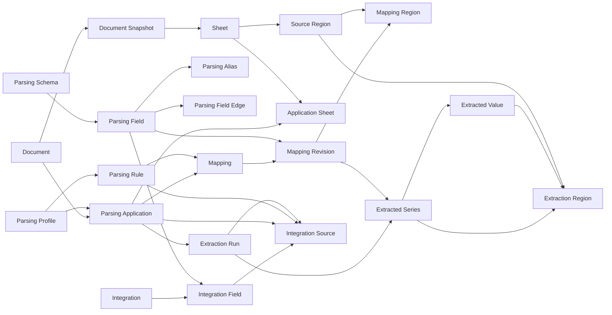

# Parsing Core Schema — 22개 코어 관계안

작성일: 2026-09-11

대상 논의:
- `v2-decisions.md`
- `dvc-minimal-schema-response.md`
- `dvc-minimal-schema-reply.md`

## 결론

현재 논의의 목표는 테이블 수를 최소화하는 것이 아니라, 아래 제품 불변식을 유지하면서 DVC와 RDB의 책임 중복을 줄이는 것이다.

1. 문서의 특정 시점 상태를 식별할 수 있어야 한다.
2. 한 문서에 여러 파싱 프로파일을 적용할 수 있고, 한 프로파일 적용이 여러 시트를 역할별로 사용할 수 있어야 한다.
3. 사용자가 수정한 매핑은 과거 추출 의미를 바꾸면 안 된다.
4. key/value/unit/context는 복수 원본 영역을 가질 수 있어야 한다.
5. 리스트·행렬 등 하나의 규칙 적용 결과를 값 묶음으로 표현할 수 있어야 한다.
6. 통합 DB의 필드가 어느 문서/규칙/실행에서 값을 가져올지 명시적으로 선택할 수 있어야 한다.
7. DVC가 담당할 수 있는 파일/스키마/프로파일/산출물 버전은 DB가 중복 관리하지 않는다.

이 기준으로 코어 관계를 **22개**로 제안한다.

> 용어는 제품 의미를 드러내기 위해 `Domain KG / Template` 대신 `Parsing Schema / Parsing Profile`을 사용한다. 물리 테이블명 변경 시점은 별도 결정 사항이다.

---

## 1. 전체 구조



핵심 흐름은 다음과 같다.

```text
문서 상태
  -> Parsing Profile 적용
  -> 현재 승인된 Mapping Revision
  -> Extraction Run
  -> Series
  -> Value
  -> 사용자가 선택한 Integration Source
  -> Integration DB
```

---

## 2. 22개 코어 테이블과 독립 테이블이어야 하는 이유

| # | 테이블 | 책임 | 왜 독립 관계가 필요한가 |
|---|---|---|---|
| 1 | `document` | 논리 문서의 안정 ID | 파일 내용이 바뀌어도 같은 문서라는 정체성을 유지해야 한다. 해시는 정체성이 아니다. |
| 2 | `document_snapshot` | 문서의 특정 시점 상태 | 과거 추출이 어느 파일 상태를 사용했는지 고정해야 한다. DVC 사용 불가 DRM도 `provider_version/content_hash`로 식별해야 한다. |
| 3 | `sheet` | snapshot 내부 시트 | 한 문서 상태에 여러 시트가 있고 시트가 파싱 적용의 실제 단위 중 하나다. |
| 4 | `source_region` | 셀/이미지/차트 등 원본 위치 | 여러 매핑·추출 결과가 동일 위치를 재사용하고, 위치 자체를 조회·시각화해야 한다. |
| 5 | `parsing_schema` | 공통 결과 구조의 묶음 | 서로 다른 분야/용도의 공통 스키마를 분리할 수 있어야 한다. 단일 스키마만 영구 보장된다면 생략 가능 후보다. |
| 6 | `parsing_field` | 정규화 대상 필드 | 값 타입·단위·계층을 가진 목적지 필드 자체가 독립 식별돼야 한다. |
| 7 | `parsing_alias` | 필드의 표현 변형 | 동일 표현이 여러 필드 후보가 될 수 있고, alias 검색은 필드 정의와 다른 N:M 성격을 가진다. |
| 8 | `parsing_field_edge` | 필드 간 계층/관계 | 트리·그래프 탐색을 위해 필드 자체와 관계를 분리해야 한다. |
| 9 | `parsing_profile` | 문서 유형별 파싱 방식의 안정 ID | 프로파일 자체의 정체성과 개별 rule을 분리해야 재사용·교체가 가능하다. |
| 10 | `parsing_rule` | 개별 탐색/변환 규칙 | 한 프로파일 안에 여러 규칙이 있고 매핑·통합 소스가 특정 규칙을 참조해야 한다. |
| 11 | `parsing_application` | 문서에 프로파일을 적용한 건 | 동일 문서에 여러 프로파일·목적을 동시에 적용할 수 있으므로 document/profile 직결 FK만으로 부족하다. |
| 12 | `application_sheet` | 적용 건의 시트 역할 바인딩 | 한 적용 건이 여러 시트를 `metadata`, `measurements` 등 역할별로 사용하므로 N:M 관계가 필요하다. |
| 13 | `mapping` | 규칙별 현재 상태/head | 현재 승인 리비전과 `edit_seq`를 빠르게 관리하고 CAS를 수행하기 위한 안정 anchor다. |
| 14 | `mapping_revision` | 매핑 변경 이력 | 매핑 수정이 과거 추출의 의미를 바꾸지 않게 하려면 추출 결과가 불변 리비전을 참조해야 한다. |
| 15 | `mapping_region` | 매핑 리비전의 복수 원본 영역 | key/value/unit/context가 여러 위치에 걸칠 수 있어 단일 `key_region_id/value_region_id`로는 부족하다. |
| 16 | `extraction_run` | 실제 추출 실행 | 같은 매핑이라도 실행 시점·엔진·snapshot이 다르므로 결과 묶음의 실행 provenance가 필요하다. |
| 17 | `extracted_series` | 규칙 1회 적용의 결과 묶음 | list/matrix의 `cardinality`, `axis`, `record_scope`는 개별 값이 아니라 값 묶음의 속성이다. |
| 18 | `extracted_value` | 추출된 개별 값 | 조회·통합·타입 변환의 기본 원자이며 series와 1:N 관계다. |
| 19 | `extraction_region` | series/value의 원본 lineage | `series_region`과 `item_region`을 하나로 통합해 N:M provenance를 유지하면서 중복 테이블을 제거한다. |
| 20 | `integration` | 사용자 통합 정의 | 어떤 필드들을 어떤 방식으로 합칠지에 대한 사용자 목적 자체가 독립 객체다. |
| 21 | `integration_field` | 통합 결과 컬럼 | 출력 컬럼명·타입·단위와 parsing field의 대응을 별도로 관리해야 한다. |
| 22 | `integration_source` | 통합 필드가 사용할 실제 소스 | `parsing_field_id`만으로는 어느 문서/규칙/실행을 사용할지 결정할 수 없다. 사용자가 실제 소스를 선택해야 한다. |

---

## 3. 테이블별 최소 컬럼 초안

정확한 타입·CHECK·UNIQUE는 후속 DDL에서 확정한다. 여기서는 관계 책임만 고정한다.

```text
document
- document_id PK
- name
- source_ref
- file_type
- current_snapshot_id FK nullable


document_snapshot
- snapshot_id PK
- document_id FK
- content_hash
- dvc_rev nullable
- provider_version nullable
- captured_at


sheet
- sheet_id PK
- snapshot_id FK
- name
- ordinal
- native_sheet_key nullable


source_region
- region_id PK
- sheet_id FK
- kind
- locator_key
- geometry_json


parsing_schema
- schema_id PK
- name
- current_rev nullable


parsing_field
- field_id PK
- schema_id FK
- name
- level
- value_type
- canonical_unit
- status


parsing_alias
- field_id FK
- alias_norm
- alias_text
- context_key


parsing_field_edge
- edge_id PK
- schema_id FK
- from_field_id FK
- to_field_id FK
- relation


parsing_profile
- profile_id PK
- name
- source_ref
- dvc_rev nullable
- definition_hash nullable


parsing_rule
- rule_id PK
- profile_id FK
- rule_key
- default_field_id FK nullable
- selector_spec
- value_spec


parsing_application
- application_id PK
- document_id FK
- profile_id FK
- scope_key
- published_run_id FK nullable


application_sheet
- application_id FK
- role_key
- ordinal
- sheet_id FK


mapping
- mapping_id PK
- application_id FK
- rule_id FK
- current_revision_id FK
- edit_seq


mapping_revision
- mapping_revision_id PK
- mapping_id FK
- revision_no
- field_id FK
- observed_key nullable
- status
- created_by
- created_at


mapping_region
- mapping_revision_id FK
- region_id FK
- role
- ordinal


extraction_run
- run_id PK
- application_id FK
- snapshot_id FK
- profile_rev nullable
- schema_rev nullable
- input_manifest
- engine_version
- status
- started_at
- finished_at nullable


extracted_series
- series_id PK
- run_id FK
- mapping_revision_id FK
- instance_key
- record_scope_key
- observed_key nullable
- cardinality
- axis
- status


extracted_value
- value_id PK
- series_id FK
- item_index
- record_key nullable
- raw_text nullable
- value_text nullable
- value_type
- unit_raw nullable
- unit_normalized nullable


extraction_region
- owner_kind
- owner_id
- role
- ordinal
- region_id FK


integration
- integration_id PK
- name
- spec_json
- revision_or_dvc_ref nullable


integration_field
- integration_id FK
- field_key
- parsing_field_id FK
- output_name
- target_type
- target_unit nullable
- ordinal


integration_source
- integration_id FK
- field_key FK
- application_id FK
- rule_id FK
- pinned_run_id FK nullable
- options_json
```

---

## 4. 코어에서 제외하는 운영/선택 관계

아래는 제품 기능에 따라 필요할 수 있지만 **코어 데이터 모델의 전제조건으로 두지 않는다.**

| 테이블/기능 | 기본 판정 | 이유 |
|---|---|---|
| `access_observation` | Operational / Optional | 권한의 진실은 DRM provider의 현재 판정이다. 과거 관찰 저장은 audit/cache 요구가 있을 때 추가한다. |
| `build_run` | Operational | 비동기 빌드 상태·멱등·진행률이 필요할 때 추가한다. 산출물 자체는 DVC로 관리 가능하다. |
| `build_lineage` | Product Decision | 통합 DB 셀에서 원본 셀까지 DB 내 역추적을 필수 요구로 확정하면 코어로 승격한다. |
| `runtime_job` | Runtime | 작업 큐 구현 상세다. 도메인 스키마와 분리한다. |
| `version_signature` | Cache | 재생성 가능한 문서군/구조 캐시다. |
| `artifact` | 제외 | 파일·manifest·산출물 포인터를 각 소유 테이블의 DVC/provider ref로 직접 둔다. |
| `build_input` | 제외 | `build/input_manifest`로 충분하며 별도 관계가 중복이다. |
| `render_chunk` | 제외 | 현재 정책상 비영속이고 실제 런타임 미사용이다. |
| `run_mapping` | 제외 | `extraction_run.input_manifest` + `extracted_series.mapping_revision_id`로 성공/실패 실행의 입력을 고정한다. |
| `integration_project` | 제외 | 이름/작성자 수준이면 `integration`에 흡수한다. |

---

## 5. Parsing Schema / Parsing Profile 버전의 책임

여전히 남은 핵심 결정이다.

### Parsing Profile

- 안정 ID는 DB의 `parsing_profile`
- 정의 파일 본문과 과거 버전은 Git/DVC
- 실행은 `profile_rev`을 pin
- `parsing_rule`을 SQL 조회해야 하므로 현재 사용 가능한 rule projection은 DB에 둔다

즉 DB는 **현재/조회용 projection**, DVC는 **파일 버전의 source of truth** 역할을 갖는다.

### Parsing Schema

동일한 원칙을 적용할 수 있다.

- Parsing Schema 정의 파일을 Git/DVC로 버전 관리
- `parsing_field/alias/edge`는 현재 또는 로드된 revision의 SQL projection
- `extraction_run.schema_rev`이 당시 의미를 pin

다만 여러 revision을 동시에 SQL에서 조회해야 한다면 `schema_revision_id`를 field/edge/alias에 포함시키는 현재 v2 방식이 더 단순할 수 있다. 이 부분은 **과거 revision 동시 조회가 제품 요구인지** 확인 후 결정한다.

---

## 6. DRM과 `access_observation`

DRM 요구는 두 개를 구분해야 한다.

```text
Correctness
- 열기/추출/다운로드 시 provider에 현재 권한 재확인

Audit
- 누가 언제 어떤 권한 판정을 받았는지 저장
```

전자는 서비스 레이어에서 provider check를 수행하면 충족된다.
후자는 `access_observation` 같은 테이블이 있어야 한다.

따라서 `access_observation`은 **DRM 제품이라는 이유만으로 코어 A 관계라고 보지 않는다.**
감사 요구가 명시되면 즉시 코어 또는 운영 스키마에 추가한다.

---

## 7. 다음 검증 질문

이 22개 안에서 더 줄이거나 늘리기 전에 아래 질문을 제품 요구로 확정해야 한다.

1. DRM 원본/암호문을 DVC remote에 저장할 수 있는가?
2. Parsing Schema의 과거 revision을 현재 DB에서 동시에 탐색해야 하는가?
3. 통합 DB 결과 셀에서 원본 Excel 셀까지 역추적하는 기능이 필수인가?
4. `Parsing Schema`를 하나만 운용할 것인가, 여러 개를 동시에 운용할 것인가?
5. 추출 실패 실행의 입력 매핑 목록도 DB FK 수준으로 보존해야 하는가, manifest로 충분한가?

이 다섯 결정에 따라 코어는 대략 **20~24개** 범위에서 수렴할 것으로 본다.
