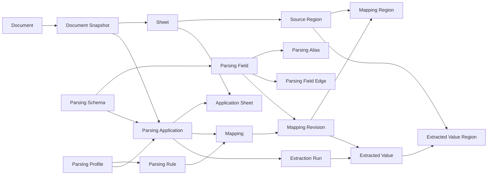

# Parsing Core Schema — 18개 코어 관계안

작성일: 2026-09-14

## 결론

현재 제품의 코어 RDB 스키마는 **18개 테이블**로 정리한다.

핵심 원칙은 다음과 같다.

1. `Parsing Schema`는 여러 개 운용될 수 있으므로 독립 엔터티로 유지한다.
2. `Parsing Profile`은 특정 문서 형식을 읽는 방법이고, `Parsing Schema`는 파싱된 값을 넣는 공통 구조다.
3. 문서 변경 이력은 `document -> document_snapshot`으로 구분하며, 파싱 적용은 논리 문서가 아니라 특정 snapshot에 묶는다.
4. 사용자가 검수한 mapping은 revision으로 보존하여 과거 추출의 의미가 바뀌지 않게 한다.
5. mapping의 실제 위치와 추출 결과의 실제 출처를 분리한다.
6. `extracted_series`는 두지 않는다. 리스트/행렬은 `group_key`, `record_key`, `item_index`로 `extracted_value`에 평탄화한다.
7. 최종 사용자 DB/CSV/Excel 생성은 일회성 export/build 기능이다. `integration_*`, `build_*` 관계는 코어 DB에 저장하지 않는다.
8. DVC는 원본/스키마/프로파일/산출물 파일의 버전 관리에 사용하고, RDB는 현재 관계·검수 상태·추출 provenance를 담당한다.

용어는 제품 목적을 명확히 하기 위해 `Domain KG / Template` 대신 `Parsing Schema / Parsing Profile`을 사용한다.

---

## 1. 전체 구조



핵심 흐름은 다음과 같다.

```text
Document
  -> Document Snapshot
       -> Parsing Profile 적용
       -> Parsing Schema 선택
       -> Mapping 검수
       -> Extraction Run
       -> Extracted Value
       -> 사용자가 필요한 값을 선택
       -> SQLite / Excel / CSV 파일 생성
       -> 반환 후 종료
```

최종 통합 파일은 시스템 내부의 영속 도메인 객체가 아니다.

---

## 2. 18개 코어 테이블

| # | 테이블 | 책임 | 독립 테이블인 이유 |
|---|---|---|---|
| 1 | `document` | 논리 문서의 안정 ID | 파일 내용이 바뀌어도 같은 문서라는 정체성을 유지한다. 해시는 ID가 아니다. |
| 2 | `document_snapshot` | 특정 시점의 문서 상태 | 과거 추출이 어느 파일 상태를 사용했는지 고정한다. |
| 3 | `sheet` | snapshot 내부 시트 | sheet의 이름/순서/구조는 snapshot마다 달라질 수 있다. |
| 4 | `source_region` | 원본의 셀/이미지/차트/영역 위치 | mapping과 extraction이 같은 원본 위치를 공통 참조한다. |
| 5 | `parsing_schema` | 공통 결과 구조의 묶음 | 여러 분야·목적별 Schema를 동시에 운용할 수 있어야 한다. |
| 6 | `parsing_field` | 정규화 대상 필드 | 타입·단위·계층을 가진 목적지 필드를 안정적으로 식별한다. |
| 7 | `parsing_alias` | 필드의 표현 변형 | 동의어·표현 차이를 필드 본문과 분리하여 관리한다. |
| 8 | `parsing_field_edge` | 필드 간 구조 관계 | 부모/자식 또는 관련 관계를 필드와 분리한다. |
| 9 | `parsing_profile` | 특정 문서 형식의 파싱 방식 | 문서 양식별 파싱 설정 묶음을 재사용하기 위한 안정 ID다. |
| 10 | `parsing_rule` | 개별 탐색/변환 규칙 | Profile 하나에 여러 rule이 있고 mapping은 특정 rule을 참조한다. |
| 11 | `parsing_application` | 특정 snapshot에 Profile/Schema를 적용한 건 | 동일 문서라도 snapshot·profile·schema 조합별 검수 상태가 다르다. |
| 12 | `application_sheet` | 적용 건의 sheet 역할 바인딩 | 한 Profile 적용이 여러 sheet를 역할별로 사용할 수 있다. |
| 13 | `mapping` | Rule별 현재 mapping 상태/head | 안정 ID와 현재 revision, CAS용 edit sequence를 관리한다. |
| 14 | `mapping_revision` | 검수된 mapping의 불변 이력 | mapping 수정이 과거 추출 의미를 바꾸지 않게 한다. |
| 15 | `mapping_region` | 검수된 mapping의 실제 key/value/unit/context 위치 | 실행 spec과 별도로 UI에서 원본 위치를 직접 조회·수정할 수 있어야 한다. |
| 16 | `extraction_run` | 실제 파싱 실행 단위 | 언제 어떤 snapshot/profile/schema/mapping으로 실행했는지 고정한다. |
| 17 | `extracted_value` | 실제 추출된 개별 값 | 조회와 export의 기본 원자 데이터다. |
| 18 | `extracted_value_region` | 한 값에 복수 원본이 있을 때의 lineage | 단일 원본은 value의 FK로 처리하고 복수 원본만 N:M으로 표현한다. |

---

## 3. 상세 스키마 초안

정확한 SQL 타입은 SQLite/PostgreSQL DDL 작성 시 확정한다. 여기서는 PK/FK와 책임을 우선 고정한다.

### 3.1 `document`

```text
document
- document_id PK
- document_name
- source_path
- file_type
- created_at
- updated_at
```

논리 문서 자체를 나타낸다. `content_sha256`을 PK로 사용하지 않는다.

---

### 3.2 `document_snapshot`

```text
document_snapshot
- snapshot_id PK
- document_id FK -> document
- content_sha256
- ciphertext_sha256 nullable
- provider_version nullable
- dvc_rev nullable
- author nullable
- authored_at nullable
- captured_at
```

하나의 `document`는 여러 snapshot을 가질 수 있다.

```text
Document A
  -> Snapshot 1
  -> Snapshot 2
  -> Snapshot 3
```

DVC로 원본을 복원할 수 있으면 `dvc_rev`를 사용하고, DRM 정책 등으로 불가능한 경우 `provider_version`과 hash로 당시 상태를 식별한다.

---

### 3.3 `sheet`

```text
sheet
- sheet_id PK
- snapshot_id FK -> document_snapshot
- sheet_name
- ordinal
- native_sheet_key nullable
```

권장 UNIQUE:

```text
(snapshot_id, ordinal)
(snapshot_id, sheet_name)
```

---

### 3.4 `source_region`

```text
source_region
- region_id PK
- sheet_id FK -> sheet
- kind
- locator_key
- r1 nullable
- c1 nullable
- r2 nullable
- c2 nullable
- geometry_json nullable
- created_at
```

`kind` 예:

```text
cells
image
chart
shape
text
```

병합 셀, 비연속 영역, 이미지/차트 geometry 등 단순 사각 범위를 넘는 정보는 `geometry_json`에 둔다.

`source_region`은 오직 **원본의 어디인가**를 표현한다.

---

## 4. Parsing Schema

### 4.1 `parsing_schema`

```text
parsing_schema
- schema_id PK
- schema_name
- description nullable
- definition_path nullable
- current_rev nullable
- definition_sha256 nullable
- created_at
- updated_at
```

Schema는 여러 개 존재할 수 있다.

예:

```text
실험 데이터 Schema
원가 데이터 Schema
품질 데이터 Schema
공정 데이터 Schema
```

DB의 `parsing_schema`는 안정 ID와 현재 projection의 anchor이고, 정의 파일의 버전은 Git/DVC가 맡을 수 있다.

---

### 4.2 `parsing_field`

```text
parsing_field
- field_id PK
- schema_id FK -> parsing_schema
- field_name
- description nullable
- field_level nullable
- value_type
- canonical_unit nullable
- status
- created_at
- updated_at
```

`status` 예:

```text
active
deprecated
```

`Concept`보다 `Field`라는 용어를 사용한다. 이 시스템의 목적은 지식그래프 구축 자체가 아니라 다양한 문서 값을 공통 구조에 넣는 것이기 때문이다.

---

### 4.3 `parsing_alias`

```text
parsing_alias
- alias_id PK
- field_id FK -> parsing_field
- alias_text
- alias_norm
- context_key nullable
```

예:

```text
Field: temperature
Aliases:
- 온도
- 오븐온도
- Temp
- Temperature
```

---

### 4.4 `parsing_field_edge`

```text
parsing_field_edge
- edge_id PK
- schema_id FK -> parsing_schema
- from_field_id FK -> parsing_field
- to_field_id FK -> parsing_field
- relation
- ordinal nullable
```

`relation` 예:

```text
parent_of
related_to
```

이 관계는 KG 자체를 구축하기 위한 것이 아니라 Schema Field의 구조와 탐색을 지원하기 위한 것이다.

---

## 5. Parsing Profile

### 5.1 `parsing_profile`

```text
parsing_profile
- profile_id PK
- profile_name
- description nullable
- definition_path nullable
- current_rev nullable
- definition_sha256 nullable
- created_at
- updated_at
```

예:

```text
A사 실험 결과 양식
2026년 온도 실험 양식
휘낭시에 온도실험 Sheet 양식
```

Profile은 **특정 문서 형식을 어떻게 읽을 것인가**를 정의한다.

---

### 5.2 `parsing_rule`

```text
parsing_rule
- rule_id PK
- profile_id FK -> parsing_profile
- rule_key
- rule_name nullable
- default_field_id FK -> parsing_field nullable
- ordinal
- selector_json
- value_spec_json
- created_at
```

예:

```text
rule_key = oven_temperature
selector = "오븐온도"를 찾고 오른쪽 값 범위를 읽음
value_spec = decimal, unit=C
```

`parsing_rule`은 현재 Profile의 조회/편집 projection이다. 실제 승인 mapping은 아래 `mapping_revision.effective_spec_json`으로 실행 의미를 고정한다.

---

## 6. Parsing Application

### 6.1 `parsing_application`

```text
parsing_application
- application_id PK
- snapshot_id FK -> document_snapshot
- profile_id FK -> parsing_profile
- schema_id FK -> parsing_schema
- scope_key
- profile_rev nullable
- schema_rev nullable
- created_at
```

중요한 원칙:

```text
Profile은 Document가 아니라 Document Snapshot에 적용한다.
```

새 snapshot이 들어오면 기존 승인 mapping을 자동 승인 상태로 그대로 사용하지 않는다. 필요하면 이전 mapping을 candidate/proposed 상태로 승계하여 재검수한다.

---

### 6.2 `application_sheet`

```text
application_sheet
- application_id FK -> parsing_application
- role_key
- ordinal
- sheet_id FK -> sheet
```

권장 PK:

```text
(application_id, role_key, ordinal)
```

예:

```text
Application A
- summary -> Summary Sheet
- experiment[0] -> 180C Sheet
- experiment[1] -> 190C Sheet
- experiment[2] -> 200C Sheet
```

한 Profile 적용이 여러 sheet를 역할별로 사용하는 N:M 관계를 표현한다.

---

## 7. Mapping

### 7.1 `mapping`

```text
mapping
- mapping_id PK
- application_id FK -> parsing_application
- rule_id FK -> parsing_rule
- instance_key
- current_revision_id FK -> mapping_revision nullable
- edit_seq
- created_at
```

권장 UNIQUE:

```text
(application_id, rule_id, instance_key)
```

`mapping`은 안정 anchor와 현재 revision만 관리한다.

---

### 7.2 `mapping_revision`

```text
mapping_revision
- mapping_revision_id PK
- mapping_id FK -> mapping
- revision_no
- snapshot_id FK -> document_snapshot
- field_id FK -> parsing_field
- observed_key nullable
- effective_spec_json
- status
- created_by nullable
- created_at
```

`status` 예:

```text
proposed
approved
rejected
```

`effective_spec_json`은 승인 당시 실제 실행 의미 전체를 고정한다.

예:

```json
{
  "selector": {
    "anchor": "oven_temperature",
    "direction": "right",
    "offset": 1
  },
  "value_type": "decimal",
  "normalization": ["trim", "to_decimal"],
  "unit": "C"
}
```

따라서 이후 `parsing_rule`이나 normalization 설정이 바뀌어도 과거 extraction 의미는 변하지 않는다.

---

### 7.3 `mapping_region`

```text
mapping_region
- mapping_revision_id FK -> mapping_revision
- region_id FK -> source_region
- role
- ordinal
```

권장 PK:

```text
(mapping_revision_id, role, ordinal)
```

`role` 예:

```text
key
value
unit
context
record_key
```

`effective_spec_json`과의 역할 차이:

```text
effective_spec_json
= 어떻게 읽고 변환할 것인가

mapping_region
= 검수 결과 실제로 어느 위치가 key/value/unit/context인가
```

Excel 원본 UI에서 특정 셀이 어떤 Field에 mapping됐는지 역방향 조회해야 하므로 위치를 JSON 내부에만 두지 않는다.

---

## 8. Extraction

`extracted_series`는 제거한다. 리스트/행렬 결과도 `extracted_value`에 평탄화한다.

### 8.1 `extraction_run`

```text
extraction_run
- run_id PK
- application_id FK -> parsing_application
- snapshot_id FK -> document_snapshot
- schema_rev nullable
- profile_rev nullable
- engine_version
- input_manifest_json
- status
- started_at
- finished_at nullable
- error_summary nullable
```

`input_manifest_json`에는 실행에 사용한 mapping revision을 pin한다.

예:

```json
{
  "oven_temperature": "mapping_revision_13",
  "baking_time": "mapping_revision_22"
}
```

별도 `run_mapping` 테이블은 두지 않는다.

---

### 8.2 `extracted_value`

```text
extracted_value
- value_id PK
- run_id FK -> extraction_run
- mapping_revision_id FK -> mapping_revision
- field_id FK -> parsing_field
- group_key nullable
- record_key nullable
- item_index nullable
- raw_text nullable
- display_text nullable
- value_text nullable
- value_type
- value_state
- unit_raw nullable
- unit_normalized nullable
- formula_state nullable
- source_region_id FK -> source_region nullable
- source_identity_key nullable
- derivation_key nullable
- created_at
```

리스트/표/행렬은 다음처럼 평탄화한다.

```text
group_key | item_index | value
--------------------------------
temp-01   | 0          | 180
temp-01   | 1          | 185
temp-01   | 2          | 190
```

`value_state`는 최소한 다음 상태를 구분할 수 있어야 한다.

```text
present
null
empty
error
```

`source_identity_key`와 `derivation_key`는 동일 원본을 여러 Profile/Rule이 파싱했을 때 단순 값 비교가 아닌 provenance 기반 중복 제거를 지원한다.

---

### 8.3 `extracted_value_region`

```text
extracted_value_region
- value_id FK -> extracted_value
- region_id FK -> source_region
- role
- ordinal
```

권장 PK:

```text
(value_id, role, ordinal)
```

기본적으로 값 하나가 한 영역에서 나오면 `extracted_value.source_region_id` 하나로 충분하다.

여러 영역이 하나의 값에 기여하는 경우에만 `extracted_value_region`을 사용한다.

```text
B1 + C1 + D1 -> value1

value1 -> B1
value1 -> C1
value1 -> D1
```

---

## 9. 최종 사용자 DB 생성은 비영속 Build

최종 목적은 추출 결과를 시스템 내부 Integration 모델로 영속하는 것이 아니라, 사용자가 필요한 데이터를 선택하여 파일로 받는 것이다.

```text
Extracted Value
    -> 사용자가 Field / 문서 / 값 선택
    -> 일회성 Build Request
    -> SQLite / Excel / CSV 생성
    -> 파일 + 필요 시 manifest 반환
    -> 종료
```

따라서 다음 테이블은 코어에서 제외한다.

```text
integration
integration_revision
integration_field
integration_source
build_run
build_input
build_lineage
integration_project
```

재현 정보가 필요하면 산출물과 함께 `manifest.json`을 생성한다.

예:

```json
{
  "sources": ["run_001", "run_005"],
  "fields": [
    {
      "field_id": "temperature",
      "output_name": "oven_temp",
      "target_unit": "C"
    }
  ]
}
```

통합 결과에서 원본까지의 lineage가 필요하면 결과 파일에 `_source_*` 메타 컬럼 또는 별도 manifest를 포함한다. 이를 이유로 운영 DB에 integration 관계를 영속하지 않는다.

---

## 10. DVC와 RDB의 책임 경계

### DVC / Git

```text
원본 파일 또는 허용된 원본 artifact
Parsing Schema 정의 파일
Parsing Profile 정의 파일
생성된 SQLite / Excel / CSV
manifest.json
```

파일의 버전과 복원을 담당한다.

### RDB

```text
논리 문서와 snapshot 식별
sheet / source region
현재 Parsing Schema / Profile projection
문서별 적용 상태
검수 mapping과 revision
실행 이력
추출 값과 provenance
```

관계 조회와 현재 서비스 상태를 담당한다.

활성 SQLite DB 자체를 DVC로 버전 관리하는 방식은 기본안으로 사용하지 않는다.

---

## 11. 코어 밖 운영 테이블

다음 관계는 필요 시 추가할 수 있으나 18개 코어 모델의 일부로 보지 않는다.

| 기능 | 판정 | 이유 |
|---|---|---|
| `access_observation` | Operational / Optional | DRM 권한의 진실은 provider의 현재 판정이며 저장 행은 감사 목적이다. |
| `runtime_job` | Runtime | 비동기 작업 큐 구현 상세다. |
| `version_signature` | Cache | 재생성 가능한 캐시다. |
| `artifact` | 제외 | 파일 포인터는 각 소유 관계의 DVC/provider ref로 직접 둔다. |
| `render_chunk` | 제외 | 현재 정책상 렌더 결과를 영속하지 않는다. |

---

## 12. 최종 테이블 목록

```text
[Document]
1.  document
2.  document_snapshot
3.  sheet
4.  source_region

[Parsing Schema]
5.  parsing_schema
6.  parsing_field
7.  parsing_alias
8.  parsing_field_edge

[Parsing Profile]
9.  parsing_profile
10. parsing_rule

[Application / Mapping]
11. parsing_application
12. application_sheet
13. mapping
14. mapping_revision
15. mapping_region

[Extraction]
16. extraction_run
17. extracted_value
18. extracted_value_region
```

이 18개를 현재 코어 스키마의 기준안으로 삼는다.
