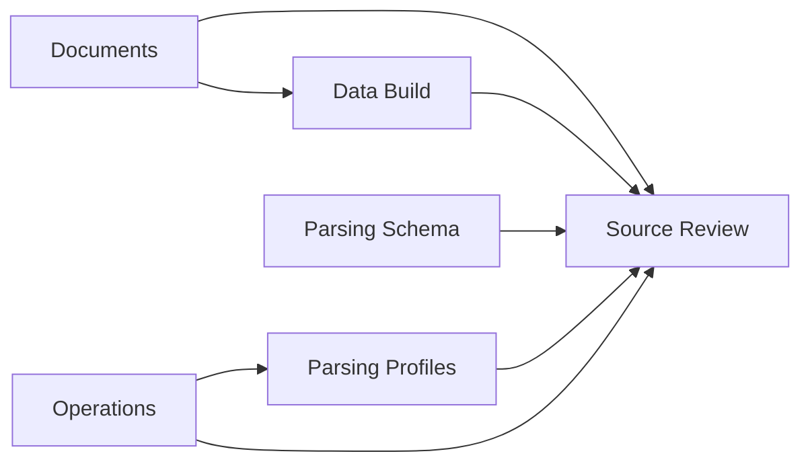

# UI Screen Definition — Use-case Driven

작성일: 2026-09-14

## 1. 목적

현재 UI는 기능 자체는 상당 부분 존재하지만 사용자용 흐름, 운영용 흐름, 검수 기능이 여러 화면에 섞여 있어 직관성이 떨어진다.

새 UI는 기존 구현을 최대한 재사용하되 **유저케이스별 화면 책임을 명확히 분리**한다.

계정/RBAC은 현재 범위에서 제외한다. 이 문서의 `사용자`와 `운영자`는 화면 사용 목적을 구분하기 위한 역할 표현이다.

---

## 2. 화면 설계 원칙

1. 사용자 흐름과 운영 흐름을 한 화면에 섞지 않는다.
2. 한 화면에는 하나의 대표 목적과 대표 행동을 둔다.
3. `Parsing Schema`와 `Parsing Profile` 용어를 UI 전체에서 일관되게 사용한다.
4. 내부 ID, revision ID, application ID는 기본 화면에서 노출을 최소화한다.
5. JSON 편집, 버전 복원, 상세 파라미터는 운영자용 상세 기능으로 내린다.
6. 모든 추출 결과는 필요할 때 Source Review로 이동할 수 있어야 한다.
7. 최종 Table/CSV/SQLite/XLSX 생성은 일회성 작업이며 별도 Integration 객체를 만들지 않는다.

---

## 3. 전체 화면 구조

상단 Navigation은 다음 5개로 정리한다.

```text
Documents
Data Build
Parsing Schema
Parsing Profiles
Operations
```

`Source Review`는 상단 메뉴에서 제거하고 문서, 결과, 운영 큐에서 진입하는 **Contextual Workspace**로 사용한다.



기본 진입 화면은 `Documents`로 한다.

---

## 4. 유저케이스와 화면 대응

| 유저케이스 | 주 화면 | 보조 화면 |
|---|---|---|
| UC-1 Agent용 표준 테이블 생성 | Documents → Data Build | Source Review |
| UC-2 추출 결과 원본 확인 | Source Review | Documents / Data Build |
| UC-3 신규 문서 양식 등록 | Operations → Parsing Profiles | Source Review |
| UC-4 파싱 실패·예외 처리 | Operations | Source Review / Parsing Profiles |
| UC-5 문서 양식 변경 대응 | Operations | Parsing Profiles / Source Review |
| UC-6 외부 Parsing Profile 이관 | Parsing Profiles | Source Review |

---

# 5. 화면 정의

## S-01. Documents

### 목적

등록된 원본 문서를 찾고, 현재 파싱 가능 상태를 확인하고, 데이터를 만들 문서를 선택하는 화면이다.

### 주요 사용자

사용자 / 운영자 공통

### 주요 구성

#### 상단

- 문서명 검색
- 상태 필터
  - 정상
  - Profile 미배정
  - 검수 필요
  - 파싱 실패
  - 변경 감지
- Parsing Profile 필터
- `원본 등록` 버튼

작성자, 날짜, 접근 상태 등 빈도가 낮은 조건은 `상세 필터`에 넣는다.

#### 문서 목록

기본 컬럼은 다음으로 단순화한다.

```text
문서명
현재 Snapshot
적용 Parsing Profile
Parsing Schema
상태
최근 처리 시각
```

행 선택 시 우측 Detail Drawer를 연다.

#### Document Detail Drawer

- 문서 기본 정보
- Snapshot 이력
- Sheet 목록
- 적용 중인 Parsing Profile
- 연결 Parsing Schema
- 추출 상태
- 최근 오류
- `데이터 만들기`
- `원본/추출 확인`

### 대표 행동

**문서를 선택하여 Data Build로 이동**

### 현재 UI에서 재사용

- `DocumentsTable`
- `DocumentDrawer`
- 원본 등록 UI
- 문서 상태 badge

### 이동/삭제

- 현재 Documents 하단의 `ReviewQueue`는 `Operations`로 이동한다.
- KG 문서군 개념은 일반 사용자 목록의 기본 컬럼에서 제거한다.
- 운영 상세 정보는 Drawer 안으로 이동한다.

---

## S-02. Data Build

### 목적

선택한 문서의 추출값을 Parsing Schema 기준으로 조합하여 Agent가 사용할 단일 테이블을 생성한다.

### 주요 사용자

Agent 개발자 / 내부 데이터 사용자

### 주요 구성

#### 1단계. 입력 범위

- 선택 문서 / 문서군
- Parsing Schema 선택
- 현재 처리 가능한 문서 수
- 제외된 문서와 제외 이유

#### 2단계. 출력 필드

Parsing Schema Tree/List에서 필요한 Parsing Field를 선택한다.

표시 정보:

```text
Field명
타입
단위
값 존재 문서 수
```

#### 3단계. Preview

실제 결과 테이블의 일부 행을 미리 보여준다.

각 셀 또는 값에서 `원본 확인`을 눌러 Source Review로 이동할 수 있어야 한다.

#### 4단계. Export

- CSV
- SQLite
- XLSX
- Agent 전달용 Table/JSON 계약

### 대표 행동

**필드 선택 → Preview → 파일 생성**

### 중요한 변경

현재 `Database` 화면의 `integration`, `project`, `build history` 중심 UI를 제거한다.

최종 데이터 생성은 영속 Integration 객체가 아니라 일회성 Build Request로 처리한다.

### 현재 UI에서 재사용

- Concept/Field Tree selection
- 출력 필드 구성 UI
- Preview table
- Lineage → Source 이동 기능
- Export/download 기능

---

## S-03. Parsing Schema

### 목적

여러 문서 양식이 공통으로 연결될 목표 데이터 구조와 Parsing Field 의미를 관리한다.

### 주요 사용자

운영자 / 도메인 담당자

### 주요 구성

#### 좌측

- Parsing Schema 선택
- Field Tree/List
- Field 검색

기본 보기는 Tree/List로 한다.

#### 중앙

선택 Parsing Field 상세:

```text
Field명
정의
Value Type
Canonical Unit
Alias
상위/하위 Field
Related Field
```

#### 우측 또는 하단

현재 Field와 연결된 정보:

- 연결 Parsing Profile/Rule 수
- 추출 가능한 문서 수
- 최근 추출값
- `원본 보기`

### Graph

현재 KG 그래프 기능은 삭제하지 않되 기본 화면에서 제외한다.

`Graph 보기`를 선택했을 때만 구조 시각화 용도로 사용한다.

### 대표 행동

**Parsing Field 정의 및 연결 상태 확인**

### 현재 UI에서 재사용

- `ConceptTree`
- `ConceptEditor`
- `DomainGraph`
- Field 검색
- Field → Source 이동

### 변경

UI 용어 `KG`, `Concept`을 각각 `Parsing Schema`, `Parsing Field`로 교체한다.

KG revision import JSON은 운영 상세 기능으로 축소한다.

---

## S-04. Parsing Profiles

### 목적

문서 양식별 파싱 방법을 등록, 검증, 버전 관리한다.

### 주요 사용자

운영자

### 주요 구성

#### Profile 목록

```text
Profile명
버전
대상 Sheet 패턴
연결 Parsing Schema
적용 문서 수
성공률/상태
최근 변경일
```

#### Profile Detail

- Profile 설명
- Sheet Role
- Parsing Rule 목록
- 각 Rule이 연결되는 Parsing Field
- selector 요약
- 값 타입/단위/normalization
- Profile 버전 이력

#### Profile Editor

두 수준으로 제공한다.

1. 기본 편집 UI
   - Sheet matcher
   - Field/Rule
   - Key/Value selector
   - type/unit
   - normalization

2. 고급 JSON
   - canonical Parsing Profile JSON 직접 편집
   - JSON validation 결과

#### 외부 Profile Import

- 외부 JSON 입력/업로드
- Adapter 형식 자동 판별 또는 선택
- canonical Profile 변환 Preview
- validation 오류 표시
- 저장 전 테스트

#### 테스트 실행

대표 문서를 하나 선택하여:

```text
Profile 적용
→ Parsing 결과
→ Source Region overlay
→ Parsing Field Mapping 확인
```

테스트 결과는 Source Review를 사용한다.

### 대표 행동

**Profile 작성/Import → 검증 → 테스트 → 버전 저장**

### DB 원칙

Profile DSL 확장을 위해 별도 테이블을 추가하지 않는다.

`anchors`, `relations`, `composite_anchors` 등의 기능은 canonical Parsing Profile JSON과 Parsing Runtime에서 처리한다.

### 현재 UI에서 재사용

- 기존 Templates 목록/버전
- JSON editor
- normalization preset
- Template export/import 기능

---

## S-05. Operations

### 목적

정상 흐름에서 벗어난 문서와 검수해야 할 항목만 모아 처리한다.

### 주요 사용자

운영자

### 상단 요약

```text
신규 양식 후보
Profile 미매칭
Mapping 검수 대기
파싱 실패
문서 변경 감지
```

각 항목은 건수 카드와 목록으로 연결한다.

### 운영 Queue

기본 Queue 유형:

1. 신규 양식 / Profile 미매칭
2. Mapping 검수 필요
3. Parsing 실패
4. 타입/단위 충돌
5. Snapshot 변경 후 재검수 필요

### 중요한 원칙

동일한 원인과 동일한 문서 양식은 가능한 한 **문서 단위가 아니라 Profile/구조 패턴 단위로 묶어서 표시**한다.

### Queue Item 행동

- Source Review 열기
- 기존 Profile 연결
- 새 Profile 만들기
- Profile 수정
- Mapping 승인/반려
- 재파싱
- 동일 패턴 일괄 처리

### 현재 UI에서 재사용

- `ReviewQueue`
- Recrawl 기능
- 실패 상태
- Mapping revision 승인/반려

### 대표 행동

**예외 원인 확인 → Profile/Mapping 수정 → 재파싱**

---

## S-06. Source Review — Contextual Workspace

### 목적

추출된 값이 원본의 어디에서 왔으며 어떤 Parsing Rule/Mapping으로 만들어졌는지 확인하고 수정한다.

상단 Navigation의 독립 메뉴가 아니라 다음 위치에서 진입한다.

- Document Detail
- Data Build 결과
- Parsing Schema Field
- Parsing Profile 테스트
- Operations Queue

### 화면 구성

```text
┌──────────────────────────────────────────────────────────┐
│ 문서 / Snapshot / Sheet / Profile / Schema context      │
├─────────────┬──────────────────────────┬─────────────────┤
│ Sheet/Rule  │      Excel Viewer        │ Mapping Detail  │
│ Navigation  │   + Source Overlay       │ / Extracted     │
│             │                          │ Value           │
└─────────────┴──────────────────────────┴─────────────────┘
```

### 좌측

- Sheet 목록
- 적용 Parsing Profile
- Parsing Rule 목록

### 중앙

- Render/Parsing Server에서 받은 Sheet Viewer
- Source Region overlay
- Key / Value / Unit / Context 구분
- zoom / 이동

### 우측

- Parsing Rule
- 연결 Parsing Field
- observed key
- 추출값
- value type / unit
- 현재 Mapping 상태
- selector 상세
- 승인/수정/반려
- revision history

### 대표 행동

**추출값과 원본 근거를 한 화면에서 비교**

### 현재 UI에서 재사용

현재 `Source.tsx`의 핵심 구조를 가장 많이 유지한다.

다만 다음은 단순화한다.

- Sheet / Application / Mapping 선택 구조의 내부 용어 노출 감소
- `application_id`, `mapping_revision_id` 직접 노출 제거
- Profile, Rule, Field 중심 용어로 재표현
- 별도 Render/Parsing Server 사용

---

# 6. 주요 흐름

## 사용자 기본 흐름

```text
Documents
   ↓ 문서 선택
Data Build
   ↓ Field 선택
Preview
   ↓
Export
```

값 검증이 필요하면:

```text
Preview 값
   ↓ 원본 확인
Source Review
```

---

## 신규 양식 운영 흐름

```text
Operations
   ↓ Profile 미매칭
Parsing Profiles
   ↓ Profile 작성/Import
Source Review
   ↓ 대표 문서 테스트
Profile 저장
   ↓
재파싱
```

---

## 파싱 실패 대응 흐름

```text
Operations
   ↓ 실패 항목 선택
Source Review
   ↓ 원인 확인
Parsing Profile 수정
   ↓
재파싱
```

---

## 문서 변경 대응 흐름

```text
Snapshot 변경 감지
   ↓
Operations
   ↓
기존 Profile 호환 여부 확인
   ├─ 호환 → 재사용/재파싱
   └─ 불호환 → Parsing Profile 수정
```

---

# 7. 현재 화면과 신규 화면 매핑

| 현재 화면/기능 | 신규 위치 | 처리 |
|---|---|---|
| Documents | Documents | 유지·단순화 |
| DocumentDrawer | Documents | 유지 |
| KG | Parsing Schema | 명칭/목적 변경 |
| Graph / Explore / List | Parsing Schema | List/Tree 기본, Graph 보조 |
| Source | Source Review | Contextual Workspace로 변경 |
| Templates | Parsing Profiles | 명칭/기능 정리 |
| Database | Data Build | 영속 Integration 개념 제거 |
| ReviewQueue | Operations | 이동 |
| Recrawl | Operations | 이동 |
| Suggestions | Operations 또는 Profile Editor | 자동 추천은 보조 기능으로 축소 |
| Legacy Viewer | 호환 경로 | 기본 Navigation에서 제외 |

---

# 8. 우선 구현 순서

### P0

1. Navigation 용어 및 화면 책임 변경
2. Documents 단순화
3. Database → Data Build 전환
4. KG → Parsing Schema 용어 전환
5. Templates → Parsing Profiles 전환
6. Source를 Contextual Source Review로 변경
7. Review Queue / 실패 / 변경 감지를 Operations로 통합

### P1

1. Profile 기본 편집 UI
2. 외부 Profile Import Adapter UI
3. Profile 테스트 실행 → Source Review 연결
4. 운영 Queue 패턴 그룹화
5. Data Build Preview에서 원본 이동

### P2

1. Profile 자동 추천
2. Schema/Field 후보 추천
3. 운영 통계/재사용률 Dashboard

---

# 9. 화면 설계 결론

현재 UI는 전면 재작성 대상이 아니다.

핵심 변경은 **화면 개수 추가가 아니라 책임 재배치와 용어 정리**다.

```text
Documents       = 원본 선택
Data Build      = 필요한 데이터 생성
Parsing Schema  = 데이터 의미 정의
Parsing Profiles= 문서 읽는 방법 정의
Operations      = 예외/실패/신규 양식 관리
Source Review   = 원본 근거 검수 작업공간
```

이 구조를 기준으로 이후 실제 Wireframe과 상세 컴포넌트 정의를 진행한다.