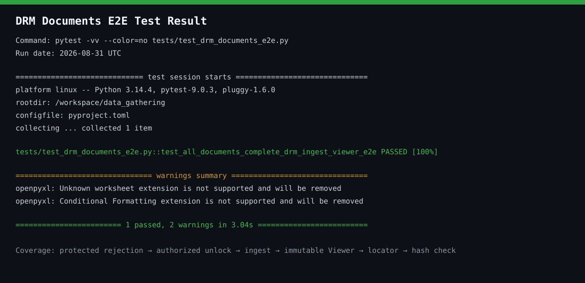

# DRM documents E2E result

The screenshot below captures the actual output of the all-document DRM E2E run
on 2026-08-31 UTC.

```bash
pytest -vv --color=no tests/test_drm_documents_e2e.py
```

Result: **1 passed**, with two non-fatal openpyxl warnings about unsupported
worksheet extensions and conditional-formatting extensions.



Tracked artifact:

```text
docs/screenshots/drm-documents-e2e-result.svg
SVG, 1280 × 620, UTF-8 text
```

The result image is stored as text-based SVG because the PR transport does not
support binary files. It is tracked directly in Git, renders inline in Markdown,
and does not rely on an external service or an ignored generated artifact.

The E2E test covers every checked-in `data/raw/*.xlsx` document through protected
input rejection, authorized unlock request and delivery, Document KG ingestion,
immutable Viewer registration, preview rendering, logical source lookup, and
source hash verification.
